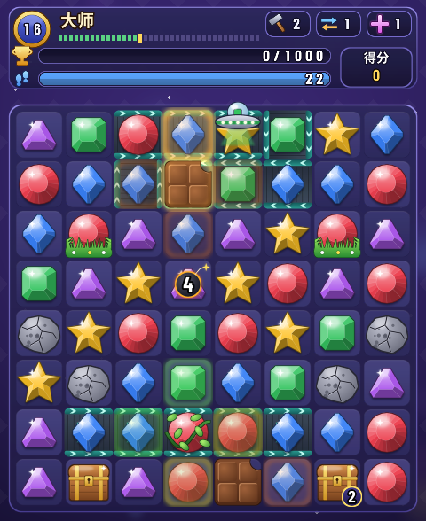
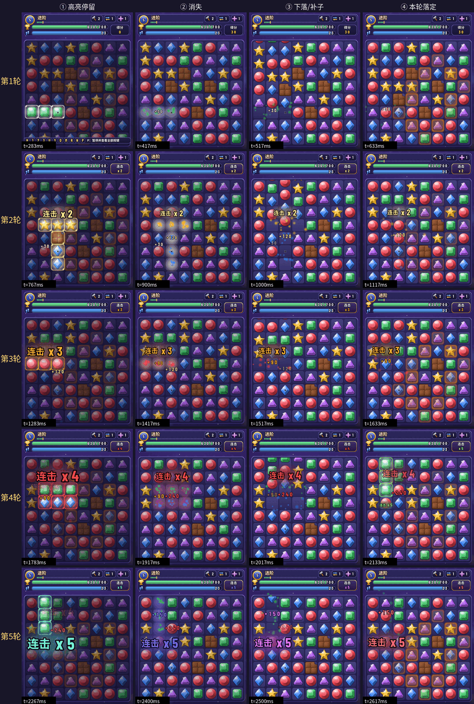

# Match-3 消消乐（Haskell + SDL2）

8×8、五色可玩三消，对标开心消消乐常见机制：特殊块、多层障碍、草/藤蔓/巧克力/迷雾/锁链/火箭冰冻/窗帘、蒸汽、蜗牛、宝箱、保险箱、蜂蜜罐、蛋糕、魔法帽、果汁机、气球、饼干掉落收集、双面块、彩蛋惊喜盒、染色瓶、时间精灵、地毯、传送带、双向传送门、倒计时炸弹、飞碟、道具点选、多样目标、每日挑战、步数携带。纯规则在 library（`Match3.Core`），SDL 前端为 `match3-sdl`。



**贴图**：宝石用「颜色 + 形状」双编码（红圆 / 绿方 / 蓝菱 / 黄星 / 紫三角），每种障碍都有独立图标，多层障碍会显示层数角标。美术说明、完整图例和重新生成方法见 [`docs/ui-art.md`](docs/ui-art.md)。贴图是 SDL2 核心可以直接读取的 32 位 BMP，macOS **不用装新的 brew 包**（不需要 sdl2_image）；缺少 `assets/` 时会自动退回几何图形渲染。

## 30 秒上手

```bash
export PATH="$HOME/.ghcup/bin:$PATH"
# Linux 一次安装 SDL2 头文件；运行期依赖 libsdl2-2.0-0
sudo apt-get install -y libsdl2-dev

# macOS Apple Silicon（Homebrew SDL2）额外需要：
# export PKG_CONFIG_PATH=/opt/homebrew/lib/pkgconfig

stack test                            # 库测，无需显示器；期望 460 通过
stack build && stack exec match3-sdl
```

1. **左键**点两格相邻交换，或**拖拽**到相邻格；无三连会回滚
2. 开局底部有键位条；**P** 暂停看完整键位（H 提示 / **1** 锤子 / **2** 任意交换 / **3** 十字清除 / **M** 选关地图 / U 撤销 / S 洗牌 / D 每日 / R 重开 / N 过关）
3. 第一关会短暂黄框提示可消一手；达目标后按 **N** / 空格 / 点击继续

无显示器冒烟：`xvfb-run -a stack exec match3-sdl`。`stack test` 不需要显示。提交前跑 `make verify`（0 警告构建 + `stack test`，按需 `make check`；流程见 [`docs/testing.md`](docs/testing.md#开发流程)）。

更细的设计说明见 [`docs/`](docs/README.md)；键位表见 [`docs/ui-controls.md`](docs/ui-controls.md)。itch.io 文案见 [`ITCH.md`](ITCH.md)。

## 功能一览

- 相邻交换（点击或拖拽）；横/竖 ≥3 消除
- **特殊块**：四消 → 直线（Line）；五消 → 彩虹（Rainbow，与搭档交换只清搭档色；同色扩展为空操作）；炸弹（Bomb）供合成
- **特殊合成**：Line×Bomb（3×3 十字）、Rainbow×Line / Rainbow×Bomb（搭档色 + 直线/炸弹扩展）、Bomb×Bomb（5×5）、Line×Line（整行+整列）
- **石头箱**（`Stone n`）：多层障碍；邻消削层；末层移除
- **宝箱**（`Chest n`）：邻消 / 直线·炸弹·锤子削一层；目标 `GoalChest`
- **蜂蜜罐**（`Honey n`）：同上削层；目标 `GoalHoney`
- **气球**（`Balloon c`）：邻格**同色**消除才爆；目标 `GoalBalloon`
- **饼干**（`Cookie`）：随重力下落，仅**底行**收集（中盘直线/炸弹/锤子无效）；目标 `GoalCookie`
- **蛋糕**（`Cake n`）：分层障碍（≠ Cookie）；邻消/直线·炸弹·锤子削层；目标 `GoalCake`
- **魔法帽**（`MagicHat`）：邻消触发，交换/重染邻格宝石色
- **锁链**（`Chain n`）：邻消揭层；锁住不可交换也不可匹配
- **火箭冰冻**（`Freeze n`）：只挡交换（仍可匹配）；邻消揭层；≠ 冰层 Ice（Ice 在宝石本身匹配时削层）
- **蜗牛**（`Snail dr dc`）：挡交换；成功步末爬一格（推宝石；碰边/障碍/传送门端点掉头）
- **窗帘**（`Curtain n`）：邻消揭层；帘下宝石不参与匹配
- **保险箱**（`Safe n`）：邻消削层；开出 Cookie；目标 `GoalSafe`
- **双面块**（`Flip front back`）：正面参与匹配；命中翻成背面 Normal 宝石
- **彩蛋**（`Surprise`）：邻消或直接种子（锤/十字/直线）打开 → 直线/炸弹或 3×3 小爆
- **染色瓶**（`Bottle c`）：邻消把正交邻格宝石染成瓶色
- **时间精灵**（`TimeSpirit`）：邻消清除，本关 **+2 步**
- **蒸汽**（`Steam`）：挡匹配；邻消扑灭；存活蒸汽步末蔓延
- **地毯**（地毯目标地砖）：该格宝石消除则铺地毯；目标 `GoalCarpet`
- **步数银行**：战役过关最多携带 **3** 步入下一关
- **果汁机**（`Maker c n`）：同色邻消充能；归零产出该色 Bomb
- **传送门**（成对 Portal）：重力后 A 有子且 B 为空则 A→B（双向）
- **冰层**：宝石上 ice；匹配削层；末层同波清除；UI 裂纹（≠ 火箭冰冻 overlay）
- **草 / 藤蔓 / 巧克力 / 迷雾**（`CellOverlay`）：草匹配清除；藤步末蔓延；巧克力邻消清除且存活蔓延；迷雾 `Fog n` 邻消揭层（雾下不匹配）
- **道具**：`1` 锤子；`2` 任意两格交换；`3` 十字清除（行+列）；有限次数；先选格再按 1/3 仍可用；锤/十字对锁链/窗帘揭一层、对石头削一层（≠ 一击清空）
- **传送带**（`Belt`）：循环移位；步末移位后可再触发连锁
- **倒计时炸弹**（`Countdown`）：步末 −1；归零 3×3；匹配/特殊可解除
- **目标**：分数 / 单色收集 / 多色收集 / 碎石 / 开宝箱 / 砸蜂蜜 / 爆气球 / 收饼干 / 清蛋糕 / 开保险箱 / 飞碟吸收 / 铺地毯 / 按元素名计数（`GoalNamed`：果冻层数、气泡）
- **飞碟**（`Ufo`）：每波连锁末 `stepUfo` 吸正交同色再移格；目标 `GoalUfo`
- **每日挑战**（`D`）：日期种子盘面 + **10** 种轮换目标；障碍类目标会自动补装饰；通关为 **Won**（不进战役 `LevelClear`/解锁）；三星按**关卡印制步数**剩余比例（携带不抬高分母）
- **双层果冻**（地面层 `jelly`，段 5）：铺在格子下面，上方每被消除一次去一层（2 → 1 → 清掉），按层计目标；不占格、不随重力 / 洗牌移动
- **气泡**（`Custom "bubble"`，段 5）：无色、挡交换、随重力下落；邻格有任意颜色的消除或被直接命中即破
- **L / T 形出炸弹**（关卡规则开关 `bomb_shapes`，新玩法 1）：同色横竖两条连线交叉（L / T 形）时，交点生成炸弹；五连仍出彩虹，L / T 里带四连也出炸弹不出直线。只在打开开关的关卡生效（第 41 关「爆破」），HUD 关名右侧有炸弹角标「L/T 形出炸弹」（网页版 / 安卓版在关卡面板里同样显示）
- **魔法石**（`Custom "magic_stone"`，新玩法 2）：固定、打不动；旁边每轮有消除充能 1 格，满 3 格后在交换的步末发射，清掉所在整行和整列，然后归零；底部 3 个充能槽显示进度（第 42 关「魔石」）
- **毛球**（`Custom "fuzzball"`，新玩法 3）：挡交换、随重力下落；旁边有消除或被特效 / 道具打到即被消灭；每次交换的步末跳到旁边一格普通宝石上（与之换位，选格按盘面散列，不影响其他关卡的随机序列）（第 43 关「毛球」）
- **魔力鸟组合增强**（关卡规则开关 `rainbow_combos`，新玩法 4）：彩虹 × 直线 → 同色普通宝石全部变成直线（横竖交替）再一起引爆；彩虹 × 炸弹 → 全部变成炸弹再引爆；变身过程先播放再爆炸。只在打开开关的关卡生效（第 44 关「魔力鸟」），HUD 关名右侧有彩虹角标「彩虹组合变身」
- **雪怪 Boss**（`Custom "snow_boss"`，新玩法 5）：占 2×2 格，挡交换、不下落；身外一圈每消掉一格扣 1 血，特效 / 道具每打到它一格扣 1 血，血量归零整只消失即过关（目标「击败 Boss」= `goalCount (CountNamed "snow_boss") 满血`）；每 3 次交换在身边召唤一块雪块（1 层石头，选格按盘面散列，不影响其他关卡）。HUD 目标条换成血条（`HP 剩余/满血`，过半后变深红闪烁），雪怪血量过半换受伤表情（第 45 关「雪怪」）
- **饼干掉落口**（关卡记录 `lvlDrops`，关卡级元素 `CookieDrop`，新玩法 6）：指定的顶行格是掉落口（格子上沿画金色漏斗），补子时掉落口的空洞在盘上饼干少于规定块数时补一块饼干而不是宝石；饼干沿用原有的底边收集。掉不掉完全由盘面决定，随机数消耗与没有掉落口时相同（第 46 关「掉落口」）
- **变色龙**（`Custom "chameleon"`，新玩法 7）：可交换、按当前颜色参与匹配的宝石（外圈五色旋转环）；每次交换的步末按 红 → 绿 → 蓝 → 黄 → 紫 → 红 的固定顺序换到下一种颜色，会让它立刻连成三消的颜色顺延跳过（得自己抓时机凑色）；不耗随机数、道具不触发；与彩虹交换清掉它当前颜色的宝石和同色变色龙；洗牌保留、不被魔法帽 / 染色瓶改色。第 47 关「变色龙」复用新玩法 6 的掉落口在顶行补变色龙
- **魔法地格**（地面层 `magic`，新玩法 8）：铺在格子下面的紫色符文地砖，永久存在、不挡交换；直线 / 炸弹在魔法地格上引爆时范围向外扩一圈（直线一行变三行、炸弹 3×3 变 5×5），扩出来的格同样算直接命中；只看引爆格，彩虹取色 / 特效组合的种子不扩。第 48 关「魔法格」用它打底行三层碎石
- 连击波次计分、提示、撤销、自动洗牌、**49** 关战役地图（CH1–CH7 章节分隔）
- HUD、道具次数、粒子、交换/下落补间、连锁逐轮回放与连击分级（见下节）、藤蔓蔓延提示、飞碟叠层、暂停帮助、过关/胜利/失败叠层

## 画面与反馈



- **连锁一轮一轮地播**：每一轮先高亮要消的宝石（其余棋盘压暗），再让它们消失，上方宝石落下、新宝石从顶上补进来，落定后才进入下一轮，能看清连锁是怎么一环扣一环的。
- **连击分级**：从第 2 轮起弹出「连击 x2」「x3」「x4」「x5」……颜色依次是浅金、橙、红、紫（x5 及以上彩虹流转），字越来越大，棋盘的轻微震动也越来越强。
- **得分浮字**：每一轮都会从消除的位置飘出本轮得分「+N」。
- **连击总结**：连锁结束后，如果达到 2 连击以上，右下角面板显示「N 连击！」。
- **回合末变化也有动画**：倒计时炸弹数字减一、传送带滑动、藤蔓 / 巧克力 / 蒸汽从相邻格「长」过来、蜗牛爬一格并推开宝石，按实际发生的顺序依次播放，同一时刻的这些变化合计不超过约 0.6 秒；棋盘无路可走时自动洗牌（单独约 0.4 秒）。
- **想快点看完**：播放中点一下鼠标，或按空格 / 回车 / `N`，约 3 倍速播完，每一轮依然看得见。
- **播放期间锁定操作**：动画没播完时不能交换、用道具、撤销或洗牌；暂停、提示、选关地图、重开照常可用。过关 / 失败面板等动画播完才出现。
- **无效交换不重播**：换了凑不成三连的两格只会弹回原位，不会把上一次的连击特效再放一遍。

步末动画的逐段截图和时长见 [`docs/ui-art.md`](docs/ui-art.md#连击表现逐轮回放)。

## 关卡表

| # | 名称 | 步数 | 目标 | 装饰 |
|---|------|------|------|------|
| 1 | 入门 | 30 | 分数 300 | — |
| 2 | 采红 | 30 | 收集 20× 红 | — |
| 3 | 热身 | 26 | 分数 500 | — |
| 4 | 采蓝 | 26 | 收集 22× 蓝 | — |
| 5 | 进阶 | 24 | 分数 700 | 巧克力 |
| 6 | 冰绿 | 24 | 收集 26× 绿 | 冰层 |
| 7 | 双采 | 28 | 红 12 + 蓝 12 | — |
| 8 | 碎石 | 26 | 毁 8 石头 | 石头 + 传送带 |
| 9 | 草场 | 24 | 分数 600 | 草 |
| 10 | 藤袭 | 22 | 收集 18× 红 | 藤蔓 |
| 11 | 传送 | 22 | 分数 800 | 草 + 传送带 |
| 12 | 轰炸 | 20 | 分数 750 | 倒计时炸弹 |
| 13 | 飞碟 | 24 | 飞碟吸收 10 | UFO C1 |
| 14 | 碟猎 | 20 | 飞碟吸收 14 | 双 UFO + 传送带 |
| 15 | 压力 | 20 | 多色红/绿/蓝 | 草 + 巧克力 |
| 16 | 大师 | 22 | 分数 1000 | 石+草+藤+巧+炸+带+UFO |
| 17 | 宝箱 | 24 | 开 6 宝箱 | 宝箱 |
| 18 | 巧箱 | 22 | 开 5 宝箱 | 宝箱 + 巧克力 |
| 19 | 蜂蜜 | 24 | 砸 6 蜂蜜罐 | 蜂蜜罐 |
| 20 | 蜜压 | 22 | 砸 5 蜂蜜罐 | 蜂蜜 + 巧克力 |
| 21 | 气球 | 24 | 爆 6 气球 | 彩色气球 |
| 22 | 饼干 | 24 | 收 6 饼干 | 高位饼干 |
| 23 | 巧饼 | 22 | 收 5 饼干 | 饼干 + 巧克力 + 迷雾 |
| 24 | 蛋糕 | 24 | 清 6 蛋糕 | 分层蛋糕 |
| 25 | 帽宴 | 22 | 清 5 蛋糕 | 蛋糕 + 魔法帽 + 巧克力 |
| 26 | 锁链 | 22 | 分数 900 | 锁链 + 石头 + 巧克力 |
| 27 | 果汁 | 24 | 收集 18× 红 | 果汁机 + 迷雾 + 传送门 |
| 28 | 终章 | 24 | 分数 1400 | 终章混合装饰 |
| 29 | 蜗牛 | 20 | 分数 850 | 爬行蜗牛 |
| 30 | 冰冻 | 20 | 收集 16× 绿 | 火箭冰冻 + 巧克力 |
| 31 | 窗帘 | 22 | 收集 16× 红 | 窗帘列 + 巧克力 |
| 32 | 金库 | 22 | 开 5 保险箱 | 保险箱→饼干 + 双面 + 巧克力 |
| 33 | 惊喜 | 22 | 分数 900 | 彩蛋 + 巧克力 |
| 34 | 染色 | 22 | 收集 16× 蓝 | 染色瓶 + 迷雾 |
| 35 | 时灵 | 22 | 分数 850 | 时间精灵（+2 步） |
| 36 | 蒸汽 | 22 | 收集 16× 绿 | 蒸汽 + 巧克力 |
| 37 | 地毯 | 24 | 铺 8 地毯 | 地毯 + 巧克力 |
| 38 | 织毯 | 24 | 铺 12 地毯 | 地毯 + 巧克力 + 迷雾 |
| 39 | 果冻 | 24 | 去 32 层果冻 | 16 格双层果冻（段 5） |
| 40 | 气泡 | 22 | 破 12 气泡 | 气泡（段 5） |
| 41 | 爆破 | 24 | 碎 10 石头 | 规则开关：L / T 形出炸弹 + 两堆石头（新玩法 1） |
| 42 | 魔石 | 24 | 碎 8 石头 | 四块魔法石 + 行列尽头的双层石头（新玩法 2） |
| 43 | 毛球 | 22 | 消灭 14 毛球 | 14 个毛球分散在全盘（隔行错开），每步末跳一格（新玩法 3） |
| 44 | 魔力鸟 | 24 | 碎 12 石头 | 规则开关：魔力鸟组合增强 + 开局两组彩虹组合 + 四边双层石头（新玩法 4） |
| 45 | 雪怪 | 24 | 击败雪怪（40 血） | 2×2 雪怪 Boss 在 (2,3)–(3,4)，每 3 步召唤一块雪块（新玩法 5） |
| 46 | 掉落口 | 26 | 收 8 块饼干 | 顶行 4 个掉落口（第 2 / 4 / 5 / 7 列），盘上饼干少于 4 块时补饼干（新玩法 6） |
| 47 | 变色龙 | 18 | 消 30 只变色龙 | 开局 2 只；顶行 (0,3) 掉落口在盘上少于 2 只时补一只红色变色龙；每步换色（新玩法 7） |
| 48 | 魔法格 | 18 | 碎 8 石头 | 底行 8 块三层碎石；魔法地格 (6,2) / (6,5) / (5,3) / (5,4)，特效在上面引爆范围扩一圈；L / T 形出炸弹（新玩法 8；终章） |

按 `D` 进入**每日**挑战（日历日期作种子）。

## 操作

| 输入 | 作用 |
|------|------|
| 左键 / 拖拽 | 相邻交换（动画播放中点击＝加速） |
| `1` 再点格 | 锤子清一格；再按 `1` 取消 |
| `2` 再点两格 | 任意两格交换；再按 `2` 取消 |
| `3` 再点格 | 十字清除（行+列）；再按 `3` 取消 |
| 先选格再 `1`/`3` | 对该格锤/十字（旧快捷） |
| `H` | 提示 |
| `U` | 撤销 |
| `S` | 洗牌 |
| `D` | 每日挑战 |
| `M` | 选关地图；点已解锁节点 |
| `N` / 空格 / 回车 | 叠层后下一关 / 重试；动画播放中＝约 3 倍加速 |
| `R` | 重开关（暂停中也可用） |
| `P` | 暂停 + 键位帮助（冻结动画；清掉进行中的拖拽） |
| `Esc` / `Q` | 退出 |

外观速查：红圆 / 绿方 / 蓝菱 / 黄星 / 紫三角＝五色宝石；白金箭头光带＝直线（方向即消除方向）；橙色光晕 + 黑炸弹标记＝炸弹；七彩旋涡＝彩虹；右下角数字＝剩余层数（果汁机为剩余次数）。每种障碍的图标见 [`docs/images/legend.png`](docs/images/legend.png)。

## 对标开心消消乐（机制对照）

| 开心消消乐 | 本项目 |
|-----------|--------|
| 三消 / 四消横竖线 / 五消彩色精灵 | ✅ Normal / LineH·V / Rainbow |
| 炸弹与特殊合成 | ✅ Bomb；Line×Bomb / Rainbow×Line / Bomb×Bomb / Line×Line |
| 箱子 / 多层障碍 | ✅ `Stone n` |
| 宝箱 / 饼干 / 蛋糕 / 魔法帽 / 锁链 / 火箭冰冻 / 窗帘 / 保险箱 / 双面 / 彩蛋 / 染色瓶 / 时间精灵 / 蒸汽 / 地毯 / 蜗牛 / 果汁机 / 传送门 / 迷雾 / 冰层 / 草藤巧 / 倒计时 / 飞碟 / 每日三星 / 选关 / 传送带 / 道具 | ✅ 见上文与 [`docs/domain.md`](docs/domain.md) |

## 构建与测试

```bash
export PATH="$HOME/.ghcup/bin:$PATH"
# macOS Apple Silicon：
# export PKG_CONFIG_PATH=/opt/homebrew/lib/pkgconfig

stack build && stack test && stack exec match3-sdl
```

GHC **9.14.1**；Stackage 快照 **lts-24.60**（快照本身对应 GHC 9.10.3，`stack.yaml` 用 `compiler: ghc-9.14.1` 换成 9.14.1，
少量依赖在 `extra-deps` 里钉了兼容版本）。`stack.yaml` 已 `system-ghc: true`，首次先 `ghcup install ghc 9.14.1`。
建议 Stack 3.11.1；较旧的 Stack（如 3.7）会提示「not tested with GHC 9.12 and above / Cabal 3.14 and above」，可忽略。

## 目录结构

```
src/Engine/   Game Effect Playback History GridUI Stream Optics（多游戏通用层：接口 / 通用效果 / 纯播放层 / 撤销历史 / 通用网格 UI 组件 / 无穷流 / 手写透镜；不依赖 Match3）
src/Match3/   Types Counts Color Goal GoalLabel Core Engine View Obstacles Rainbow Combos Ice
              Daily Countdown Conveyor Boosters Grass Ufo Snail Carpet
              （View = 第 11 刀的视图模型：从 GameState 算出 HUD / 目标 / 棋盘读数，桌面与网页都读）
              （Engine = 三消作为通用接口的第一个实现）
src/Match3/Types/  Name Cell Overlay Optics Body Board Game（第 6 刀从 Types.hs 按职责拆出，Name 为第 6b 刀的 ElementName / CustomState；Types.hs 为再导出门面）
src/Match3/Levels/ Level Campaign（关卡记录 / 49 关关卡表与 lookupLevel，第 6 刀）
src/Match3/Board/  Grid Match Clear Gravity Cascade Effect Phase Wave Hooks Refill Random Default（Effect = 连锁的能力类与解释器；Phase = 一轮的阶段标签；Wave = 回放轮次；Hooks = 第 7 刀的关卡级钩子记录；Refill = 第 8 刀的补子策略；Default = 不带 With 的内置表便捷入口）
src/Match3/Game/   State Tally Outcome Shuffle Level Trace EndPhase Resolve Move Boosters（EndPhase = 步末表）
src/Match3/Element/ Types Class Caps Message Registry Special Builtin Event Level（元素框架：规则类型 / 元素类与能力记录 / 能力声明简写（第 9 刀）/ 消息 / 注册表 / 规则表解释器（第 8 刀：特殊块形状、特殊块组合）/ 内置元素汇总 / 效果事件 / 一局的关卡级元素（第 7 刀）；Element.hs 为再导出外观）
src/Match3/Element/Builtin/ Gem Layer Obstacle Collectible Actor Ground Level Common（内置元素按功能分组的 instance；Builtin.hs 只汇总条目）
app/Main.hs   SDL2 前端入口（读环境变量 → runShell）
app/Shell/    Loop（通用 SDL 外壳：窗口 / 固定步长主循环 / 插件钩子；不依赖 Match3）
app/UI/       三消插件：Plugin Types Layout Env Input Actions Playback Draw Cascade EndStage
              BoardArt BoardPrim CellTable Ground GoalStyle HudArt HudPrim HudBlocks TextArt Glyph LevelMap Audio
              （HudBlocks = 第 10 刀从 drawHud 拆出的几何版 HUD 各区块）
app/UI/Cell/  Prim Art PrimOverlay（每种元素一个几何 / 贴图渲染函数，经 CellTable 查表；PrimOverlay = 几何版覆盖层）
app/Art.hs    贴图图集加载 / 九宫格面板 / 降级
app/pure/     不依赖 SDL 的纯前端模块（桌面、测试、网页共用）：ComboFx（连锁逐轮回放 / 步末动画的纯阶段机与时间线）、
              UI/Presentation（第 10 刀：效果事件 → 前端表现的表现表）、UI/Sound（回放事件 → 音效名）、UI/GoalIcon（目标 → 图标贴图名，网页共用）、
              UI/MoveText（走步结果 → 桌面提示文案）、UI/Palette（调色板：五色 / 格子颜色）
assets/       生成的贴图（atlas.bmp / atlas1.bmp 图集分页 + atlas.txt + background.bmp；2x 高分屏规格）
tools/        gen_assets.py（Pillow 程序化生成贴图与图例）；golden/ 旧提交比对用的 Golden.hs 存档（不参与编译）
test/Spec.hs  测试入口（只汇总；460 命名用例）
test/Spec/    按功能拆分的测试模块（GridMatch / Gravity / Cascade / Specials / Builtin.*（按元素分组，对应 Element/Builtin/*） / Boosters / GoalsLevels / Levels / Element / Extension / Branches / JellyBubble / ElementClass / Engine / UIEvents / ReplayUndo / Golden / Properties / Caps / Presentation / SourceScan）与共用辅助 Support（含源码扫描工具 Support.Source、摘要函数 digest）
test/Toy.hs   通用接口的玩具实现（一维计数器，只 import Engine.*）
test/golden/ 行为金标准（Golden.hs 投影 + golden.txt）与元素查询快照（ElementQueries.hs + element-queries.txt）
docs/         中文设计文档（架构 / 领域 / 规则流水线 / 测试 / 键位 / 美术）
```

冻结规则 API 形态：`trySwap` / `runMove` / `ensurePlayable` / `shuffleGame` / `Outcome` / `GoalCollect`。

## 发布状态

- 战役：**49** 关（地图 CH1–CH7；第 39 / 40 关是段 5 追加的果冻 / 气泡，第 41 关「爆破」是新玩法 L / T 形出炸弹，第 42 关「魔石」是新玩法魔法石，第 43 关「毛球」是新玩法毛球，第 44 关「魔力鸟」是新玩法魔力鸟组合增强，第 45 关「雪怪」是新玩法雪怪 Boss，第 46 关「掉落口」是新玩法饼干掉落口，第 47 关「变色龙」是新玩法变色龙，第 48 关「魔法格」是新玩法魔法地格，第 49 关「宽域」是 6×9 矩形盘面），批量可构造 / 可玩 / 装饰与目标对齐
- 测试：`stack test` **460**（Tasty + QuickCheck）
- 许可证：BSD-3-Clause（见 `LICENSE`，英文法律文本保持原文）
