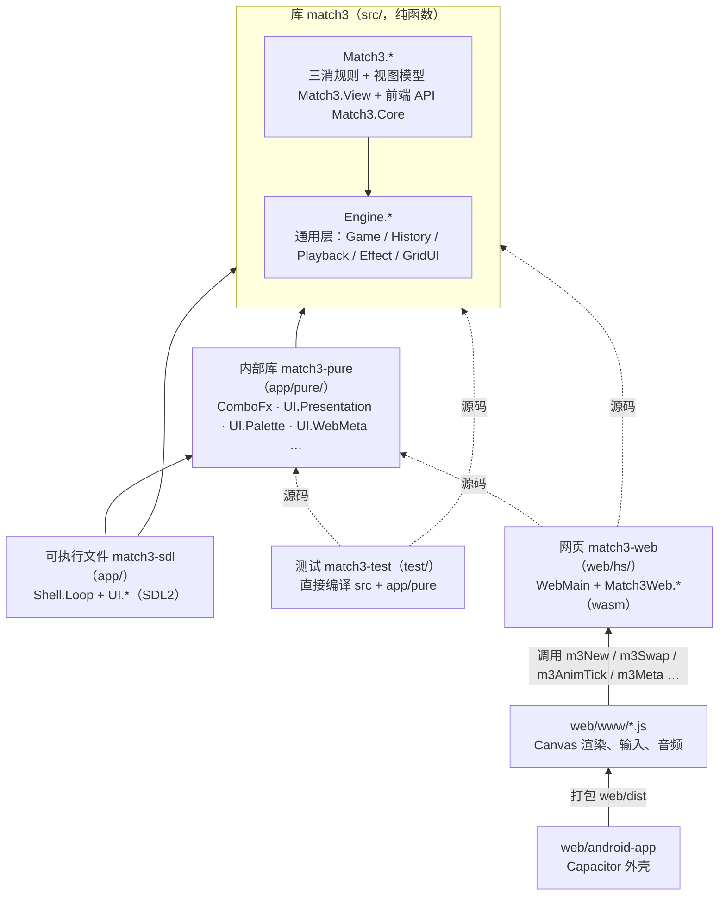
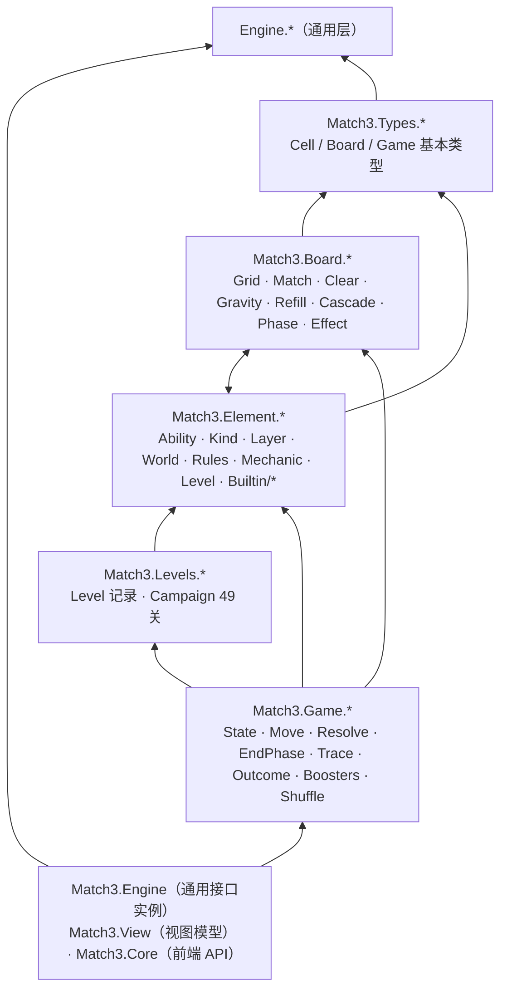

# 01 总览与阅读路线

> 本章回答三个问题：代码放在哪？由哪几个构建组件组成、谁依赖谁？建议按什么顺序读？
> 模块逐个的说明在 [architecture.md「模块地图」](../architecture.md#模块地图)，本章不重复。

## 1. 一句话

这是一个**纯函数规则核心 + 两个前端**的三消游戏。规则全部写在 `src/`（Haskell，无 IO），
桌面版用 SDL2 画（`app/`），网页版把同一份 `src/` 用 GHC 的 wasm 后端编进浏览器、再由 JS 画（`web/`）。
安卓版是网页版套 Capacitor 外壳（`web/android-app/`）。两个前端共用的「纯表现逻辑」（回放时间线、表现表、调色板）
单独放在 `app/pure/`。

## 2. 仓库结构

| 目录 / 文件 | 内容 | 规模（`a045194`） |
|-------------|------|------|
| `src/Engine/` | 与具体游戏无关的通用层：`Game` / `Step` 接口、撤销历史、播放器时钟、通用效果、网格 UI 几何、惰性流、手写光学 | 7 个模块 |
| `src/Match3/` | 三消规则核心：类型（`Types/`）、盘面算法（`Board/`）、元素框架（`Element/`）、一步结算（`Game/`）、关卡（`Levels/`），以及视图模型、目标、计数等顶层模块 | 69 个模块 |
| `app/` | 桌面前端：`Main.hs`、通用 SDL 外壳 `Shell/Loop.hs`、三消插件 `UI/*`、贴图 `Art.hs` | 28 个模块（不含 `app/pure`） |
| `app/pure/` | 不依赖 SDL 的纯前端模块：`ComboFx`（回放阶段机）、`UI.Presentation`（表现表）、`UI.Palette`、`UI.CellFace`、`UI.WebMeta`、`UI.Sound`、`UI.GoalIcon`、`UI.MoveText` | 8 个模块 |
| `test/` | `stack test` 套件：入口 `Spec.hs`、各功能模块 `Spec/*.hs`、金标准 `golden/` | 476 个用例 |
| `web/hs/` | 网页版的 Haskell 包装：`WebMain.hs`（JS 导出）、`Match3Web/{Api,Anim,Json}.hs` | 4 个模块 |
| `web/www/` | 网页 JS / HTML：`main.js`、`render.js`、`cells.js`、`hud.js`、`layout.js`、`audio.js`、`art.js`、`guide.js` | 约 1.7k 行 JS |
| `web/test/` | 原生 vs wasm 一致性（`Parity.hs`、`AnimParity.hs`、`parity.sh`、`node-*.mjs`）与无头浏览器 e2e（`e2e.mjs`） | 手动运行 |
| `web/android-app/` | Capacitor 安卓工程 | 见 [android.md](../android.md) |
| `web/dist/` | 已提交的可部署构建产物（只在部署前重建，平时不提交） | — |
| `assets/` | 桌面贴图图集（`atlas*.bmp` + `atlas.txt`）、背景、音效 `sfx/` | — |
| `tools/` | `verify.sh`（`make verify`）、`gen_assets.py`（生成贴图） | — |
| `package.yaml` / `match3.cabal` | hpack 包描述（`match3.cabal` 由 hpack 生成） | — |
| `web/match3-web.cabal` | 网页 wasm 包描述（直接引用 `../src` 与 `../app/pure` 源码） | — |
| `Makefile` | 常用任务入口（`make help` 列出全部），见 [web.md §3.1](../web.md#31-make-目标) | — |

源码行数（`wc -l`）：`src/` 约 11.9k 行、`app/` 约 6.6k 行（含 `app/pure`）、`test/` 约 18.4k 行、`web/hs/` 约 0.65k 行。
测试代码比产品代码多，是这个仓库的一个特点（见 [07 测试体系](07-测试体系.md)）。

## 3. 构建组件

`package.yaml` 里有 4 个组件，`web/match3-web.cabal` 里另有 1 个：

| 组件 | 定义位置 | 源码目录 | 依赖 | 作用 |
|------|----------|----------|------|------|
| 库 `match3` | `package.yaml` 的 `library` | `src` | base、random、array、containers、transformers（**不含 SDL**） | 规则核心与通用层 |
| 内部库 `match3-pure` | `package.yaml` 的 `internal-libraries` | `app/pure` | `match3` | 桌面 / 网页 / 测试共用的纯表现逻辑（可扩展性 P2 `32b772b` 做成内部库） |
| 可执行文件 `match3-sdl` | `package.yaml` 的 `executables` | `app` | `match3`、`match3-pure`、`sdl2` 等 | 桌面版（`stack run match3-sdl`） |
| 测试 `match3-test` | `package.yaml` 的 `tests` | `test`、`test/golden`、`app/pure`、**`src`** | tasty、QuickCheck 等 | `stack test`；**直接编译 `src` 和 `app/pure`**，不经库（`9c9c0b9`，为了让改库导出时少重编） |
| 网页 `match3-web` | `web/match3-web.cabal` | `web/hs`、`../src`、`../app/pure` | ghc-wasm 工具链 | `web/build.sh` 产出 `web/dist/match3-web.wasm` |

注意两点：

- 测试和网页都**直接编译源码目录**，而不是依赖 `match3` 库。所以 `web/match3-web.cabal` 的模块清单必须和
  `package.yaml` 的 `library.exposed-modules` 一致（文件头注释写明；`web/build.sh` 第 1 步比对两份清单，不一致时打警告）。
- `app/pure` 被编译三次：作为 `match3-pure` 库（给桌面）、作为测试的源码目录、作为网页包的源码目录。
  它因此不能 import 任何 SDL 模块（桌面专用模块都在 `app/UI/`、`app/Shell/`、`app/Art.hs`）。

## 4. 依赖方向

### 4.1 组件之间

实线 = 包依赖，虚线 = 直接编译对方的源码目录。箭头方向 = 「依赖于」。

### 4.2 库内部

库内部的分层图在 [architecture.md「分层」](../architecture.md#分层)（ASCII 图 + 硬约束清单）。要点：

- **`Engine.*` 不 import 任何 `Match3` 模块**，`app/Shell/Loop.hs` 也不 import（`test/Spec/Engine.hs` 的 `engine_layer_is_game_agnostic` 扫描 `src/Engine`、`app/Shell` 与 `test/Toy.hs` 的 import）。
  三消是通用接口的第一个实现（`src/Match3/Engine.hs` 的 `match3Game`），见 [architecture.md「多游戏接口」](../architecture.md#多游戏接口)。
- 前端只经 `Match3.Core`（前端 API，只再导出、每个名字都有前端在用）、`Match3.Engine`（通用接口实例）和 `Match3.View`（视图模型）取规则层的东西。
- 目录级看，`Match3.Board` 与 `Match3.Element` 互相引用（例如 `Board.Cascade` 查元素世界，`Element.Mechanic` 用 `Board.Grid` 的 `MBoard`），
  但**模块级无环**（没有 `.hs-boot`）。读代码时把它们当作同一层的两半：`Board` 是盘面算法，`Element` 是「格子里每种东西的规则」。

（`T → Eng`：`Types` 只用到 `Engine.Optics` 的透镜类型，见 `src/Match3/Types/{Cell,Body,Overlay,Optics}.hs` 的 import；`Engine.Game` / `Engine.History` 这些通用接口由 `Match3.Engine` 实现。）

## 5. 建议的阅读顺序

按「先数据、再流程、后扩展和表现」的顺序。每步给出要打开的文件和对应章节：

| 步 | 读什么 | 文件 | 本组文档 / 原文 |
|---:|--------|------|-----------------|
| 1 | 玩家视角：有哪些机制、49 关长什么样 | `README.md`、`docs/domain.md` | [README](../../README.md)、[domain.md](../domain.md) |
| 2 | 基本类型：格子、盘面、状态、结局 | `src/Match3/Types/{Cell,Board,Game}.hs`、`src/Match3/Game/State.hs` | [02 核心数据模型](02-核心数据模型.md) |
| 3 | 通用接口与三消实例 | `src/Engine/Game.hs`、`src/Match3/Engine.hs` | [02 §6](02-核心数据模型.md#8-通用接口与三消实例)、[architecture.md「多游戏接口」](../architecture.md#多游戏接口) |
| 4 | 一步棋的结算 | `src/Match3/Game/Move.hs` → `Resolve.hs` → `Board/Cascade.hs` → `Board/Clear.hs` → `Game/EndPhase.hs` | [03 生命周期](03-一步棋的生命周期.md)、[rules-pipeline.md](../rules-pipeline.md) |
| 5 | 元素框架 | `src/Match3/Element/{Ability,Kind,Layer,World,Rules,Mechanic,Level}.hs`、`Element/Builtin/*.hs` | [04 元素框架](04-元素框架.md)、[architecture.md「元素框架与事件」](../architecture.md#元素框架与事件) |
| 6 | 回放与表现 | `src/Match3/Game/Trace.hs`、`app/pure/ComboFx.hs`、`app/pure/UI/Presentation.hs` | [06 效果 / 动画 / 音效](06-效果动画音效与撤销.md)、[ui-art.md「连击表现」](../ui-art.md#连击表现逐轮回放) |
| 7 | 桌面前端 | `app/Main.hs` → `app/Shell/Loop.hs` → `app/UI/Plugin.hs` → `UI/Input.hs` / `UI/Actions.hs` / `UI/Playback.hs` / `UI/Draw.hs` | [05 前端](05-前端.md)、[ui-controls.md](../ui-controls.md) |
| 8 | 网页前端 | `web/hs/WebMain.hs` → `Match3Web/Api.hs` / `Anim.hs` → `web/www/main.js` | [05 §4](05-前端.md#4-网页版web)、[web.md](../web.md) |
| 9 | 测试 | `test/Spec.hs`、`test/Spec/Support.hs`、`test/golden/Golden.hs` | [07 测试体系](07-测试体系.md)、[testing.md](../testing.md) |
| 10 | 为什么是现在这样 | `git log`、`docs/refactor-2026-09.md`、`docs/backlog.md` | [08 演进史](08-演进史.md) |
| 11 | 进阶：Haskell 写法 | `docs/haskell-features/01–09` | 各篇开头有动机与前后对比 |

## 6. 两个容易误解的地方

1. **「规则」与「表现」严格分开**：规则层一步棋只返回数据（新状态 + `Outcome` + 回放脚本 `MoveTrace` + 效果事件 `[Event]`），
   不播动画、不发声（`app/UI/Audio.hs` 头注释：「引擎不发声」）。动画、音效全在前端，由同一份数据驱动。
2. **网页版没有第二份规则**：浏览器里跑的就是 `src/` 编出来的 wasm，JS 只做渲染和输入。连回放时间线也在 wasm 里
   （`app/pure/ComboFx.hs` 编进 wasm，`m3AnimTick` 每帧推进一次），所以网页与桌面逐帧一致（`make anim-parity` 检查）。
