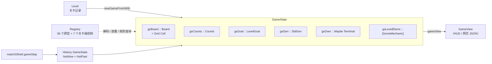

# 02 核心数据模型

> 本章按「格子 → 盘面 → 一局状态 → 关卡 → 结局 → 元素 → 通用接口 → 视图」的顺序，列出规则层的核心类型，
> 每个类型给出文件位置和签名摘录（只留字段，省略注释）。词条的中文含义见 [domain.md](../domain.md)，
> 类型拆分的来历见 [refactor-2026-09.md](../refactor-2026-09.md) 第 4–7 刀。

## 1. 格子：`Cell`

`src/Match3/Types/Cell.hs`

```haskell
data GemKind = Normal | LineH | LineV | Bomb | Rainbow                    -- :35
data CellOverlay = Grass | Vine | Choco | Fog Int | Chain Int
                 | Freeze Int | Curtain Int | Steam                        -- :46
data CellContents                                                          -- :58
  = Gem Color GemKind Int (Maybe CellOverlay)   -- 颜色、特殊块种类、冰层数、叠层
  | Stone Int | Chest Int | Honey Int | Balloon Color | Cookie | Cake Int
  | MagicHat | Maker Color Int | Snail Int Int | Safe Int | Flip Color Color
  | Surprise | Bottle Color | TimeSpirit | Countdown Color Int
  | Custom ElementName CustomState              -- 扩展元素：名字 + 一个 Int 状态
type Cell = CellContents                                                   -- :79
```

读法：

- **一个格子 = 本体 + 至多一层冰 + 至多一个叠层**。冰和叠层只能挂在宝石上（`Gem` 的第 3、4 个字段）。
  这三层在元素框架里分别对应「本体元素」和「修饰器」（见 [04 §2](04-元素框架.md#2-三类元素)）。
- 早期机制各占一个内置构造器（`Stone` … `Countdown`）；2026-09-30 以后的新元素（魔法石、毛球、雪怪、变色龙、气泡等）
  一律用 `Custom 名字 状态`，不再加构造器。`CustomState` 只装一个 `Int`（`src/Match3/Types/Name.hs:33`），
  多字段状态要编码进这个整数（例如雪怪把满血、血量、召唤计数、象限四个字段打包成一个整数，见 `src/Match3/Element/Builtin/Obstacle.hs` 的 `snowBossArch` 与 `decodeBoss`）。
- 名字是 newtype：`newtype ElementName = ElementName { unElementName :: String }`（`Name.hs:29`），
  它是注册表的键，也是关卡放置表、计数键、贴图的键。

格子以下还有一层**地面层**（果冻、魔法地格），不在 `Cell` 里，而是关卡级状态：
`type Ground = [(Pos, (ElementName, Int))]`（`src/Match3/Types/Game.hs:68`）。

## 2. 盘面：`Board`、`MBoard`、`Stage p`

`src/Match3/Types/Board.hs`、`src/Match3/Board/Grid.hs`、`src/Match3/Board/Phase.hs`

```haskell
type Pos = (Int, Int)                       -- (行, 列)，Board.hs:66
data Dir = North | South | West | East      -- Board.hs:73
newtype Grid a = Grid (Array Pos a)         -- Board.hs:123
type Board = Grid Cell                      -- Board.hs:128
type MBoard = Array Pos (Maybe Cell)        -- Grid.hs:60，Nothing = 空洞（消除后、补子前）

data Phase = Full | Swapped | Cleared | Fallen          -- Phase.hs:64
data Stage (p :: Phase) where                           -- Phase.hs:74
  AtFull    :: Board  -> Stage 'Full
  AtSwapped :: Board  -> Stage 'Swapped
  AtCleared :: MBoard -> Stage 'Cleared
  AtFallen  :: MBoard -> Stage 'Fallen
```

- 盘面是二维数组，`getCell` O(1)（第三刀 `1be75a1` 从行列表改为数组）。行列数由数组边界决定，
  可以不是 8×8（第 49 关是 6×9，`20455d3`）。
- `Stage p` 给一轮里的盘面贴阶段标签：消除得到 `'Cleared`，下落得到 `'Fallen`，补子回到 `'Full`。
  「没下落就补子」之类的错位编译不过。这是 Haskell 特性第 1 项，详见 [haskell-features/01-类型层.md](../haskell-features/01-类型层.md)。

## 3. 一局状态：`GameState`

`src/Match3/Game/State.hs:62`

```haskell
data GameState = GameState
  { gsBoard       :: Board
  , gsScore       :: Score              -- type Score = Int
  , gsMoves       :: MovesLeft          -- type MovesLeft = Int
  , gsGoal        :: LevelGoal
  , gsCounts      :: Counts             -- 所有计数（含颜色袋），见 §4
  , gsGen         :: StdGen             -- 随机数只来自这里
  , gsOver        :: Maybe Terminal     -- 终局；Nothing = 还能走
  , gsLevel       :: Int
  , gsHint        :: Maybe (Pos, Pos)
  , gsCombo       :: Int                -- 上一步的最大连锁轮数
  , gsShuffled    :: Bool               -- 上一步是否触发了自动洗牌
  , gsHammers, gsFreeSwaps, gsCrossClears :: Int   -- 三种道具次数
  , gsLastCleared :: [Pos]
  , gsDaily       :: Bool
  , gsLevelElems  :: [SomeMechanic]     -- 关卡级机制（飞碟 / 皮带 / 传送门 / 地毯 / 地面层 / 规则开关 / 掉落口）
  }
```

要点：

- **整局状态是一个不可变值**。所有操作都是 `GameState -> GameState` 的纯函数，前端只读。
- **随机性只来自 `gsGen`**。补子、开局、洗牌都从它取数，所以同一种子、同一串操作必然得到同一局面——金标准和网页一致性测试都靠这一点。
- **撤销历史不在 `GameState` 里**，而在通用层 `Engine.History`（段 3，`0d60a7d`），见 [06 §5](06-效果动画音效与撤销.md#5-撤销历史)。
- 皮带、飞碟等关卡级状态原来是独立字段，第 7a 刀（`ac015c0`）收进 `gsLevelElems`；
  `gsBelts` / `gsUfos` / `gsGround` 等现在是从它派生的读数（`State.hs:88-105`），另有对应的透镜（`gsUfosL` 等，`State.hs:153` 起）。
- 每步给前端的「边沿特效」是 `MoveFx { fxCombo, fxCleared }`（`State.hs:279`），由 `moveFx before after outcome` 算出；
  被拒的一步返回空，保证不会重播上一步的特效。

## 4. 计数与目标：`Counts`、`LevelGoal`

`src/Match3/Counts.hs`、`src/Match3/Goal.hs`

```haskell
data CounterKey                                   -- Counts.hs:30
  = CountStones | CountChests | CountHoney | CountBalloons | CountCookies | CountCakes
  | CountSafes | CountSpirits
  | CountNamed ElementName      -- 扩展元素按名字计数
  | CountUfo | CountCarpets
  | CountColor Color            -- 各色清除数（颜色袋）
newtype Counts = Counts (M.Map CounterKey Int)    -- Counts.hs:40，稀疏

data Meter = MeterScore | MeterCount CounterKey   -- Goal.hs:31
data Quota = Quota { quotaMeter :: Meter, quotaTarget :: Int }   -- Goal.hs:35
newtype LevelGoal = LevelGoal { goalQuotas :: [Quota] }          -- Goal.hs:41
```

- 第 4 刀（`47485c3`）把 10 个计数字段合成 `Counts`；第 5 刀（`024d421`）把目标变成数据：
  **目标 = 若干「计数键 + 目标值」**，全部达到即过关。前端按 `goalView`（`Goal.hs:69`）分派画法。
- 新元素要做成目标时，用 `CountNamed "名字"` 计数，不用改 `CounterKey`。

## 5. 关卡与战役：`Level`、`Campaign`

`src/Match3/Levels/Level.hs:36`、`src/Match3/Levels/Campaign.hs`

```haskell
data Level = Level
  { lvlIndex :: Int, lvlName :: String, lvlMoves :: MovesLeft, lvlGoal :: LevelGoal
  , lvlPlacements :: [Placement]   -- 放置表：Place 元素名 [参数] [坐标]
  , lvlBelts :: [Belt], lvlPortals :: [(Pos, Pos)], lvlUfos :: [Ufo], lvlCarpets :: [Pos]
  , lvlGround :: Ground
  , lvlRules :: [ElementName]      -- 规则开关，如 "bomb_shapes"、"rainbow_combos"
  , lvlDrops :: [DropSpec]         -- 掉落口（新玩法 6）
  , lvlRows, lvlCols :: Int        -- 盘面尺寸
  }
```

- 49 关都在 `allLevels :: [Level]`（`Campaign.hs:42`）里，按下标取用 `lookupLevel`（`Campaign.hs:22`）；`levelCount`（`Campaign.hs:30`）= 49。
- 放置表 `Placement = Place ElementName [Arg] [Pos]`（`src/Match3/Element/Types.hs:213`）按元素名经注册表落格，所以关卡数据不点名构造器。
- 关卡数据有一个 Applicative 校验 `validateLevel :: Level -> Validation [LevelIssue] Level`（`Level.hs:177`），一次报全所有问题（Haskell 特性第 8 项，见 [haskell-features/08-数据边界.md](../haskell-features/08-数据边界.md)）。
- 开局：`Match3.Game.Level` 的 `newGameFromWith`（`src/Match3/Game/Level.hs:102`）按关卡记录的行列数生成随机可玩盘面（`randomPlayableBoardSized`）、按放置表放装饰、按目标补齐收集物（有掉落口的关卡跳过）、初始化关卡级元素（`Element.Level.startLevelsWith`），最后 `ensurePlayableWith` 保证有可走步；三种道具开局次数是 2 / 1 / 1。

## 6. 结局：`Outcome` 与 `Terminal`

`src/Match3/Types/Game.hs`

```haskell
data Outcome                     -- :30，一步的结果
  = InvalidSwap | NoMatch        -- 被拒（越界 / 不相邻；交换后无匹配）
  | MoveApplied Score            -- 走完未结束（本步得分）
  | Won Score | Lost Score | LevelClear Score Int   -- 终局（LevelClear 带下一关下标）

data Terminal                    -- :42，终局状态，存在 gsOver 里
  = TWon Score | TLost Score | TLevelClear Score Int
terminalOf   :: Outcome -> Maybe Terminal   -- :49
fromTerminal :: Terminal -> Outcome         -- :59
```

`Terminal` 是审计第 7 项（`0e408eb`）从 `Outcome` 里分出来的：`gsOver` 的类型从「任意 `Outcome`」收窄到「只能是终局」，
非终局值存不进去。对外打印（金标准、网页 JSON）仍先换回 `Outcome`，文本不变。

胜负由 `Game.Outcome.decideOutcome`（`src/Match3/Game/Outcome.hs:37`）给出：目标满足 → 每日挑战 `Won`，战役还有下一关 `LevelClear`，否则 `Won`；
步数 ≤ 0 → `Lost`；其余 `MoveApplied`。之后再经胜负节拍（`AnswerJudge`）交关卡级机制复核（可扩展性 P2，见 [03 §2.6](03-一步棋的生命周期.md#26-胜负判定)）。

## 7. 元素：原型、组件、system 与注册表（ECS）

元素框架是规则层的骨架，[04 元素框架](04-元素框架.md) 专章讲。这里只列类型（ECS 重写 ecs-1…7 之后，没有元素类型类）：

`src/Match3/ECS/Component.hs`（纯数据组件）

```haskell
data Match   = Match   { mColor, mBlockMatch, mBlockSwap, mHintable }       -- 颜色 / 挡匹配 / 挡交换 / 可提示
data OnHit   = OnHit   { hStrike, hFires, hBlast }                          -- 受击：Strike、点火、爆炸范围
data Physics = Physics { pFixed, pFalls, pPortal, pRecolor, pPush, pKeepShuffle, pDrains }
data Tally   = Tally   { tCounter, tDiffWeight, tVacatesCarpet }            -- 计数
data Face    = Face    { fBase, fExtras }                                   -- 网页 JSON
data Hud = Hud { hudLabel, hudLoseHint, hudGoalIcon, hudShowsHp };  data DiffCount = DiffCount { dcKey, dcBonus }
data Wear = Durable | WearsOut;  data Widen = WidenRing                     -- 地面层组件
-- 组件值：gemMatch / obstacleMatch、gemHit / immuneHit / chipHit、gemPhysics / obstaclePhysics / fixedPhysics
```

`src/Match3/ECS/Archetype.hs`、`Cover.hs`（原型）

```haskell
data Column s = Column { colGet :: Cell -> Maybe s, colPut :: s -> Cell }
data Archetype s = Archetype { aName, aColumn, aSpawn, aMatch, aHit, aPhysics, aTally, aFace, aDiff, aHud, aSystems }
data Row = forall s. Row (Archetype s) s                 -- 解码出的一行；rowGet @Match / rowProbe
data Cover l = Cover { cvName, cvColumn, cvSpawn, cvShield :: l -> Shield l, cvSystems }   -- 叠层
data Entity s = Entity { footprint, partNo, hitPoints, withHp }   -- 多格实体（雪怪）
```

`src/Match3/Element/Kind.hs`、`Mechanic.hs`

```haskell
data GroundArch = GroundArch { groundName, groundWear, groundCounter, groundWiden, groundHud }   -- 地面层（内置 jelly / magicGround）
data Mechanic m = Mechanic { mechName, mechCore, mechView :: m -> LevelView, mechSystems :: [MechSys m] }
data SomeMechanic = forall m. (Typeable m, Eq m, Show m) => SomeMechanic (Mechanic m) m
```

`src/Match3/ECS/System.hs`、`Stage.hs`（system 与阶段世界）

```haskell
newtype System w = System { runSystem :: w -> w }        -- a <> b = 先 a 后 b
data SysDef = SysNear Int (System NearWorld) | SysEnd EndSys | SysSwap SwapSys | SysOpen (System OpenWorld)
-- 一轮消除 WaveWorld / waveSystems（Board/Clear.hs），步尾 StepWorld / stepSystems（Game/Resolve.hs）
```

注册表 `src/Match3/ECS/Registry.hs`：

```haskell
data Def = KindDef SomeArchetype | LayerDef SomeCover | GroundDef GroundArch | InertDef ElementName
kindDef :: Archetype s -> Def                 -- 写法：kindDef stoneArch；叠层 coverDef iceCover；地面层 groundDef jelly
mkRegistry  :: [Def] -> Registry              -- 有序原型列表 → 解码缓存 + 排好序的调度表
mkRegistryChecked :: [Def] -> Either [RegistryError] Registry   -- DuplicateName / SharedCell / Unclaimed
newtype StepCtx = StepCtx { stepWiden :: [(Pos, Widen)] }       -- 本步上下文（魔法地格扩爆格）
```

内置注册表 `defaultRegistry`（`src/Match3/Element/Builtin.hs`）= `mkRegistry builtinDefs`（36 项）再注册 7 个关卡级机制 `builtinMechanics`、换上内置形状表与组合表。
规则层几乎所有入口都有一个 `…With :: Registry -> …` 版本（`resolveSwapWith`、`trySwapWith`、`ensurePlayableWith` …），测试专用元素经它接入。

## 8. 通用接口与三消实例

`src/Engine/Game.hs`、`src/Match3/Engine.hs`

```haskell
type Seed = Int                                              -- Engine/Game.hs:31
data Step s e o r = Step { stepState :: s, stepEvents :: [e], stepOutcome :: Maybe o
                         , stepAccepted :: Bool, stepReport :: Maybe r }      -- :34
data Game cfg s a e o r = Game                               -- :43
  { gameName :: String, gameNew :: cfg -> Seed -> s, gameStep :: s -> a -> Step s e o r
  , gameOutcome :: s -> Maybe o, gameActions :: s -> [a]
  , gameStatus :: s -> [(String, Int)], gameEffect :: e -> Effect }

-- 三消的取值（Match3/Engine.hs）
data Action = Swap Pos Pos | Hammer Pos | FreeSwap Pos Pos | CrossClear Pos | Hint | Shuffle   -- :57
data Setup  = Campaign Int | CustomLevel GameConfig | Daily Year Month Day | LevelSetup Level   -- :67
data Played = Played { pdState :: GameState, pdOutcome :: Maybe Outcome, pdTrace :: MoveTrace
                     , pdFx :: MoveFx, pdEvents :: [Event], pdHint :: Maybe (Pos, Pos)
                     , pdAccepted :: Bool }                  -- :75，整步报告
match3Game  :: Game Setup GameState Action Event Terminal Played                       -- :116
match3Shell :: Game Setup (History GameState) (Undoable Action) Event Terminal Played  -- :172
```

- 通用接口是**函数记录**（record of functions），不是类型类：一种游戏 = 一个 `Game` 值。取舍见
  [architecture.md「多游戏接口」](../architecture.md#多游戏接口)。
- 两个前端都只调 `match3Shell`（= `withHistory match3History match3Game`，带撤销）的 `gameStep`，再从 `stepReport` 取 `Played` 里的回放脚本和事件。
- `LevelSetup Level` 是可扩展性 P2（`98bd6b5`）加的：可以用任意完整的关卡记录开局，不必进战役表。

## 9. 视图模型：`Match3.View`

`src/Match3/View.hs`

```haskell
data GameView = GameView                       -- :120
  { gvLevel, gvLevelIndex :: Int, gvLevelName, gvRawName :: String, gvDaily :: Bool
  , gvRules :: [String], gvScore, gvMoves :: Int, gvBoosters :: Boosters
  , gvCombo :: Int, gvShuffled :: Bool, gvOver :: Maybe Terminal, gvStatus :: PlayStatus
  , gvGoal :: GoalInfo, gvBoss :: Maybe BossView, gvBoard :: BoardView }
gameView   :: GameState -> GameView                          -- :140
cellFace   :: Cell -> (String, [(String, CellField)])        -- 单格描述（网页 JSON 用；来自元素 view 的 fBase）
cellExtras :: Cell -> [(String, FaceValue)]                  -- 元素自带显示字段（来自元素 view 的 fExtras）
```

第 11 刀（`8f153c7`）加的视图模型：HUD、标题、进度点、目标标签、单格描述都从 `GameState` 推出，
网页 JSON 读这一份，不自己解释 `GameState`。详见 [architecture.md「视图模型」](../architecture.md#视图模型第-11-刀)。

## 10. 一张图看关系


