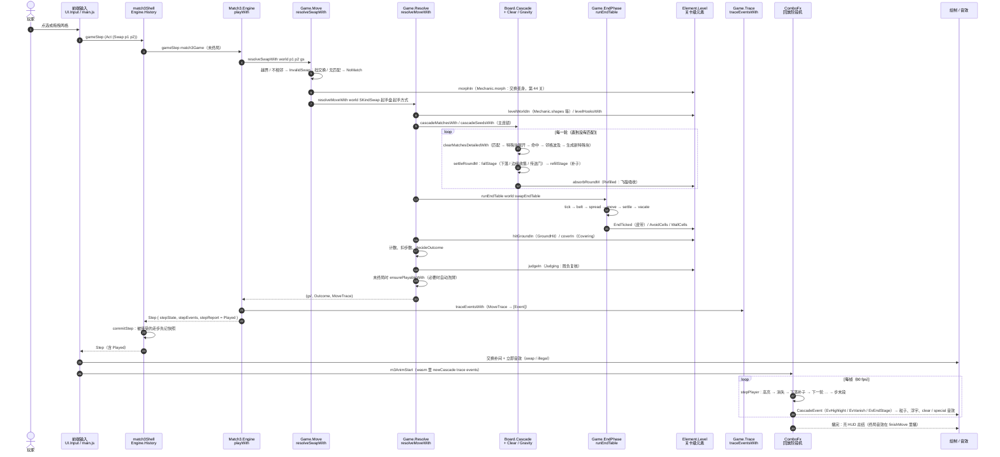

# 03 一步棋的完整生命周期

> 本章跟着「玩家把两颗宝石交换一下」走完全程：输入 → 动作 → 规则结算 → 胜负 → 效果事件 → 动画与音效。
> 规则内部每个阶段「谁先谁后、为什么」的细节在 [rules-pipeline.md](../rules-pipeline.md)；本章侧重**把规则层和两个前端连起来**，
> 并给出每一步对应的模块和函数。

## 1. 时序图

下图是一次被接受的玩家交换（`Swap p1 p2`）。前端（网页，唯一前端）只管最左边（输入）和最右边（绘制 / 发声），中间全是 Haskell 核心（编进 wasm，与原生测试同一份代码）。



## 2. 逐步说明

### 2.1 输入 → `Action`

| 前端 | 入口 | 走到规则层的那一行 |
|------|------|------|
| 网页 | `web/www/main.js`：`pointerdown` 点选、`pointermove` 拖过 0.4 格 → `doSwap(a, b)`（`:98`） | `X.m3Swap(r1,c1,r2,c2)` → `web/hs/WebMain.hs` 的 `jsSwap`（`:53`）→ `withGame` → `Match3Web.Api.apiSwapAnim` → `runStep`（`web/hs/Match3Web/Api.hs:72`）= `gameStep match3Shell h act` |

前端只调通用接口的 `gameStep`，动作类型是 `Undoable Action`（`Act (Swap p1 p2)` 或 `Undo`）。
播放期间输入被锁（`main.js` 的 `busy`），点击只用来加速回放，见 [ui-controls.md「播放锁定」](../ui-controls.md#播放锁定)。

### 2.2 通用接口 → 三消实例

1. `Engine.History.withHistory`（`src/Engine/History.hs:73`）：`Act a` 交给内层游戏；`Undo` 由本层处理（见 [06 §5](06-效果动画音效与撤销.md#5-撤销历史)）。
2. `Match3.Engine.match3GameWith`（`src/Match3/Engine.hs:121`）的 `gameStep`：已终局时只接受 `Hint`；否则调 `playWith`。
3. `playWith`（`Engine.hs:94`）按动作分派：`Swap` → `resolveSwapWith`；`Hammer` / `FreeSwap` / `CrossClear` → `Game.Boosters` 的三个 `resolve*With`；`Hint` / `Shuffle` 不走结算。
   走步动作结束后，它用 `moveFx` 算边沿特效、用 `traceEventsWith` 展开效果事件，打包成 `Played`。

### 2.3 交换校验与起手方式（`Game.Move`）

`resolveSwapWith`（`src/Match3/Game/Move.hs:36`）按顺序检查：

| 条件 | 结果 | 状态变化 |
|------|------|----------|
| 已终局 | 原结局 | 不变 |
| 越界或不相邻 | `InvalidSwap` | 清掉本步特效字段（`clearMoveFx`） |
| 任一格挡交换（`World.swapBlockedWith`，`src/Match3/Element/World.hs:425`） | `NoMatch` | `rejectMove`，不扣步 |
| 没有变身、没有成对规则、交换后也没有三连 | `NoMatch` | 同上 |
| 其余 | 进入公共结算 | — |

起手方式 `Opening`（GADT，`src/Match3/Game/Resolve.hs:106`，按起手盘面的阶段索引）有三种：

- `OpenMatch`：普通三消。
- `OpenSeeds`：成对交换规则给出种子（彩虹 × 宝石、特殊 × 特殊组合，`World.swapOpeningWith`，`World.hs:604`）。
- `OpenMorph`：关卡级元素回复 `Morphing`（第 44 关「魔力鸟组合增强」），先变身再按种子起手。

道具（锤子 / 十字 / 自由交换）在 `src/Match3/Game/Boosters.hs` 里做自己的校验，然后进同一个 `resolveMoveWith`，只是起手方式和步末表不同。

### 2.4 主连锁：匹配 → 消除与特殊块 → 重力补子 → 连锁

`resolveMoveWith`（`src/Match3/Game/Resolve.hs:135`）先取本关的元素世界 `levelWorldIn`（关卡级机制可以换特殊块形状表，如第 41 关的 L / T 形炸弹）
和钩子 `levelHooksWith`，再按起手方式进 `Match3.Board.Cascade`：

| 一轮里的步骤 | 函数 | 文件 |
|--------------|------|------|
| 找匹配（≥3 同色连线） | `findMatchRunsWith` / `hasAnyMatchWith` | `src/Match3/Board/Match.hs:75` / `:99` |
| 消除流水线（唯一实现） | `clearWaveWith`：① 特殊块展开 `expandSpecialsWith` ② 直接命中按层结算（冰 → 叠层 → 本体）③ 彩蛋开启 ④ 真消除格的叠层随格清掉 ⑤ 按 `arOrder` 跑邻格波及 ⑥ 挖空并放新特殊块 `spawnSpecialsWith`（查形状表） | `src/Match3/Board/Clear.hs:102`（注释里列了这 6 步）、`:38`、`:50` |
| 下落、边缘收集、传送门 | `fallStage` → `settleDrainWith`（重力 `applyGravityWith`、底行收饼干、钩子 `onSettle` = 传送门） | `src/Match3/Board/Phase.hs:124`、`src/Match3/Board/Gravity.hs:132` / `:64` |
| 补子 | `refillStage` → `refillWith`（补子策略 `RefillPolicy`，可被关卡级元素经 `Refilling` 换掉，如掉落口） | `Phase.hs:130`、`src/Match3/Board/Refill.hs:49` |
| 一轮 = 下落 + 补子 | `settleRoundM` | `src/Match3/Board/Cascade.hs:162` |
| 整轮吸收（飞碟） | `absorbRoundM`（钩子 `onAbsorb`，关卡级元素回复 `Refilled`） | `Cascade.hs:181` |
| 循环直到没有匹配 | `cascadeMatchesFromM` | `Cascade.hs:219` |

几个关键设计：

- **结算与回放来自同一次计算**：每轮在算计数的同时发出一条 `CascadeWave`（`src/Match3/Board/Wave.hs:14`：消除前盘面、清除格、挖空盘、补子后盘面、本轮得分），
  所以回放脚本和结算结果天然一致（第二刀 2a `31275da` 的「单一实现」）。
- **阶段有类型**：一轮里盘面依次是 `Stage 'Full → 'Cleared → 'Fallen → 'Full`（`clearStage` / `fallStage` / `refillStage`），调换顺序编译不过。
- **效果可替换**：连锁核心写成只依赖能力类 `MonadCascade` 的程序（补子随机数、关卡钩子、发出回放），对外的 `…With` 入口用纯解释器跑，测试可换追踪解释器拿事件日志（Haskell 特性第 3 项，[03-效果与架构.md](../haskell-features/03-效果与架构.md)）。
- **随机数只在补子时消耗**，顺序固定；金标准锁住了这个顺序。

### 2.5 步末阶段

主连锁结束后，`runEndTable`（`src/Match3/Game/EndPhase.hs:85`）按表执行步末各阶段。交换用 `swapEndTable`，道具用 `boosterEndTable`（`Resolve.hs` 的 `endTableFor`，`:226`）：

```text
玩家交换：tick → belt → spread → move → settle → vacate
道具    ：vacate → spread → settle
```

| 阶段 | 做什么 | 规则从哪来 |
|------|--------|-----------|
| `tick`（`PhaseTick`） | 倒计时减一、归零引爆；魔法石充能发射；引爆接一段新连锁 | 元素步末规则：倒计时 `tickRule 10`、魔法石 `tickRule 20`（`src/Match3/Element/Builtin/Actor.hs:85`、`Obstacle.hs:169`） |
| `belt` | 皮带移位，接皮带后连锁 | 关卡级元素回复 `EndTicked`（`Element.Level.beltShiftIn`） |
| `spread`（`PhaseSpread`） | 藤 → 巧克力 → 蒸汽蔓延 | 修饰器步末规则 `overlaySpreadRule 10 / 20 / 30`（`src/Match3/Element/Builtin/Layer.hs:85`、`:96`、`:152`） |
| `move`（`PhaseMove`） | 蜗牛爬行、毛球跳格、雪怪召唤、变色龙换色 | 元素步末规则 `moveRule 10 / 20 / 30 / 40`（`Actor.hs:67`、`:100`，`Obstacle.hs:243`，`Collectible.hs:124`）；避让格 / 墙问关卡级机制（`avoidCells` / `wallCells` 节拍） |
| `settle` | 步末规则声明的空洞挖空 → 沉降补子 → 成消再连锁 | `EndRule.erHoles`（内置元素都为空） |
| `vacate` | 记下地毯「腾空」比较用的盘面 | — |

注意：**格子里的元素（巧克力、藤蔓、雪怪……）在步末不是靠节拍驱动的**，而是元素世界里按 `(阶段, 顺序)` 排好的步末规则 `EndRule`（`src/Match3/Element/Types.hs:96`；藤 / 巧 / 蒸汽的蔓延由 `Layer.spreads` 方法经通用驱动生成，其余挂在 `boardPasses` 逃生口上）。
节拍（`Match3.Element.Mechanic` 的有类型方法，见 [04 §2.6](04-元素框架.md#26-关卡级机制mechanic-的节拍)）只给**关卡级机制**（皮带、传送门、飞碟、地毯、规则开关、掉落口、地面层）。
每个阶段产出的非消除变化记成 `EndStep`（`src/Match3/Game/Trace.hs:76`），按发生顺序放进 `mtEnd`。

### 2.6 胜负判定

仍在 `resolveMoveWith` 里：

1. 汇总：各段连锁的计数、前后盘面差计数（`Game.Tally.diffCountsWith`，`src/Match3/Game/Tally.hs:29`：保险箱开启、时间精灵 +2 步、雪怪按血量加权）、地面层去层（`hitGroundIn`，节拍 `onGroundHit`）、地毯覆盖（`coverIn`，节拍 `onCover`）。
2. 扣步数与道具次数（`kindCost` / `kindCharges`，`Resolve.hs:70` / `:74`）。
3. `decideOutcome`（`src/Match3/Game/Outcome.hs:37`）：目标满足 → `Won` / `LevelClear`；步数用完 → `Lost`；否则 `MoveApplied`。
4. `judgeIn`（`src/Match3/Element/Level.hs:198`）：把结局交关卡级机制的 `judge` 方法复核，有回复就用回复的结局（可扩展性 P2，`98bd6b5`；内置机制都不回复）。
5. 终局写进 `gsOver = Just Terminal`；未终局且没有可走步时 `ensurePlayableWith`（`src/Match3/Game/Shuffle.hs:51`）自动洗牌，洗后盘面记在 `mtShuffle`。

### 2.7 效果事件

`playWith` 把回放脚本 `MoveTrace`（`src/Match3/Game/Trace.hs:54`）展开成按时间排好的效果事件：

```haskell
traceEventsWith :: World -> MoveTrace -> [Event]            -- Trace.hs:111
data EventKind = EvClear | EvHit | EvBlast | EvDrain | EvScore | EvCombo
               | EvTick | EvBelt | EvSpread | EvMove | EvShuffle   -- Event.hs:121
data Event = Event { evKind :: EventKind, evWave :: Int, evElement :: ElementName
                   , evCells :: [(Pos, Pos)], evAmount :: Int }   -- Event.hs:137
```

`evWave` 与 `EndStep.esAfterWaves` 是同一条时间轴。事件是纯数据、**不参与结算**，只给前端决定怎么播。
通用层另有 `Engine.Effect.Effect`，三消经 `toEffect`（`Engine.hs:192`）映射过去；目前网页前端直接用三消的 `Event`，`Effect` 只有测试里的玩具游戏 `test/Toy.hs` 在用。

### 2.8 前端播放

| 步骤 | 网页 |
|------|------|
| 立即反馈 | `doSwap` 里 `play("swap")` 或 `play("illegal")`；被拒的 `NoMatch` 播「换过去再换回」补间 |
| 建立回放 | 交换补间结束 → `startCascade` → `m3AnimStart`（wasm 里 `Match3Web.Anim.animStart`，`web/hs/Match3Web/Anim.hs:69`） |
| 每帧推进 | `stepCascade` → `m3AnimTick(fast)`（`Anim.hs:89`，同一个 `ComboFx` 阶段机） |
| 阶段事件 → 表现 | JS 收 `hl` / `van` / `end` 事件，`fx.comboPop` / `fx.burst` / `fx.crumbs`，`play("clear" / "special")` |
| 发声 | `web/www/audio.js` 的 Web Audio |
| 播完 | `finishMove`：换成新状态、刷新 HUD、终局播 `win` / `lose` |

动画时间线、表现表、音效的细节见 [06 效果、动画、音效与撤销](06-效果动画音效与撤销.md)。

## 3. 被拒的一步

- `InvalidSwap` / `NoMatch`：`stepAccepted = False`，状态（除清掉提示和本步特效字段外）不变、不扣步、不记撤销快照、没有事件。
- 网页：`res.accepted === false` 时只播 `illegal`，`NoMatch` 额外播一次「换过去再换回」。

## 4. 想动手验证时

- 在 `stack ghci` 里：`import Match3.Engine`，`let s = gameNew match3Game (Campaign 0) 42`，再 `pdTrace <$> stepReport (gameStep match3Game s (Swap (r1,c1) (r2,c2)))`。
  注意 `gameNew` / `gameStep` 是 `Game` 记录的字段（`import Engine.Game`）。
- 用测试看回放：`stack test --ta '-p trace_'` 跑逐轮回放护栏（见 [testing.md「逐轮回放护栏」](../testing.md#逐轮回放护栏)）。
- 用网页看：浏览器控制台的 `window.m3debug`（见 [web.md §2.3](../web.md#23-js-渲染器)）。
