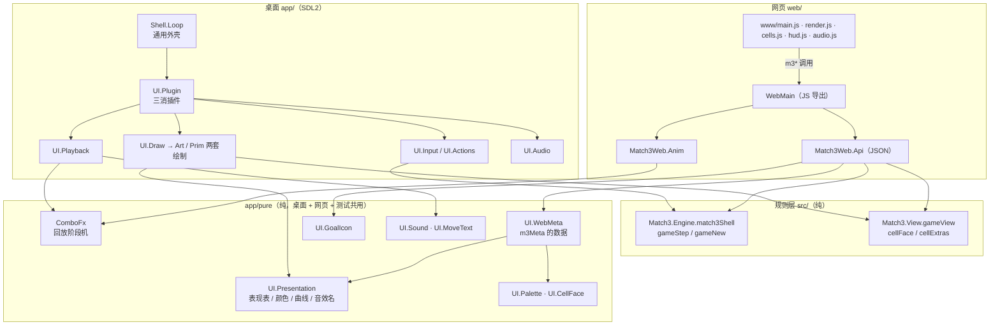

# 05 前端：桌面、共用纯模块、网页

> 本章讲两个前端怎么接到同一份规则上，以及它们共用了哪些「纯表现逻辑」。
> 键位与操作见 [ui-controls.md](../ui-controls.md)，美术与贴图见 [ui-art.md](../ui-art.md)，网页构建部署见 [web.md](../web.md) 与 [web/README.md](../../web/README.md)，安卓见 [android.md](../android.md)。

## 1. 总图：谁共用什么

一句话：**规则、视图模型、回放时间线、表现表都只有一份**；桌面和网页各自只写「输入」和「把数据画出来 / 放出声」。

## 2. 桌面版（`app/`）

### 2.1 外壳与插件

- `app/Main.hs`：读环境变量（种子、起始关、展示模式、`MATCH3_SCALE`），`runShell (match3ShellConfig opts) (match3Plugin opts)`。
- `app/Shell/Loop.hs`：**与游戏无关**的 SDL 外壳（第三刀 `89caed3`，不 import 任何 `Match3` 模块）。
  `runShell`（`:40`）建窗口（`windowHighDPI = True`）和渲染器（alpha 混合），然后跑固定步长主循环（默认 16 ms ≈ 60 fps）：
  `plugBegin`（帧首）→ `pollEvents` → `plugEvents` → `plugTick` → `plugDraw` → `present` → 补足帧时长。
- 插件记录 `Plugin w`（`Loop.hs:31`）的五个钩子由 `app/UI/Plugin.hs` 的 `match3Plugin`（`:52`）填：

  | 钩子 | 三消的实现 |
  |------|-----------|
  | `plugInit` | `loadArt` 加载贴图（失败返回 `Nothing`）、启动音频、建 `IORef App` |
  | `plugBegin` | `UI.Env.syncScale`：每帧同步 HiDPI 倍率 |
  | `plugEvents` | `UI.Input.foldEvents`：键鼠 → 动作 |
  | `plugTick` | `UI.Playback.tickAnim` 推进动画，再 `drainSounds` 放音效 |
  | `plugDraw` | `UI.Draw.draw` |

- 界面状态 `App`（`app/UI/Types.hs`）：当前局面的撤销历史 `appHist :: History GameState`、选中格、动画 `appAnim`、粒子、浮字、音效队列 `appSounds` 等。规则状态只在 `appHist` 里，前端不改写。

### 2.2 输入 → 动作

`UI.Input`（键鼠分派、两步点选与拖拽、道具模式）→ `UI.Actions`（`stepShell` / `playMove` / `applyBooster`）→ `gameStep match3Shell`。
道具点选流（锤子 / 自由交换 / 十字）见 [ui-controls.md「道具模式」](../ui-controls.md#道具模式toolmode)。走步提示文案在纯模块 `UI.MoveText`（审计第 5 项 `5def28e` 移进 `app/pure` 并加测试）。

### 2.3 绘制：贴图版与几何降级版

- `Art.loadArt`（`app/Art.hs:66`）：按 `$MATCH3_ASSETS` → `./assets` → 可执行文件所在目录向上找 `assets/`，用 SDL 核心的 `SDL_LoadBMP` 读图集（不需要 sdl2_image）。
  **任何一步失败都返回 `Nothing`**，前端退回几何绘制，不会崩溃。
- `UI.Draw.draw`（`app/UI/Draw.hs:24`）按 `appArt` 分两支：`Just art` 走 `*Art` 系列（贴图、圆角面板），`Nothing` 走几何版（矩形 / 线条 / 位图字）。
- 单格绘制查表 `UI.CellTable`（第三刀 `ce52699`）：键 = 元素名，值 = 同一元素的两个后端——几何版 `UI.Cell.Prim` 与贴图版 `UI.Cell.Art`。
  `cellRenderer`（`app/UI/CellTable.hs:88`）先按 `Custom` 名字查 `customTable`，查不到用通用画法（贴图名 = 元素名 + 层数角标）。
  有贴图但缺某张图时，`drawCellAny`（`app/UI/BoardArt.hs:105`）逐格退回几何画法。
- 棋盘动画在 `UI.Cascade`（交换补间、逐轮回放、轻落、震屏）和 `UI.EndStage`（步末段：倒计时、皮带、蔓延、蜗牛、洗牌）。

### 2.4 HiDPI / Retina

详见 [ui-art.md「高分屏 / Retina」](../ui-art.md#高分屏--retina)。实现要点：

1. 窗口以 `windowHighDPI = True` 创建（`Shell/Loop.hs`），macOS 给出 2× 物理像素的绘制表面，窗口坐标仍是逻辑点。
2. `syncScale`（`app/UI/Env.hs:56`）每帧比较「渲染输出像素 / 窗口大小」，变化时设 `rendererScale` 并把倍率写进 `artScale`——窗口拖到另一块屏幕上也立即跟上。
3. 图集里同一贴图有多个尺寸变体 `基名@像素高`；绘制时按「目标逻辑高度 × artScale」挑最小的够用变体（`Art.spriteSizeAt` / `pickSprite`），文字和图标在 Retina 上接近 1:1。
4. `MATCH3_SCALE=N` 把窗口本身放大 N 倍，在 Xvfb 这类没有 HiDPI 的环境里模拟 Retina；此时鼠标坐标要除以 N（`UI.Env.mouseToLogical`）。

### 2.5 音频

`UI.Audio`（`app/UI/Audio.hs`）只在 UI 层播放，素材在 `assets/sfx/*.wav`；音效与 BGM 各自开关（K / B 键），偏好写在 `~/.config/match3/{sfx,bgm}`。
音效名从哪来见 [06 §4](06-效果动画音效与撤销.md#4-音效)。

## 3. 共用纯模块（`app/pure/`，内部库 `match3-pure`）

| 模块 | 内容 | 谁在用 |
|------|------|--------|
| `ComboFx` | 逐轮回放的阶段机 `cascadeStages`、`newCascade`、帧数常量、下落映射 `fallTable` | 桌面 `UI.Playback` 等 7 个模块；网页 `Match3Web.Anim`、`WebMain`；测试 |
| `UI.Presentation` | 前端表现表：效果事件 → 播放方式 / 帧数 / 颜色 / 贴图 / 碎屑 / 音效；`elementRGBTable`、`spreadCurves`、`soundNames` | 桌面 10 个模块；网页 `Api`；测试 |
| `UI.Palette` / `UI.CellFace` | 颜色与「一格取什么色」的规则；雪怪象限 `bossPart` | 桌面几何版；经 `UI.WebMeta` 给网页；测试 `WebColors` |
| `UI.WebMeta` | 打包给网页的表（`webMeta`）：颜色、元素色、碎屑色、生长曲线、帧数、音效名 | 网页 `Api.apiMeta`；测试 `WebColors` |
| `UI.GoalIcon` | 目标 → 图标贴图名 | 桌面 HUD / 地图、网页 `Api` |
| `UI.Sound` | 回放阶段事件 → 音效名 | 桌面 `UI.Playback`；测试 |
| `UI.MoveText` | 桌面走步提示文案；`keepsTool`（道具换不掉时留在模式） | 桌面；网页 `Api`（`keepsTool`）；测试 |
| `UI.Chapters` | 章节表 `chapterStarts` / `chapterLabel` / `chapterTitle`（从 `UI.LevelMap` 移来，桌面重新导出） | 桌面地图；网页 `m3Meta.chapters` |
| `UI.Restart` | 「重开本关」规则 `restartSame`（每日挑战按开局步数与原目标重开；从 `UI.Input` 移来，桌面改为调它） | 桌面 R / 失败后 N；网页 `m3Restart` / `m3Advance` |
| `UI.Showcase` | 元素展示盘 `showcaseState`（从 `UI.Env` 移来，桌面重新导出） | 桌面 `MATCH3_SHOWCASE`；网页 `m3Showcase` / `?showcase=1` |

为什么单独一个目录：它们不依赖 SDL，所以能被编进 wasm 和测试；10 刀（`0230893`）建目录，可扩展性 P2（`32b772b`）做成内部库，桌面经库依赖它，测试和网页直接编它的源码。

## 4. 网页版（web/）

### 4.1 Haskell 一侧（编成 wasm）

`web/match3-web.cabal` 把 `web/hs`、`../src`、`../app/pure` 一起编成 `match3-web.wasm`。

- **JS 导出**（`web/hs/WebMain.hs:34-41`，`foreign export javascript … sync`）：

  | 导出 | 作用 |
  |------|------|
  | `m3New(level, seed)` | 开一局（`apiNew`） |
  | `m3Swap(r1, c1, r2, c2)` | 交换；返回 `{ok, accepted, outcome, trace, events, state}` |
  | `m3Undo()` | 撤销；JSON 形状同 `m3Swap` |
  | `m3State()` | 当前局面 |
  | `m3AnimStart()` | 为上一步建立逐轮回放 |
  | `m3AnimTick(fast)` | 推进一帧回放，只回几十字节 |
  | `m3Levels()` | 关卡列表 |
  | `m3Meta()` | 启动时下发表现数据（颜色、曲线、帧数、音效名、章节表） |
  | `m3Hammer` / `m3Cross` / `m3FreeSwap` / `m3Shuffle` | 道具与手动洗牌；形状同 `m3Swap`（道具另带 `keepTool`） |
  | `m3Daily` / `m3Restart` / `m3Advance` / `m3Showcase` | 每日挑战、重开、结局后前进、展示盘（同桌面 `keyDaily` / `restartSame` / `advanceOrMsg` / `MATCH3_SHOWCASE`） |
  | `m3Progress` / `m3MapJump` / `m3Badge` | 只读：星级与进度点、地图点选、分数徽章 |

- **全局状态**只有三个 `IORef`（`WebMain.hs:22-31`）：当前一局 `History GameState`、上一步的回放输入、回放播放器。
  `withGame` 先把 JSON 完整算出来（`evaluate`）再写回状态，出错时不污染全局。
- `Match3Web.Api`：`runStep`（`Api.hs:72`）只调 `gameStep match3Shell`，表现数据取自 `stepReport`；JSON 编码读视图模型（`Match3.View`），不直接读 `GameState` 字段（测试 `frontends_read_view_model` 扫描 `Api.hs`）。
  格子 JSON 由 `encodeCell`（`Api.hs:301`）按 `cellFace` + 元素自带显示字段生成，`Api` 不点名元素。
- `Match3Web.Anim`：直接复用 `ComboFx`，`m3Swap` 已把本步所有盘面快照随 `trace` 发给 JS，回放时只传「盘面编号」（`animBoards`），每帧回包很小。

接口字段的完整说明见 [web/README.md「网页端与核心的接口」](../../web/README.md#5-网页端与核心的接口) 和 [web.md §2.1](../web.md#21-wasm-导出webmainhs)。

### 4.2 JS 一侧（`web/www/`）

| 文件 | 对应桌面 | 职责 |
|------|----------|------|
| `main.js` | `Shell.Loop` + `UI.Input` + `UI.Actions` | 加载 wasm 与图集、固定步长帧循环、点选 / 拖划、`doSwap` → `m3Swap`、`m3AnimTick` 驱动回放、HUD 消息 |
| `render.js` | `UI.Cascade` + `UI.EndStage` + 粒子 | 按 wasm 给的阶段 / 帧号插值绘制，不算规则 |
| `cells.js` | `UI.CellTable` + `UI.Cell.Art` + `UI.Ground` | 单格与棋盘底层；缺贴图逐格退回纯色块，并在 `m3debug.fallbacks` 记一笔 |
| `hud.js` | `UI.HudArt` | HUD、两行按钮（含道具次数）、雪怪血条、进度点、分数徽章、结算星级、横幅 / 按键条 |
| `panels.js` | `UI.HudArt.drawPauseHelpArt` + `UI.LevelMap` | 全屏浮层：暂停按键说明（含触屏入口）、按章节分块的选关地图 |
| `layout.js` | `UI.Layout` | 自适应布局（竖屏 HUD 在上、横屏在右），按关卡行列数算 |
| `art.js` | `Art` | 图集与绘制原语（`atlas.webp` + `atlas.json`） |
| `audio.js` | `UI.Audio` | Web Audio，音效名由 `m3Meta` 下发 |
| `guide.js` | — | 本关出现过的特殊格子说明 |

启动时 `main.js` 调一次 `m3Meta`，把颜色表、生长曲线、帧数、音效名填进各模块（`setPalette` / `setAnimMeta` / `setSoundNames`），**JS 不手抄 Haskell 的表**（可扩展性 P2）。
`stack test` 的 `Spec.WebColors` 再按 `cells.js` 的取色规则逐格核对 `m3Meta` 的数据与桌面 `UI.Palette.cellRGB` 相同。

### 4.3 网页与桌面的已知差异

见 [web.md §8.1](../web.md#81-已知差异与桌面版已确认接受)。2026-10-04 起网页是唯一前端（PC 端将来像安卓一样套壳），桌面版的功能已全部迁到网页：道具、洗牌、每日挑战、选关地图、暂停、结局后前进、星级、进度点、分数徽章、首关提示、按键条、窗口标题、展示盘。
逐项对照与「迁走后桌面哪些代码可删」见 [web.md §2.6](../web.md#26-桌面版功能迁移featweb-sdl-parity)；桌面代码暂时保留。

## 5. 安卓版

`web/android-app/` 是 Capacitor 工程，把 `web/dist` 打进 WebView 离线运行（`b153cc8`，合入 `c6b2b63`）。没有任何安卓专用的游戏代码。
`make apk` / `apk-release` / `aab` 见 [android.md](../android.md)；按 `docs/backlog.md` §1，安卓代码保留但不在日常流程里。
