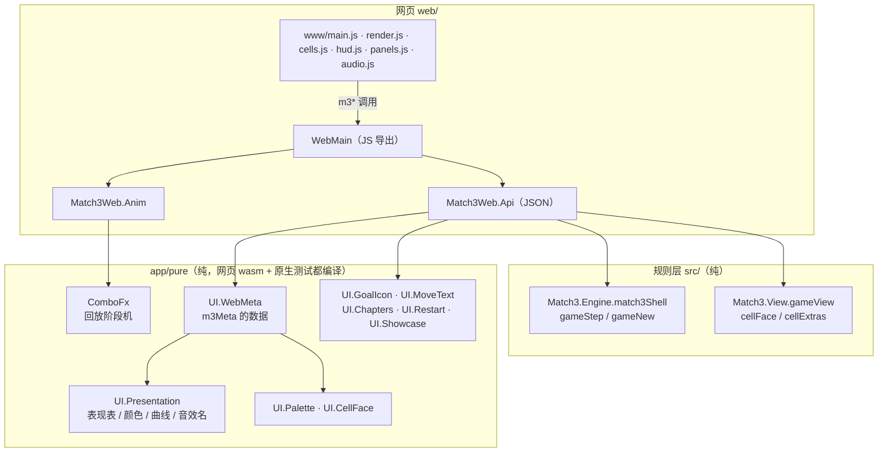

# 05 前端：共用纯模块与网页

> 本章讲前端怎么接到规则上，以及它用到了哪些「纯表现逻辑」。**网页是唯一前端**：浏览器直接玩，安卓是网页套壳，PC 端以后同样给网页套壳。
> 原 SDL2 桌面版（`app/Main.hs`、`app/Shell/`、`app/UI/`、`app/Art.hs`，可执行文件 `match3-sdl`）的功能在 `feat/web-sdl-parity` 全部迁到网页后，于 `refactor/web-only` 移除（[08 演进史](08-演进史.md)）。
> 键位与操作见 [ui-controls.md](../ui-controls.md)，美术与贴图见 [ui-art.md](../ui-art.md)，网页构建部署见 [web.md](../web.md) 与 [web/README.md](../../web/README.md)，安卓见 [android.md](../android.md)。

## 1. 总图：谁用什么

一句话：**规则、视图模型、回放时间线、表现表都在 Haskell 里只有一份**；网页 JS 只写「输入」和「把数据画出来 / 放出声」。

## 2. 原 SDL2 桌面版（已移除）

桌面版曾是第一个前端：通用 SDL 外壳 `Shell.Loop`（固定步长主循环 + 插件钩子）+ 三消插件 `UI.*`（输入、贴图 / 几何两套绘制、HiDPI、音频）。
它沉淀下来的纯逻辑在移除前都已移进 `app/pure`（下节），网页 JS 的绘制与交互逐项迁自桌面（对照见 [web.md §2.6](../web.md#26-桌面版功能迁移featweb-sdl-parity)，代码注释里的「原桌面版 X」指这些已删模块，可在 `refactor/web-only` 之前的历史里查到）。
通用层的 `Engine.GridUI`（网格几何、点选 / 拖动判定）当时只由桌面版使用，已于 `refactor/web-only-2` 删除（网页在 JS 里按同样的规则做命中）。

## 3. 共用纯模块（`app/pure/`，内部库 `match3-pure`）

| 模块 | 内容 | 谁在用 |
|------|------|--------|
| `ComboFx` | 逐轮回放的阶段机 `cascadeStages`、`newCascade`、帧数常量、下落映射 `fallTable` | 网页 `Match3Web.Anim`、`WebMain`；测试 |
| `UI.Presentation` | 前端表现表：效果事件 → 播放方式 / 帧数 / 颜色 / 贴图 / 碎屑 / 音效；`elementRGBTable`、`spreadCurves`、`soundNames` | 网页 `Api` / `UI.WebMeta`；测试 |
| `UI.Palette` / `UI.CellFace` | 颜色与「一格取什么色」的规则；雪怪象限 `bossPart` | 经 `UI.WebMeta` 给网页；测试 `WebColors` |
| `UI.WebMeta` | 打包给网页的表（`webMeta`）：颜色、元素色、碎屑色、生长曲线、帧数、音效名 | 网页 `Api.apiMeta`；测试 `WebColors` |
| `UI.GoalIcon` | 目标 → 图标贴图名 | 网页 `Api`（HUD 目标条、选关地图） |
| `UI.MoveText` | `keepsTool`（道具换不掉时留在模式；原桌面走步文案 `moveMsg` 已随桌面删除） | 网页 `Api`；测试 |
| `UI.Chapters` | 章节表 `chapterStarts` / `chapterLabel` / `chapterTitle`（从原桌面 `UI.LevelMap` 移来） | 网页 `m3Meta.chapters` |
| `UI.Restart` | 「重开本关」规则 `restartSame`（每日挑战按开局步数与原目标重开；从原桌面 `UI.Input` 移来） | 网页 `m3Restart` / `m3Advance` |
| `UI.Showcase` | 元素展示盘 `showcaseState`（从原桌面 `UI.Env` 移来） | 网页 `m3Showcase` / `?showcase=1` |

为什么单独一个目录：它们是纯模块，能被编进 wasm 和原生测试；10 刀（`0230893`）建目录，可扩展性 P2（`32b772b`）做成内部库 `match3-pure`。桌面版移除后内部库仍保留：原生 `-Wall` 编译这些模块，`web/build.sh` 检查 1b 用它的模块表核对 `web/match3-web.cabal`；测试和网页直接编它的源码。原只给桌面回放用的 `UI.Sound` 已删（网页在 `main.js` 按效果事件选音效）。

## 4. 网页版（web/）

### 4.1 Haskell 一侧（编成 wasm）

`web/match3-web.cabal` 把 `web/hs`、`../src`、`../app/pure` 一起编成 `match3-web.wasm`。

- **JS 导出**（`web/hs/WebMain.hs:34-41`，`foreign export javascript … sync`）：

  | 导出 | 作用 |
  |------|------|
  | `m3New(level, seed)` | 开一局（`apiNew`） |
  | `m3Swap(r1, c1, r2, c2)` | 交换；返回 `{ok, accepted, outcome, trace, events, state}` |
  | `m3Undo()` | 撤销；JSON 形状同 `m3Swap` |
  | `m3State()` | 当前局面 |
  | `m3AnimStart()` | 为上一步建立逐轮回放 |
  | `m3AnimTick(fast)` | 推进一帧回放，只回几十字节 |
  | `m3Levels()` | 关卡列表 |
  | `m3Meta()` | 启动时下发表现数据（颜色、曲线、帧数、音效名、章节表） |
  | `m3Hammer` / `m3Cross` / `m3FreeSwap` / `m3Shuffle` | 道具与手动洗牌；形状同 `m3Swap`（道具另带 `keepTool`） |
  | `m3Daily` / `m3Restart` / `m3Advance` / `m3Showcase` | 每日挑战、重开、结局后前进、展示盘（迁自原桌面 `keyDaily` / `restartSame` / `advanceOrMsg` / `MATCH3_SHOWCASE`） |
  | `m3Progress` / `m3MapJump` / `m3Badge` | 只读：星级与进度点、地图点选、分数徽章 |

- **全局状态**只有三个 `IORef`（`WebMain.hs:22-31`）：当前一局 `History GameState`、上一步的回放输入、回放播放器。
  `withGame` 先把 JSON 完整算出来（`evaluate`）再写回状态，出错时不污染全局。
- `Match3Web.Api`：`runStep`（`Api.hs:72`）只调 `gameStep match3Shell`，表现数据取自 `stepReport`；JSON 编码读视图模型（`Match3.View`），不直接读 `GameState` 字段（测试 `frontends_read_view_model` 扫描 `Api.hs`）。
  格子 JSON 由 `encodeCell`（`Api.hs:301`）按 `cellFace` + 元素自带显示字段生成，`Api` 不点名元素。
- `Match3Web.Anim`：直接复用 `ComboFx`，`m3Swap` 已把本步所有盘面快照随 `trace` 发给 JS，回放时只传「盘面编号」（`animBoards`），每帧回包很小。

接口字段的完整说明见 [web/README.md「网页端与核心的接口」](../../web/README.md#5-网页端与核心的接口) 和 [web.md §2.1](../web.md#21-wasm-导出webmainhs)。

### 4.2 JS 一侧（`web/www/`）

| 文件 | 迁自原桌面 | 职责 |
|------|----------|------|
| `main.js` | `Shell.Loop` + `UI.Input` + `UI.Actions` | 加载 wasm 与图集、固定步长帧循环、点选 / 拖划、`doSwap` → `m3Swap`、`m3AnimTick` 驱动回放、HUD 消息 |
| `render.js` | `UI.Cascade` + `UI.EndStage` + 粒子 | 按 wasm 给的阶段 / 帧号插值绘制，不算规则 |
| `cells.js` | `UI.CellTable` + `UI.Cell.Art` + `UI.Ground` | 单格与棋盘底层；缺贴图逐格退回纯色块，并在 `m3debug.fallbacks` 记一笔 |
| `hud.js` | `UI.HudArt` | HUD、常驻按钮（撤销 / 提示 / 菜单）、雪怪血条、进度点、分数徽章、结算星级、横幅 / 按键条 |
| `panels.js` | `UI.HudArt.drawPauseHelpArt` + `UI.LevelMap` | 全屏浮层：菜单（道具次数与其余操作）、暂停按键说明（含触屏入口）、按章节分块的选关地图 |
| `layout.js` | `UI.Layout` | 自适应布局（竖屏 HUD 在上、横屏在右），按关卡行列数算 |
| `art.js` | `Art` | 图集与绘制原语（`atlas.webp` + `atlas.json`） |
| `audio.js` | `UI.Audio` | Web Audio，音效名由 `m3Meta` 下发 |
| `guide.js` | — | 本关出现过的特殊格子说明 |

启动时 `main.js` 调一次 `m3Meta`，把颜色表、生长曲线、帧数、音效名填进各模块（`setPalette` / `setAnimMeta` / `setSoundNames`），**JS 不手抄 Haskell 的表**（可扩展性 P2）。
`stack test` 的 `Spec.WebColors` 再按 `cells.js` 的取色规则逐格核对 `m3Meta` 的数据与 `UI.Palette.cellRGB` 相同。

### 4.3 与原桌面版的差异

网页是唯一前端（PC 端将来像安卓一样套壳）。桌面版的功能（道具、洗牌、每日挑战、选关地图、暂停、结局后前进、星级、进度点、分数徽章、首关提示、按键条、窗口标题、展示盘）在移除前已全部迁到网页；
迁移时确认接受的差异见 [web.md §8.1](../web.md#81-已知差异与桌面版已确认接受)，逐项对照见 [web.md §2.6](../web.md#26-桌面版功能迁移featweb-sdl-parity)。桌面代码已于 `refactor/web-only` 删除。

## 5. 安卓版

`web/android-app/` 是 Capacitor 工程，把 `web/dist` 打进 WebView 离线运行（`b153cc8`，合入 `c6b2b63`）。没有任何安卓专用的游戏代码。
`make apk` / `apk-release` / `aab` 见 [android.md](../android.md)；按 `docs/backlog.md` §1，安卓代码保留但不在日常流程里。
