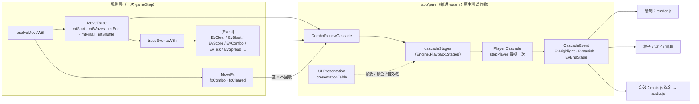

# 06 效果、动画、音效与撤销历史

> 本章讲一步棋结算完之后，数据怎样变成屏幕上的动画和扬声器里的声音，以及撤销历史存在哪。
> 时间线的帧数、连击等级样式、步末段的画法见 [ui-art.md「连击表现」](../ui-art.md#连击表现逐轮回放)；
> 表现表的设计见 [architecture.md「前端表现表」](../architecture.md#前端表现表第-10-刀)。

## 1. 管线总览



三个关键约束：

1. **规则层不播放**：它只交出 `MoveTrace`（每一轮的盘面快照与步末记录）、`[Event]`（按时间排好的效果事件）和 `MoveFx`（要不要播）。
2. **回放和结算来自同一次计算**（第二刀 2a `31275da`），所以回放演示的永远是真实发生的事。护栏：`test/Spec/ReplayUndo.hs` 的 `trace_*` 测试，见 [testing.md「逐轮回放护栏」](../testing.md#逐轮回放护栏)。
3. **时间线只有一份**：`ComboFx` 是纯模块，网页编进 wasm 经 `m3AnimTick` 调，原生 `AnimParity.hs` 直接调，两边逐帧相同（`make anim-parity` 逐帧比对 JSON）。

## 2. 回放脚本：`MoveTrace`

`src/Match3/Game/Trace.hs:54`

```haskell
data MoveTrace = MoveTrace
  { mtStart   :: Board          -- 第一轮之前的盘面（交换后 / 道具作用前）
  , mtWaves   :: [CascadeWave]  -- 按时间顺序的每一轮（含倒计时爆炸 / 皮带 / 蜗牛后的续连锁）
  , mtFinal   :: Board          -- 所有轮次与步末效果之后的盘面
  , mtEnd     :: [EndStep]      -- 步末效果（非消除的盘面变化），按发生顺序
  , mtGen     :: StdGen         -- 结算结束、自动洗牌之前的生成器
  , mtShuffle :: Maybe Board    -- 触发自动洗牌时，洗牌后的盘面
  }
data EndStep = EndStep { esAfterWaves :: Int, esBefore, esAfter :: Board, esEffect :: EndEffect }   -- :76
```

- 每一轮 `CascadeWave`（`src/Match3/Board/Wave.hs:14`）带消除前盘面 `cwBefore`、清除格、挖空盘 `cwHoles`、补子后盘面 `cwAfter`、本轮得分。
- 步末效果 `EndEffect`（`src/Match3/Element/Event.hs:31`）是通用形状：事件种类 + 元素名 + 若干 `EndItem {eiFrom, eiTo, eiCell, eiBack}`（第 7b 刀 `ade2775`），
  所以新元素的步末动画可以借用已有的段（例：毛球跳格发 `EvBelt "fuzzball"`，按皮带平移播放）。
- `esAfterWaves` 把步末效果插在第几轮之后；`evWave` 用同一条时间轴。

## 3. 动画：`ComboFx` 阶段机 + `Engine.Playback` 时钟

### 3.1 通用时钟

`src/Engine/Playback.hs`（第三刀，与游戏无关）：

```haskell
data Stages st ev = Stages { stageLen :: st -> Int, stageNext :: st -> Either st (st, [ev]) }   -- :33
data Player st = Player { plStage :: st, plFrame :: Int, plFast :: Bool }                       -- :39
stepPlayer :: Int -> Stages st ev -> Player st -> Tick st ev                                     -- :55
```

一段回放由若干「阶段」组成：每个阶段多长（`stageLen`）、播完去哪并触发什么一次性事件（`stageNext`）由游戏给出；
播放器只管每帧推进 1 帧（加速时推进 `fastStep` = 3 帧）。

### 3.2 三消的阶段机

`app/pure/ComboFx.hs`：

- 状态 `Cascade`（`:176`）：尚未播完的轮次 `cWaves`、当前阶段 `cPhase`、连击序号、累计得分、待播的步末效果 `cEnds`、当前步末段 `cStages` 等。
- 阶段 `WavePhase = PhStart | PhFlash | PhPop | PhFall | PhRest | PhEnd`（`:139`）。每一轮：**高亮（12 帧）→ 消失（6 帧）→ 下落补子（8–14 帧，落差越大越长）→ 停顿（4 帧）**，
  轮与轮之间、全部落定之后插入步末段（`PhEnd`）。
- 步末记录先分段（`groupStages`，`:289`：连续的蔓延记录并成一段，所以藤 / 巧 / 蒸汽同时长出；其余每条一段），同一时刻连续的步末段合计不超过 36 帧，超出按比例压缩、每段至少 8 帧（`budget` 与 `endBudgetFrames`，`:130`）。
- `cascadeStages :: Stages Cascade CascadeEvent`（`:237`）把它接到通用时钟上；进入阶段时吐出 `CascadeEvent`（`:191`）：
  `EvHighlight k`（k ≥ 2 弹「连击 xk」）、`EvVanish k`（粒子、得分浮字、k ≥ 2 震屏）、`EvEndStage`（蔓延碎屑、倒计时火星）。
- 各段的帧数**来自表现表**：`waveFlashFrames = prFrames (presentationFor EvClear)` 等。

### 3.3 表现表

`app/pure/UI/Presentation.hs:110` 的 `presentationTable` 按 `EventKind` 一行，每行一个 `Presentation`
（`prLook` 表现方式、`prFrames` 帧数、`prColor` 主色、`prCrumbs` 碎屑、`prSound` 音效，`:94`）：

| 事件 | 表现方式 | 帧数 | 音效 |
|------|----------|-----:|------|
| `EvClear` | 高亮 → 消失 | 12 | `clear` |
| `EvBlast` | 随消除 | 0 | `special` |
| `EvHit` / `EvDrain` | 随消除 | 0 | — |
| `EvScore` | 得分浮字 | 48 | — |
| `EvCombo` | 连击弹字 + 震屏 | 54 | — |
| `EvTick` | 步末段：倒计时 | 10 | — |
| `EvBelt` | 步末段：皮带 | 14 | — |
| `EvSpread` | 步末段：蔓延 | 18 | — |
| `EvMove` | 步末段：蜗牛 | 18 | — |
| `EvShuffle` | 步末段：洗牌 | 22 | — |

表里没有的事件种类按蔓延段、18 帧播放（`defaultPresentation`）。按元素名细分的生长曲线 `spreadCurves` 与颜色 `elementRGBTable` 也在这个模块。

### 3.4 网页怎么驱动它

| | 网页 |
|---|------|
| 建立 | `m3AnimStart` → `Match3Web.Anim.animStart`（`web/hs/Match3Web/Anim.hs:69`）；是否回放由 `seedOf`（`:40`）判断（`MoveFx` 为空时不播） |
| 每帧 | `stepCascade` → `m3AnimTick(fast)` → `animTick`（`Anim.hs:89`），回传阶段、帧号、轮次、连击、当前落定盘面编号与事件 |
| 事件 | JS 收 `hl` / `van` / `end`，调 `fx.comboPop` / `fx.burst` / `fx.crumbs`、`play(...)` |
| 绘制 | `render.js` 按 wasm 给的阶段 / 帧号插值 |
| 加速 | `fastReq = true`，下一次调 `m3AnimTick(1)`，`animTick` 里同样走 `acceleratePlayer` |

## 4. 音效

规则层不发声，音效全在网页（`web/www/audio.js`，Web Audio）。音效名有两个来源：

1. **交换结果**（立即）：`doSwap` 里播 `swap` / `illegal`，在 `finishMove`（回放播完）里播 `win` / `lose`。
2. **回放阶段**：`stepCascade` 在 `van` 事件上按「本轮有没有爆炸」播 `special` 或 `clear`，与表现表 `prSound`（`effectSound`：消除 `clear`、爆炸 `special`）一致。
   原 SDL2 桌面版用 `app/pure/UI/Sound.hs` 的 `cascadeSounds` 查表，它只给桌面用，已随桌面版删除。

全部音效名 `soundNames = ["swap", "clear", "special", "illegal", "win", "lose", "bgm"]`（`Presentation.hs:162`）：网页经 `m3Meta` 拿到这张表，按名字加载 `sfx/<名字>.wav`。音效与 BGM 来自 `ee108be` / `38724d2`（2026-09-30 / 10-01）。

加一个新音效：在表现表对应事件填 `prSound = Just "名字"`，把名字加进 `soundNames`，在 `assets/sfx/` 放同名 `.wav`（网页构建时 `web/build.sh` 把 `assets/sfx/*.wav` 拷进 `dist/sfx`）。

## 5. 撤销历史

### 5.1 存在哪

段 3（`0d60a7d`）之前，`GameState` 里有一个 `gsHistory` 字段。段 3 把它移到通用层：**历史只在 `Engine.History` 里存一份**，三消状态不再带历史。

`src/Engine/History.hs`

```haskell
data History s = History { histNow :: s, histPast :: [s] }          -- :27，新的在前
data Undoable a = Act a | Undo                                       -- :33
data HistoryPolicy s a = HistoryPolicy
  { hpLimit :: Int, hpRecord :: a -> Bool, hpSnapshot :: s -> s, hpRestore :: s -> s }   -- :37
withHistory :: HistoryPolicy s a -> Game cfg s a e o r -> Game cfg (History s) (Undoable a) e o r   -- :73
```

- `withHistory` 给任何 `Engine.Game` 套一层撤销：`Act a` 交给原游戏；原游戏接受了、且 `hpRecord a` 为真时，先把走步前的状态经 `hpSnapshot` 记下（最多 `hpLimit` 份），再换成新状态（`commitStep`，`:67`）。
- `Undo` 由本层处理，**先于原游戏的终局拒绝**，所以终局后也能撤销；没有历史时 `stepAccepted = False`。

### 5.2 三消的取值

`src/Match3/Engine.hs:154` 的 `match3History`：

| 字段 | 取值 |
|------|------|
| `hpLimit` | 20 |
| `hpRecord` | `Swap` / `Hammer` / `FreeSwap` / `CrossClear` 记快照；`Hint` / `Shuffle` 不记 |
| `hpSnapshot` | 去掉提示与洗牌标记 |
| `hpRestore` | 清掉本步特效字段（`clearMoveFx`）、提示、终局标记 `gsOver`、洗牌标记 |

`match3Shell = withHistory match3History match3Game`（`Engine.hs:172`）。

### 5.3 前端

- 网页：撤销按钮 / Z / U 键 → `m3Undo` → `apiUndo`（回放进行中不响应；成功时直接换状态、清掉粒子与浮字，不播回放）；撤销没有整步报告，`runStep` 给一个「盘面不动」的空脚本，前端不用特判。还可撤销的步数经 `gameStatus` 的 `undo` 项编进 `state.undo`（`web/hs/Match3Web/Api.hs:167`）。
- 状态机模型测试：撤销历史的 QuickCheck 状态机见 [haskell-features/06-测试与光学.md](../haskell-features/06-测试与光学.md)。

## 6. 通用效果 `Engine.Effect`（备用通道）

`src/Engine/Effect.hs` 定义了与游戏无关的 `Effect {efBeat, efKind, efSubject, efSpots, efAmount}` 和按节拍分组的 `beats`，
`Engine.Playback` 有配套的固定队列阶段机 `cueStages` / `effectCues`。三消经 `toEffect`（`src/Match3/Engine.hs:192`）把 `Event` 映射过去。
**目前网页前端不走这条通道**（它们直接用三消的 `Event` 和 `ComboFx`），只有 `test/Toy.hs` 的玩具游戏在用；可扩展性审核也指出了这一点。
