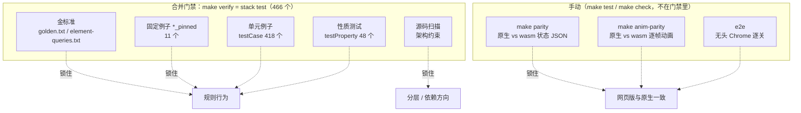

# 07 测试体系

> 本章是 [testing.md](../testing.md) 的导读：先讲测试分几层、各自防什么，再指到 testing.md 的对应小节。
> 逐模块的测试清单、每一刀 / 每个玩法的验收细节都在 testing.md，这里不重复。

## 1. 一张图看全

（418 与 48 是 `test/` 下 `testCase "` / `testProperty "` 的出现次数，合计 466，与 `stack test` 报告一致。）

## 2. 套件怎么组织

- 入口 `test/Spec.hs`：tasty 的 `defaultMain`，所有模块的 `tests` **平铺进一个顶层组 `"match3"`**，所以 `--list-tests` 的路径是 `match3.<测试名>`，
  用 `stack test --ta '-p 名字'` 可以只跑一部分。每个测试默认 120 秒超时（`defaultTimeout`）。
- 测试套件**直接编译 `src` 与 `app/pure` 的源码**（`package.yaml` 的 `tests.match3-test.source-dirs`：`test`、`test/golden`、`app/pure`、`src`），
  不先装库再链接。这是可扩展性审核 P1（`9c9c0b9`）的改动，testing.md 记录 `make verify` 因此从约 50–67 秒降到 22–27 秒。
- `-threaded -with-rtsopts=-N`：金标准按段在多核上并行求值、按原顺序拼回（`test/Spec/Support/Parallel.hs`，Haskell 特性第 5 项）。
- 共用工具在 `test/Spec/Support*`：`Support.hs`（造盘面、走步）、`Arbitrary.hs`（QuickCheck 生成器 `AnyBoard` / `HoledBoard`）、
  `Obstacles.hs`、`Source.hs`（源码扫描）、`Inventory.hs`（「现在有多少」的数字只写这一处）、`Parallel.hs`。
- `test/Toy.hs`：一个极小的第二款游戏，证明 `Engine.*` 的通用接口不依赖三消。

按主题归类（数字来自 [testing.md「套件结构」](../testing.md#套件结构)的模块表，合计 466）：

| 主题 | 模块 | 个数 |
|------|------|-----:|
| 盘面算法 | GridMatch、Gravity、Cascade、Specials、Phase、Perf、GridGeometry | 45 |
| 内置元素 | `Builtin.{Obstacle,Collectible,Actor,Layer,Level}`、Boosters、JellyBubble | 140 |
| 新玩法 1–8 | BombShapes、MagicStone、Fuzzball、RainbowCombos、SnowBoss、CookieDrop、Chameleon、MagicGround | 56 |
| 目标与关卡数据 | GoalsLevels、Levels、DataBoundary、BoardSeed | 58 |
| 元素框架与扩展 | Element、Extension、Branches、ElementClass、ElementAbility、ElementOracle、Archetype、RulesDedup、Classes | 70 |
| 通用层 | Engine、ReplayUndo、Effects、Lazy、Optics | 36 |
| 前端纯模块 | UIEvents、Presentation、View、MoveText、WebColors | 30 |
| 全局护栏 | Golden、Properties、Invariants、SourceScan | 31 |

## 3. 五种护栏

### 3.1 金标准（golden）——重构的总闸

| 快照 | 生成器 | 比对测试 | 行数 |
|------|--------|----------|-----:|
| `test/golden/golden.txt` | `test/golden/Golden.hs`（`goldenSections`） | `golden_behaviour_snapshot`（`test/Spec/Golden.hs`） | 3373 |
| `test/golden/element-queries.txt` | `test/golden/ElementQueries.hs`（`queryLines`） | `ec_queries_*` / `ec_rules_*` / `ec_play_matches_stage1_snapshot`（`test/Spec/ElementClass.hs`） | 1666 |
| `test/golden/element-oracle.txt` | `test/golden/ElementOracle.hs`（`oracleLines`） | `oracle_values_match` / `oracle_names_and_placement_match` / `oracle_rules_per_rule_match` / `oracle_round_queries_match`（`test/Spec/ElementOracle.hs`） | 3623 |

- `golden.txt` 把关卡 × 种子 × 逐步走棋的结果投影成文本。按 `test/Spec/Golden.hs` 的注释，前 2186 行在 `3bd26d8`（第一刀前）与 `5eef3e3`（第一刀）上分别生成且全等，随后由 `4fbcefc`（2026-09-29 18:01）入库；之后每一刀都要求逐行全等，末尾 H4–H6 段是后来按同样办法补的。
- `element-queries.txt` 在元素类迁移阶段 1（`9ae6a7b`，新旧记录并存）上生成，把所有元素查询、规则表和逐手对局投影出来，供阶段 2（`b30cecd`）删掉旧记录后继续比对。
- `element-oracle.txt` 在元素类重构第 0 刀（`458832d`）生成：更多样本格 × 全部值查询、逐条邻格 / 步末 / 成对交换规则在 400 张随机盘上的散列与起作用盘数、整轮查询；第 1–6 刀全程逐字节不变。
- 纪律：**内部 API 变了只改投影代码，快照一个字都不动**；只有确认规则行为应该变化（例如新增关卡）时才重新生成。`test/golden/regen.sh` 只重生成 `golden.txt`。
- 详见 [testing.md「行为金标准」](../testing.md#行为金标准golden) 与 [「元素类验收」](../testing.md#元素类验收阶段-1-原型--阶段-2-迁移)。

### 3.2 固定例子（`*_pinned`）

审计第 2 项删掉了测试里的 9 个「旧实现副本」文件（`Spec.Support.Legacy*`，`85be9a1`，共 2507 行）——它们原本用来和新实现逐项对照。
删之前先把对照结果钉成具体例子（`ffc10a8`），就是现在 11 个以 `_pinned` 结尾的测试，例如 `perf_gravity_pinned`、`daily_date_pinned`、`archetype_defaults_pinned`（原有 15 个；只钉桌面英文文案的 `move_text_*_pinned` 3 个随 `refactor/web-only`、只钉 `Engine.GridUI` 像素换算的 `grid_ui_px_pinned` 随 `refactor/web-only-2` 删除）。
来龙去脉见 [testing.md「旧副本对照的去留」](../testing.md#旧副本对照的去留)。

### 3.3 性质测试（QuickCheck）

47 个性质，生成器在 `test/Spec/Support/Arbitrary.hs`。几类代表：

- 盘面不变量：`qc_inv_gravity_idempotent_no_floating`、`qc_inv_settle_fills_board`、`qc_inv_rejected_move_changes_nothing`、`qc_cascade_terminates_stable`；
- 撤销：`qc_undo_redo_roundtrip`、`qc_inv_history_matches_list_model`（拿一个列表模型对照撤销历史）；
- 代数定律：`qc_counts_algebra`、`qc_caps_monoid_laws`、`qc_validation_applicative_laws`、`qc_optics_*_laws`；
- 确定性：`qc_replay_same_seed_deterministic`、`qc_board_seed_is_fnv1a64_of_show`。

见 [testing.md「性质测试」](../testing.md#性质测试第-1-刀) 与 [haskell-features/06](../haskell-features/06-测试与光学.md)。

### 3.4 源码扫描——把架构约束写成测试

`test/Spec/Support/Source.hs` 递归列出源文件、剥掉注释（字符串原样保留、行号不变）、取 import 与标识符，本身有自测 `support_source_scanner`（`test/Spec/SourceScan.hs`）。几个关键约束：

| 测试 | 约束 |
|------|------|
| `engine_layer_is_game_agnostic`（`test/Spec/Engine.hs`） | `Engine.*` / `Shell.Loop` 不得 import `Match3` |
| `frontends_read_view_model`（`test/Spec/View.hs:398`） | 网页 `Api.hs` 不直接读 `GameState` 字段，只读视图模型（原桌面 HUD / 盘面绘制模块的检查随 SDL2 前端移除） |
| `ab_some_element_forwards_all_methods` / `ab_layered_composes_all_methods`（`test/Spec/ElementAbility.hs:378`） | 按源码核对：六个能力类的每个方法都在 `SomeElement` 转发、在 `Layered` 合成、进了 `abilityProbe` |
| `ec_flat_record_removed`（`test/Spec/ElementClass.hs:224`） | `src/Match3/{Element,Board,Game}` 里（含注释）不再出现旧框架的名字：扁平记录、`SomeMessage` / `fromMessage`、`LevelElement` / `SomeLevelElement` / `levelReply`、`Registry`、`HitResult` |
| `br_main_flow_no_special_branches`（`test/Spec/Branches.hs:336`） | 结算管线（`Game.Move/Boosters/Resolve`、`Board.Match/Clear/Cascade/Gravity`）不再 import 旧的专门模块、不调用彩虹 / UFO / 皮带等专门函数 |
| `jb_main_flow_untouched_scan`（`test/Spec/JellyBubble.hs:156`） | 主流程源码里不出现 `jelly` / `bubble`，两者只定义在 `Element.Builtin` |

见 [testing.md「源码扫描约定」](../testing.md#源码扫描约定第-1-刀)。

### 3.5 数量清单 `Inventory`

`test/Spec/Support/Inventory.hs` 是「现在有多少」的唯一出处：`campaignLevelCount = 49`、`builtinEntryCount = 36`、`builtinBodyInstanceCount = 22`。
新增关卡或元素时改这里一处，相关测试一起跟上（可扩展性审核 P1，`9c9c0b9` 引入）。新增元素的完整触点见 [04-元素框架.md](04-元素框架.md)。

## 4. 网页版的手动测试

不在 `make verify` 里，部署前手动跑（[testing.md「网页版测试」](../testing.md#网页版测试make-check)）：

| 命令 | 做什么 | 文件 |
|------|--------|------|
| `make parity` | 同一串操作分别喂给原生程序和 wasm，每一步的状态 JSON 必须逐字节相同 | `web/test/Parity.hs`、`node-parity.mjs`、`parity.sh` |
| `make anim-parity` | 同上，比的是 `ComboFx` 回放的逐帧 JSON | `web/test/AnimParity.hs`、`node-anim-parity.mjs` |
| `make e2e` | 无头 Chrome 打开页面逐关走一遍，截图并检查贴图缺失时的几何降级 | `web/test/e2e.mjs` |
| `make test` | `test-native` + `parity` + `anim-parity` + `e2e` | `Makefile` |
| `make check` | `lint-sh` + 构建网页版 + `make test` + 体积报告 | `Makefile` |

## 5. 开发流程

[testing.md「开发流程」](../testing.md#开发流程)规定：

1. 合 main 前只跑 `make verify`（`tools/verify.sh`：先 `unset CC CXX …` 避开 wasm 工具链的环境变量，再 `stack test`，最后一行写结论、测试数与用时）。
2. 只做快进合并：`git fetch` → `git merge-base --is-ancestor origin/main <SHA>` → `git push origin <完整SHA>:refs/heads/main` → `git ls-remote` 核对。
3. 只留一个开发工作树 `/workspace/match3-dev`；平时不提交 `web/dist`，部署前才 `make clean && make build` 全量重建。

## 6. 加测试时去哪

| 改动 | 放哪 |
|------|------|
| 新元素 | `test/Spec/Builtin/<分类>.hs` 或独立模块（照新玩法的样子），并更新 `Inventory` |
| 新关卡 | `GoalsLevels` / `Levels` 或专门模块，`campaignLevelCount` 加一；`golden.txt` 只覆盖前 40 关（`Golden.hs` 里写死 `campaign38` / `campaign40`），新关不影响它 |
| 前端表现 | `Presentation`（表现表）/ `UIEvents`（回放事件）/ `View`（视图模型） |
| 通用层 | `Engine`，以及 `test/Toy.hs` 能否照常编译 |

写法约定见 [testing.md「编写约定」](../testing.md#编写约定)。
