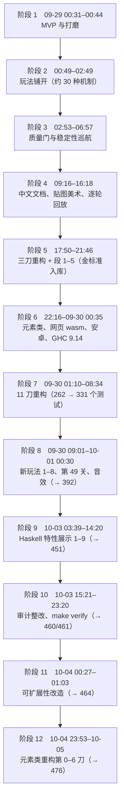

# 08 实现过程与演进史

> 依据：`git log`（截至 `a045194`，共 269 个提交，时间均为 UTC+8）和仓库里的总结文档
> [refactor-2026-09.md](../refactor-2026-09.md)（11 刀）、[backlog.md](../backlog.md)（新玩法、审计整改）、[testing.md「如何运行」](../testing.md#如何运行)（测试数的来历）、
> [haskell-features/](../haskell-features/)（特性展示）。
> 提交说明里没写、文档里也没有的动机，本章标「（推断）」或「（不确定）」。

## 0. 时间轴

10-01 00:30 到 10-03 03:39 之间没有提交。

## 阶段 1：MVP 与打磨（09-29 00:31–00:44）

| 提交 | 内容 |
|------|------|
| `7806b59` 00:31 | 「Match-3 消消乐：纯规则 + SDL2 可玩前端」——第一个提交就分成纯规则核心与 SDL 前端 |
| `2326693` 00:36 | 洗牌、HUD、补间动画、连击 |
| `5c7a409` 00:44 | 帮助 / 暂停、第 1 关提示、平衡 |

**关键决策**：一开始就把规则写成纯函数、前端单向依赖核心（第一刀的提交说明重申了这一点：「纯核心 src/Match3/* 不依赖 SDL，app 单向依赖核心」）。
后来的金标准、网页 wasm 复用、逐帧一致性测试都建立在这一点上。

## 阶段 2：玩法铺开（00:49–02:49）

两个小时内 32 个提交（`5c7a409..1dbbaca`），加入了大部分机制，提交说明里常带「开心消消乐」对标字样。下表只列机制提交，略去关卡调整与小修：

| 提交 | 机制 |
|------|------|
| `75e3b54` / `3c2c22c` / `c40162e` | 石头、彩虹（五连）、冰层 |
| `690e6e8` / `2dc89c0` / `944179d` | 特殊块组合：直线 × 炸弹、彩虹 × 直线、炸弹 × 炸弹与直线 × 直线 |
| `c6ef5c0` | 每日挑战、星级、拖动交换 |
| `44d4f85` / `97a56ae` / `56b323d` | 倒计时炸弹、传送带、道具 |
| `26d6ff4` / `7da3263` / `4a92863` / `7a250a3` | 草 / 藤蔓、飞碟、巧克力、宝箱 |
| `8912c2b` / `4f9b578` / `2d363dd` / `0daccef` | 蜂蜜罐、气球、饼干、迷雾 |
| `f228d02` / `12036b8` | 蛋糕 + 魔法帽、锁链 + 果汁机 + 传送门 |
| `39e46f5` / `601dcbc` / `5b401b7` | 蜗牛 + 冰冻、窗帘 + 保险箱 + 双面块、彩蛋 + 染色瓶 + 十字道具 |
| `1d31904` / `1dbbaca` | 时间精灵 + 蒸汽 + 步数结转、地毯 |

**取舍**：此时机制直接写在 `Board.hs` / `Game.hs` 里，带专门分支和专门字段（后来第二刀 2b「主流程改为查注册表」、段 4「专门分支收进元素框架」做的正是收这些），加得快，但两个文件很快涨到 1003 行和 1442 行（见第一刀 `5eef3e3` 的提交说明）。这正是阶段 5、7 要还的账。

## 阶段 3：质量门与稳定性巡航（02:53–06:57）

`043bcb5`（关卡审计、步末不变量）、`fa7a9f7`（连锁上限、洗牌保留装饰、发布不变量），之后是标题为「Stability cruise」的一串小修复（`5307d44` 03:05 起，到 `e35171a` 06:57「每日挑战通关判 Won 而不是 LevelClear」）。
从 MVP 到 `e35171a` 共 77 个提交，其中 `5307d44` 到 `e35171a` 的 39 个提交标题都是「Stability cruise」。

## 阶段 4：文档、美术与回放（09:16–16:18）

| 提交 | 内容 |
|------|------|
| `e717047` 09:16 | 中文文档与设计说明、源码中文注释（`docs/` 的起点） |
| `3f7e542` 12:09 | 精美贴图，形状 + 颜色双编码（[ui-art.md](../ui-art.md)） |
| `48c1988` 14:23 | Retina 高分屏渲染 |
| `0c3d4ec` 15:02 | 无效交换回滚不再重播上一步特效 |
| `70b0b87` 15:46 | 连锁逐轮回放、递增连击弹字、得分浮字、HUD 总结 |
| `955e46f` 16:18 | 步末效果动画：倒计时 / 皮带 / 蔓延 / 蜗牛 / 自动洗牌 |

**留下的问题**：逐轮回放最初是另写一份「回放用的连锁」，必须和结算手工保持同步——第二刀 2a 把它们合成一份。

## 阶段 5：三刀重构与段 1–5（17:50–21:46）

**动机**：机制越加越多，两个大文件难以维护；回放与结算两份实现容易漂移。**纪律**：每一刀「行为不变」，由金标准逐行把关。

| 刀 | 提交 | 内容 |
|----|------|------|
| 第一刀 | `5eef3e3` 17:50 | 只搬代码：`Board.hs` → `Board/{Grid,Match,Clear,Gravity,Cascade,Random}`，`Game.hs` → `Game/{State,Tally,Outcome,Shuffle,…}`，保留门面 |
| — | `4fbcefc` 18:01 | **行为金标准入库**（`test/golden`，在第一刀前后两个提交上生成且全等） |
| 第二刀 2a | `31275da` 18:13 | 结算与回放合成单一实现 `CascadeRun`：一次计算同时得到计数与逐轮回放 |
| 第二刀 2b | `51b1cfa` 18:47 | 元素框架：`ElementDef` 记录 + 注册表 `Registry` + 事件驱动的效果；主流程改为查注册表 |
| 第三刀 | `fed2b14` … `13094d1`（19:49） | 删门面与元组兼容层；`Board` 改成二维数组、皮带一份实现；**通用接口 `Engine.*`** 与三消实例 `Match3.Engine`（`7d68044`，此时 228 个测试）；通用 SDL 外壳 `Shell.Loop` + 三消插件（`89caed3`）；单格绘制按元素查表（`ce52699`） |

紧接着的「段」是在三刀之后补齐框架缺口：

| 段 | 提交 | 内容 |
|----|------|------|
| 段 1 | `bf16a49` | 金标准补 H4–H6 场景；随后 `fe3fd90` 把 `test/Spec.hs` 拆成按功能的模块 |
| 段 2c | `4cfef8e` / `865b9de` / `f0efe00` | Board 层不再依赖 `defaultRegistry`；扩展钩子：`GoalNamed`、地面层元素槽、方向可配的边缘收集、步末补结算统一路径 |
| 段 3 | `0d60a7d` | 撤销走通用接口：历史只存一份在 `Engine.History`，`GameState` 删 `gsHistory`（见 [06 §5](06-效果动画音效与撤销.md#5-撤销历史)） |
| 段 4 | `7630d8b` | 彩虹取色、特殊合成等专门分支收进元素框架 |
| 段 5 | `25db84a` 21:46 | 双层果冻与气泡（第 39 / 40 关），作为「只加元素、不改主流程」的验收（`jb_main_flow_untouched_scan`） |

「刀」「段」两个词没有在仓库里正式定义；从提交说明看，「刀」是一次独立推送、行为不变的重构，「段」是三刀之后的后续工作（推断）。

## 阶段 6：元素类、网页版、安卓、GHC 9.14（09-29 17:57 – 09-30 09:14）

- **网页版**：`f26c259`（09-29 17:57，在分支 `web-wasm-spike` 上）用 GHC wasm 后端把纯核心编进浏览器跑通第 1 关，`web/` 纯增量、核心源码零改动、随机数库钉同版本保证同种子同盘面。
  之后 `722ac93` 22:16 变基到 main 并改走 `Engine.Game` 通用外壳，`5ddbca0` 加精灵图集与 `ComboFx` 动画，`5e8be85` / `4820f73` / `8f2d193` 加 serve.py、Makefile（后移到根目录），`59f1e53` 23:59 合入 main。设计见 [web.md](../web.md)。
- **元素类**（在 main 上）：`9ae6a7b` 22:52 原型——仿 xmonad `LayoutClass` 的 `Element` 类与 `SomeElement`，经适配层与旧 `ElementDef` 记录并存（此时 259 个测试）；
  `b30cecd` 23:18 全部内置元素改为 instance、删除扁平记录（由 `element-queries.txt` 快照把关）；`2121bf8` 23:44 按功能拆到 `Element/Builtin/`。
- **安卓**：`b153cc8`（09-30 00:10）用 Capacitor 把网页版包成 APK，`c6b2b63` 09:14 合入。现在流程里不再例行打包（[backlog.md](../backlog.md)、[android.md](../android.md)）。
- **GHC 9.14.1**：`b1e3b0d` 00:35 桌面版升级（lts-24.60 + compiler 覆盖，不再兼容 9.4.8），与网页版的 ghc-wasm 9.14 对齐到同一编译器版本（推断：网页版在 `f26c259` 就用 FLAVOUR=9.14）；`870748d` 01:12 合入网页文档对齐。

## 阶段 7：11 刀重构（09-30 01:10–08:34）

起点 `870748d`（262 个测试）、终点 `8f153c7`（331 个），共 13 个提交，内置游戏行为不变。逐刀要点、验收与行为差异见 [refactor-2026-09.md「每刀一览」](../refactor-2026-09.md#每刀一览)，这里只摘最影响现在代码结构的几刀：

| 刀 | 提交 | 留下的结构 |
|----|------|------------|
| 1 | `05281e0` | 源码扫描工具 `Spec.Support.Source`，新增 8 条 QuickCheck 性质 |
| 4 / 5 | `47485c3` / `024d421` | 计数统一成 `Counts`；目标数据化 `Goal = [Quota]` |
| 6a | `ebff019` | `Types.*` 拆分；关卡数据并进 `Level` 记录、`lookupLevel` |
| 7a / 7b | `ac015c0` / `ade2775` | 关卡级状态 `gsLevelElems`；步末阶段表 `EndPhase`；通用 `EndEffect` |
| 8 | `0e91565` | 补子策略、特殊块形状表与组合表 |
| 9 | `ac211d8` | `Element` 类只剩 `name` / `toCell` / `caps`，能力进 `Caps` 记录 |
| 10 | `0230893` | 前端表现表 `UI.Presentation`、新目录 `app/pure` |
| 11 | `8f153c7` | 视图模型 `Match3.View`、通用网格组件 `Engine.GridUI` |

**动机（不确定）**：refactor-2026-09.md 记录了每刀做了什么、怎么验收，但没有单独写「为什么开这一轮」。从内容看是在扩展新玩法前清理类型安全、数据化目标与计数、把前端读数收拢到视图模型（推断）；紧随其后的 `e7e50e2` 08:50 写了新玩法待办清单。

## 阶段 8：新玩法 1–8、宽盘面与音效（09-30 09:01 – 10-01 00:30）

每个新玩法一个提交、一关展示，再由网页分支跟进贴图与 Api（例：`16a51d6` 雪怪血条、`add73de` 变色龙、`cdb1912` 魔法地格）：

| 新玩法 | 提交 | 关卡 |
|--------|------|------|
| 1 L / T 形出炸弹（规则开关） | `803352e` | 41 爆破 |
| 2 魔法石 | `64c0351` | 42 魔石 |
| 3 毛球 | `3fe0d9a` | 43 毛球 |
| 4 魔力鸟组合增强（规则开关） | `69b286b` | 44 魔力鸟 |
| 5 雪怪 Boss（2×2） | `f86c6cd` | 45 雪怪 |
| 6 饼干掉落口（关卡级元素） | `b53a917` | 46 掉落口 |
| 7 变色龙 | `c89f452` | 47 变色龙 |
| 8 魔法地格（地面层） | `0867d16` | 48 魔法格 |

另有：`c59a48e` 目标中文标签移到 `Match3.GoalLabel`；`e15490a` 首次提交 `web/dist` 便于部署；`20455d3` 矩形盘面（5–10），第 49 关「宽域」6×9；`ee108be` / `38724d2` 音效与 BGM（「引擎不发声」）。测试 331 → 392。
原清单 12 项里第 8、10–12 项随后因**玩法冻结**（2026-10-03）不做，见 [backlog.md §2](../backlog.md#2-2026-09-30-新玩法清单的结果)。

**观察**：新玩法 2、3、5、7 都是 `Custom` 元素，基本只碰元素与关卡数据，说明前两轮重构后的元素框架可用；但每个玩法仍要在 `app/`、`web/` 各补一份显示代码——这在阶段 11 被量化（30–39 个触点）并部分解决。

## 阶段 9：Haskell 特性展示 1–9（10-03 03:39–14:20）

一组「行为不变、用 Haskell 特性改写某一块」的展示，每项一个分支、一篇文档，合入后重建一次 `web/dist`：

| 项 | 提交 | 文档 |
|----|------|------|
| 1 类型层（`Stage p`，DataKinds / GADTs） | `f2c82b2` | [01](../haskell-features/01-类型层.md) |
| 2 类型类与抽象 | `331d93e` | [02](../haskell-features/02-类型类与抽象.md) |
| 3 效果与架构（能力类、解释器） | `38fe6a5` | [03](../haskell-features/03-效果与架构.md) |
| 4 惰性与递归模式 | `65086d7` | [04](../haskell-features/04-惰性与递归模式.md) |
| 5 性能与并发（unboxed、ST、STM 并行金标准） | `0280b2c` | [05](../haskell-features/05-性能与并发.md) |
| 6 测试与光学 | `7408fd4` | [06](../haskell-features/06-测试与光学.md) |
| 9 规则去重 | `8387a50` … `49d57ad` | [09](../haskell-features/09-规则去重.md) |
| 7 网格几何 | `080c451` … `e548ace` | [07](../haskell-features/07-网格几何.md) |
| 8 数据边界（Applicative 校验） | `fe30730` … `b93a5d4` | [08](../haskell-features/08-数据边界.md) |

合入顺序是 1–6、9、7、8；第 10 项已取消（backlog.md §3）。测试 392 → 451。

## 阶段 10：审计整改与 make verify（10-03 15:21–23:20）

**第一轮审核（代码审计）**：对 `b93a5d4` 做只读审计，报告不在仓库里（backlog.md 称「代码审计报告」）。整改按报告顺序一项一个分支，行为不变：

| 项 | 提交 | 内容 |
|----|------|------|
| 1 | `8b33ae9` | 毛球 / 雪怪的选格散列合成一份 `boardSeed`，并用 `Spec.BoardSeed` 钉住 |
| 2 | `f569b56` / `ffc10a8` / `85be9a1` | 删无人使用的导出；把 Legacy 对照改成 `*_pinned`；删 9 个旧副本（2507 行） |
| 3 | `14acb96` / `d01730d` / `fa4bc3a` / `74fb7b0` | 收掉被 pragma 关掉的警告、多余依赖 |
| 4 | `927a9ec` | 文档刷新 |
| 5 | `5def28e` | 桌面道具动作合一，走步文案移进 `app/pure` |
| 8 | `6e2bdf2`（+ `d2bca28`） | 网页 JS 颜色表与桌面表现表逐项比对；顺手补齐桌面缺的两项 |
| 6 | `3bf87f9` | 拆分 `Match3.Core`：只留前端 API |
| 7 | `0e408eb` | 终局类型 `Terminal` |
| 9 | `2053153` / `d428855` | 清理历史注释、收尾 |

P3 第 10–12 项不做。逐项结果见 [backlog.md §4](../backlog.md#4-审计整改2026-10已完成)。测试 → 460（之后贴图调色板对照 +1 → 461）。
同晚 `328f94b` 22:46 引入 `make verify`，`4c59620` 23:20 简化为只跑 `stack test`，并把「合 main 前只跑 stack test、快进合并」写进 [testing.md「开发流程」](../testing.md#开发流程)。

## 阶段 11：可扩展性改造（10-04 00:27–01:03）

**第二轮审核（可扩展性）**：对 `4c59620` 做只读审核，报告不在仓库里。据报告，主要发现是：新增一个元素要碰 30–39 个文件；`make verify` 慢在测试套件重编库；胜负判定写死；多游戏接口只有编译和单元测试；`boardSeed` 冻结了 `Show Cell` 的格式。

| 提交 | 内容 |
|------|------|
| `9c9c0b9` P1 | 测试套件直接编译 `src`（verify 约 50–67 秒 → 22–27 秒）；数量集中到 `Spec.Support.Inventory`；用例默认 120 秒超时 |
| `98bd6b5` P2 | `Setup` 加 `LevelSetup`（任意完整关卡记录开局）；胜负节拍 `Judging`（关卡级元素复核结局） |
| `b5deb86` P2 | 元素自带显示字段 `ViewCaps`，收掉视图与网页 Api 的若干特判；网页表现表改由 wasm 的 `m3Meta` 下发 |
| `32b772b` P2 | `app/pure` 做成内部库 `match3-pure` |
| `655bcf0` / `a045194` | 文档同步 |

测试 → 464（元素类重构后 476，见阶段 12）。新增元素现在的触点见 [04-元素框架.md](04-元素框架.md)。

## 阶段 12：元素类重构（10-04 23:53 – 10-05）

**动机**：可扩展性改造之后，元素仍是「一个 `Element` 类 + 能力记录 `Caps`」：能力是记录字段而不是方法，冰 / 叠层另有 `Modifier` 类，
关卡级元素靠开放消息 `SomeMessage` 按类型认领，注册表 `Registry` 与世界是两套东西。按 yu 批准的设计稿（仓库外 `/workspace/match3-element-class-design.md`）
分 7 刀改成 xmonad 风格的类型类写法，允许不兼容旧 API，三份快照全程逐字节不变。

| 刀 | 提交 | 内容 | 测试 |
|----|------|------|-----:|
| 0 | `458832d` | 元素对照快照 `element-oracle.txt`（3623 行）+ `Spec.ElementOracle`；性能基线 | 468 |
| 1 | `f09075d` | 新增能力六类 `Match3.Element.Ability`、类型级 `Kind` / `GroundKind`、叠层 `Layer` + `Layered`、`World`；过渡适配器与旧注册表并存 | 474 |
| 2 | `7a9aa42` | 内置 36 种元素全部改成新 instance（`SpecialGem` 用 DataKinds；地面层是不带值的类型；`Obstacle` / `Fixed` 原型包）；删除旧元素类、`Caps`、`Modifier`、适配器 | 473 |
| 3 | `0d8bc7e` | 邻格 / 蔓延规则改为类方法（`neighbourPrio` / `reach` / `onNeighbourClear`、`spreads`）+ 通用驱动 `Match3.Element.Rules`；多格实体 `Entity` | 474 |
| 4 | `4001b02` | 注册表并进 `World`（删 `Registry.hs`；`Def` / `kindDef @T` / `mkWorldChecked`）；本步上下文 `StepCtx`；删 `Slot` / `HitResult`（改用 `Strike`） | 474 |
| 5 | `cccd241` | `class Mechanic` 的有类型节拍取代 `LevelElement` 与开放消息（删 `Class.hs` / `Message.hs`） | 474 |
| 6 | `833a9d0` 起 | 前端格子描述 `cellFace` 由 `Renders.faceBase` 驱动；文档改写 | 476 |

每刀 `make verify` 全绿后才合 main；动到 `app/`、`web/` 或 `View` / `Core` 导出的刀（3–6）另跑 `make check`。

## 贯穿始终的几条做法

1. **行为不变的重构由快照把关**：`golden.txt`（09-29 起）、`element-queries.txt`（元素类迁移起）和 `element-oracle.txt`（元素类重构起），内部变了只改投影。
2. **一份实现、多处投影**：结算与回放（2a）、皮带（第三刀）、表现表（第 10 刀，网页经 `m3Meta`）、视图模型（第 11 刀）。
3. **源码扫描把架构约束写成测试**：依赖方向、主流程无专门分支、前端只读视图模型。
4. **共享纯核心**：网页 / 安卓不复制规则，只是另一个前端；原生与 wasm 用 parity 测试逐字节对照。

## 不确定之处

- 「两轮审核」按本章理解为 10-03 的代码审计（对 `b93a5d4`）和 10-03 深夜到 10-04 的可扩展性审核（对 `4c59620`）。两份报告都在仓库之外，仓库里只有 backlog.md 和提交说明的间接记录。
- 阶段 2 的机制数「约 30 种」是按提交标题粗数的（含特殊块组合与道具），不是精确统计。
- 11 刀的动机没有成文，见上文。
- 「刀」「段」的含义是从提交说明推断的。
