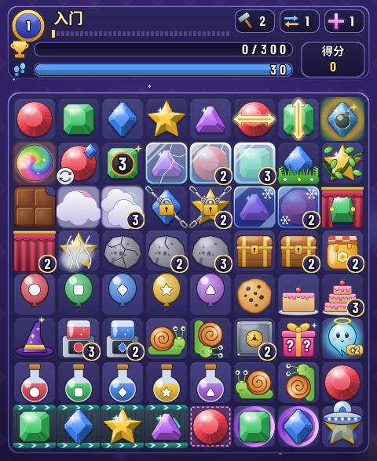

# UI 美术与贴图

本文说明 `match3-sdl` 的美术风格、贴图清单、生成方式，以及运行时如何加载和降级。规则层（`src/Match3/*`）完全不受影响；贴图只在 `app/` 里使用。


## 风格

- **糖果宝石风**：深紫夜空背景，棋盘格是圆角深蓝半透明方砖（棋盘格交替两种深浅）。宝石有高光、渐变和柔和投影。
- **统一规格**：棋盘贴图按 **112×112**（格子 56 px 的 2 倍）绘制；HUD 面板、图标、星星、角标、背景和全部文字也都按**逻辑尺寸的 2 倍**烘焙。窗口开启 HiDPI 后在 Retina 上 1 个贴图像素 = 1 个物理像素（见下文「高分屏 / Retina」）。
- **颜色 + 形状双编码**：每种颜色同时对应一种轮廓，色弱玩家或灰度截图也能一眼区分（见下表）。
- **层数可读**：多层障碍的外观会随层数变化（裂纹、层数、厚度），层数 ≥ 2 时右下角还有**数字角标**。
- **HUD**：九宫格圆角面板（`panel_*`），金色描边表示强调/选中；数字用描边字形，中文标签预渲染成贴图，所以运行时不需要字体库（无 SDL_ttf）。字形和标签按游戏内实际使用的字号分别烘焙（2x），不会被非整数倍缩放。

## 颜色 → 形状

| 颜色 | 内部 | 形状 | RGB |
|------|------|------|-----|
| 红 | `C1` | 圆形宝珠 | (236, 62, 78) |
| 绿 | `C2` | 切角方形翡翠 | (52, 196, 96) |
| 蓝 | `C3` | 菱形 | (56, 128, 246) |
| 黄 | `C4` | 五角星 | (255, 194, 36) |
| 紫 | `C5` | 三角形 | (172, 88, 236) |

带颜色的障碍（气球、果汁机、染色瓶、飞碟）也会在自身上印同样的**形状徽记**，所以不必只靠颜色判断。

## 图例

完整图例（中英文标签）：[`images/legend.png`](images/legend.png)，每次运行生成脚本都会重新生成。


### 特殊块

| 贴图 | 含义 | 外观 |
|------|------|------|
| `line_h` / `line_v` | 直线 LineH / LineV | 宝石上一条白金光带，两端带箭头，方向即消除方向（横 / 竖） |
| `bomb_glow` + `bomb_mark` | 炸弹 Bomb | 宝石后面有橙色呼吸光晕，宝石上有黑色小炸弹标记 |
| `rainbow` | 彩虹 Rainbow | 七彩旋涡球，游戏中缓慢旋转 |

### 覆盖物（宝石之上）

| 贴图 | 构造子 | 外观 / 层数表示 |
|------|--------|-----------------|
| `ice_1..3` | 冰层 `ice` | 青色透明冰壳，层数越多越厚、裂纹越少；≥2 显示角标 |
| `grass` | `Grass` | 格子底部一丛绿草 |
| `vine` | `Vine` | 绿藤缠绕宝石；将要蔓延的格子会闪绿色提示 |
| `choco` | `Choco` | 巧克力方块（盖住宝石）；将要蔓延的格子会闪棕色提示 |
| `fog_1..2` | `Fog n` | 白色云团，2 层更浓；≥2 显示角标 |
| `chain_1..2` | `Chain n` | 铁链 + 金锁：1 层是一条斜链，2 层是交叉双链 |
| `freeze_1..2` | `Freeze n` | 深蓝雪花釉壳，2 层颜色更深（和青色冰层 Ice 区分开） |
| `curtain_1..2` | `Curtain n` | 酒红幕布，2 层全闭，1 层半开 |
| `steam` | `Steam` | 灰白蒸汽团 |

### 障碍 / 特殊格

| 贴图 | 构造子 | 外观 / 层数表示 |
|------|--------|-----------------|
| `stone_1..3` | `Stone n` | 灰色岩块：3 层完整，2 层有裂纹，1 层碎裂；更多层时用 `stone_3` 加角标 |
| `chest` | `Chest n` | 金边木宝箱 + 层数角标 |
| `honey` | `Honey n` | 琥珀蜂蜜罐（带蜂巢六边形）+ 层数角标 |
| `balloon_c1..c5` | `Balloon c` | 对应颜色的气球，上面印有形状徽记，游戏中会上下浮动 |
| `cookie` | `Cookie` | 巧克力豆饼干（收集物） |
| `cake_1..3` | `Cake n` | 奶油蛋糕，层数就是蛋糕的层数（1/2/3 层），≥2 显示角标 |
| `magic_hat` | `MagicHat` | 紫色星星魔法帽 |
| `maker_c1..c5` | `Maker c n` | 对应颜色的果汁机；剩余次数 n **始终**用角标显示 |
| `snail` | `Snail dr dc` | 橙壳蜗牛，按爬行方向旋转 / 镜像 |
| `safe` | `Safe n` | 钢制保险箱 + 金色转盘 + 层数角标 |
| `flip_mark` | `Flip f b` | 正面宝石 + 右上角小宝石（翻面后的颜色）+ 左下角循环箭头 |
| `surprise` | `Surprise` | 粉色礼盒 + 问号 |
| `bottle_c1..c5` | `Bottle c` | 对应颜色的染色瓶 + 形状徽记 |
| `time_spirit` | `TimeSpirit` | 带光环的小精灵，标着「+2」，会上下浮动 |
| `countdown_1..9` | `Countdown c n` | 宝石上叠一个红色倒计时炸弹，中间写剩余步数 |
| `ufo_c1..c5` | 飞碟 `Ufo` | 对应颜色的飞碟，悬停在格子上方 |
| `bubble` | 气泡 `Custom "bubble" 1`（段 5） | 透明水泡：蓝青边缘 + 虹彩 + 高光，无颜色徽记，轻微上下浮动。按 Custom 名字经 `UI.CellTable.customTable` 分派（不画层数角标）；几何降级版 `primBubble`：浅蓝方块 + 亮边 + 左上高光 |
| `snow_boss_0..3` / `snow_boss_hurt_0..3` | 雪怪 Boss `Custom "snow_boss" v`（新玩法 5，2×2） | 冰蓝雪怪：一整只按 2 格（224 px）画好再切成四块，每格画自己的象限（0 左上 / 1 右上 / 2 左下 / 3 右下，读 `Match3.View.bossPart`），拼起来是一只：毛茸茸的雪白身体 + 冰蓝阴影、冰角、两只眼睛（怒眉）与獠牙；血量 ≤ 满血一半时换 `snow_boss_hurt_*`（皱眉 + 裂纹 + 创可贴 + 汗滴）；右下块底部三个小点显示召唤进度（每 3 步召唤一块雪块，雪块就是 1 层石头 `stone_1`）。按 Custom 名字经 `UI.CellTable.customTable` 分派；`snow_boss`（整只缩到一格）只给 HUD 血条当头像。几何降级版 `primSnowBoss`：每格一块浅冰蓝方块，四块之间不留缝、外缘深蓝描边，上两块画白眼红瞳（受伤时左眼变一道横线），下两块画嘴和獠牙，右下块另画召唤进度点 |
| `chameleon` / `chameleon_icon` | 变色龙 `Custom "chameleon" k`（新玩法 7，k = 当前颜色下标 0..4） | 底下照常画当前颜色的宝石 `gem_c{k+1}`（颜色读 `Match3.Element.Builtin.chameleonColor`），上面叠 `chameleon`：五色分段环 + 绿色卷尾 + 一点闪光，随 `pulse` 慢慢转动；换色是步末 `EvTick "chameleon"`，按事件类型复用倒计时段 `StTick`（前半段旧颜色、后半段新颜色）。`chameleon_icon` 是 HUD / 地图目标图标（`gem_c4` + 环合成一张）。按 Custom 名字经 `UI.CellTable.customTable` 分派；几何降级版 `primChameleon`：当前颜色的几何宝石 + 20 段五色描边；消除粒子颜色 = 当前颜色（`UI.Layout.cellRGB`） |

### 地砖（宝石之下）

| 贴图 | 含义 |
|------|------|
| `tile_a` / `tile_b` | 普通棋盘格（交替两种深浅） |
| `carpet_open` / `carpet_covered` | 地毯目标格：虚线品红框表示未铺，编织纹品红地毯表示已铺 |
| `belt` | 传送带：青色边轨 + 箭头，箭头朝向就是移动方向 |
| `portal` | 紫色旋转传送门环 |
| `cookie_drop` | 饼干掉落口（新玩法 6）：金色漏斗（上宽下窄 + 深色口沿 + 两颗铆钉）+ 白色向下箭头，只占格子上部四分之一。和其它地砖不同，画在**棋子之上**、掉落口格上沿（上移 6 px 压在棋盘框上），不随下落动画偏移（`UI.BoardArt.drawDropsArt`，读 `Match3.View.bvDrops`）；几何降级版 `drawDropMark`：三级金色台阶 + 白色箭头 |
| `jelly_2` / `jelly` | 双层果冻（地面层 `gsGround`，段 5）：双层为深粉果冻块 + 一道白色层线；单层为淡粉半透明。经 `UI.Ground.groundTable` 按名字分派，画在棋盘格之上、棋子之下。几何降级版画在**棋子之上**（整格色块会盖住底层）：双层粗粉框 + 内框，单层细框 |

### 交互 / HUD

`sel_ring`（选中框，颜色随道具模式变化）、`hint_glow`（提示呼吸光）、`spark`（消除闪光）、`star_on/off`、`medal`、`node_cur/done/lock`（地图节点）、`icon_*`（锤子 / 交换 / 十字 / 步数 / 分数 / 多色）、`badge_1..9`、`g_*`（字形）、`zh_*`（中文标签）、`name_*`（关卡名）。魔法石（新玩法 2）：`magic_stone_<充能>`，满 3 格的贴图外发光并轻微浮动。毛球（新玩法 3）：`fuzzball`（灰粉色毛团 + 大眼睛，轻微浮动；步末跳格借用皮带的平移动画）。魔力鸟组合增强（新玩法 4）：没有新棋子贴图，变身段借用蔓延的「长出新格」动画（第一轮之前，同色宝石从格子中心长成直线 / 炸弹；与彩虹格恰好差一行或一列的目标沿蔓延方向擦出，是 `drawEndSpread` 按来源方向分支的结果）。网页版（`web/www/cells.js` / `render.js`）画法相同：毛球用同一个浮动公式 `round(2·sin(pulse/9))`（网页逻辑帧 1/60 s、桌面 16 ms，周期约 0.94 s 对 0.90 s），跳格走皮带段，变身走蔓延段的同一组分支（匀速、白色前沿光、不迸碎屑）。规则开关角标：打开 `bomb_shapes` 的关卡，关名右侧画 `bomb_glow` + `bomb_mark`（22 px）和 `zh_rule_bomb`（18 px）；打开 `rainbow_combos` 的关卡画 `rainbow`（22 px）+ `zh_rule_rainbow`「彩虹组合变身」（18 px）。角标表在 `Match3.View.ruleBadgeTable`（规则名 → 文字、叠放图标、文字贴图），桌面 `UI.HudArt` 与网页版都按它通用地画；网页图集不含 `zh_*`，网页版在关卡面板「第 N 关」右侧画同样的图标 + 画布字体文字（小胶囊）。新增规则开关的角标：`ruleBadgeTable` 加一行 + gen_assets.py 的 `ZH` / `ZH_SIZES` 加文字贴图（`stack test` 核对两边文字一致）。

**Boss 血条**（新玩法 5）：目标是「击败 Boss」时（`Match3.View.gvBoss` 为 `Just`），HUD 目标条换成血条：左边 `snow_boss` 头像，红色进度条长度 = 剩余血量 / 满血，文字「HP 剩余/满血」；剩余 ≤ 一半后进度条变深红并随 `appPulse` 呼吸闪烁。几何版 `UI.HudBlocks.hudBoss` 在目标条位置画同样的红条和两个数字。

名字里带 `@` 的是同一贴图的**尺寸变体**（`基名@像素高`），例如 `zh_combo@68`（「连击」34 px 大字版）、`g_48@60`（5 号字形「0」）、`gem_c1@56`（半尺寸宝石，给 HUD 小图标用）、`panel_gold@80`（小圆角面板）。代码里始终只写基名，运行时自动挑变体。

## 重新生成贴图

```bash
pip install pillow numpy        # 或 apt install python3-pil python3-numpy
python3 tools/gen_assets.py     # 约 40 秒；加 --preview 另存 /tmp/atlas_preview*.png
```

脚本会生成：

- `assets/atlas.bmp`、`assets/atlas1.bmp`：图集第 0、1 页（32 位 BGRA，带透明通道）。每页最大 1024×2048，放不下自动开新页；目前 2 页（1024×1998 + 1024×998），共 485 个贴图（含尺寸变体；新玩法 7 新增变色龙环 `chameleon`、目标图标 `chameleon_icon` 及其 `@56`、关卡名 `name_46`「变色龙」；新玩法 6 新增掉落口 `cookie_drop` 及其 `@56`、关卡名 `name_45`「掉落口」；新玩法 5 新增雪怪 `snow_boss`、`snow_boss_0..3`、`snow_boss_hurt_0..3` 及其 `@56`、关卡名 `name_44`「雪怪」；新玩法 4 新增关卡名 `name_43`「魔力鸟」与角标文字 `zh_rule_rainbow`；新玩法 3 新增毛球 `fuzzball` 及其 `@56`、关卡名 `name_42`「毛球」；新玩法 2 新增魔法石 `magic_stone_0..3` 及其 `@56`、关卡名 `name_41`「魔石」；新玩法 1 新增关卡名 `name_40`「爆破」与 HUD 角标文字 `zh_rule_bomb`「L/T 形出炸弹」；段 5 新增 `jelly` / `jelly_2` / `bubble` 及其 `@56`，另有第 39 / 40 关的关卡名 `name_38` / `name_39`）
- `assets/atlas.txt`：索引文件，每行 `name x y w h page`（第 6 列页号；旧的 5 列格式视为第 0 页）
- `assets/background.bmp`：窗口背景（960×1176，即 480×588 的 2 倍，24 位不透明）
- `docs/images/legend.png`：图例

图形采用 4 倍超采样再缩小；**文字不超采样**，而是按目标像素字号直接用 FreeType 渲染（带 hinting，笔画对齐像素格）。随机种子固定，所以同一台机器上多次运行结果一致。关卡名从 `src/Match3/Types.hs` 解析，新增关卡后重新跑一次即可。字体按顺序查找：拉丁字形用 Barlow Condensed / DejaVu / Arial，中文用 Noto Sans CJK / 文泉驿 / 苹方 / 华文黑体。

## 加载与降级

实现见 `app/Art.hs`。

1. **格式**：BMP V4 头（`BI_BITFIELDS` + alpha 掩码；多页时按 `atlas.txt` 最大页号依次加载 `atlas.bmp`、`atlas1.bmp`……，任何一页缺失都整体降级），用 SDL2 核心的 `SDL.loadBMP` 就能保留透明度，**不需要 SDL_image / SDL_ttf**。macOS 只要已有的 `brew install sdl2`，**不用装任何新的 brew 包**。新增的 Haskell 依赖只有 GHC 自带的 `containers`、`directory`、`filepath`。
2. **路径查找**（找到第一个同时包含 `atlas.bmp` 和 `atlas.txt` 的目录就用它）：
   1. 环境变量 `MATCH3_ASSETS`
   2. 当前目录下的 `./assets`（在仓库根目录运行 `stack exec match3-sdl` 时就是这个）
   3. 可执行文件所在目录，以及它向上最多 12 层父目录里的 `assets/`（从 `.stack-work/.../bin` 也能找到仓库里的资源）
3. **降级**：找不到资源或加载失败时，只会在 stderr 打印一行警告，然后使用原来的纯色方块 / 几何图形渲染，游戏照常运行。单个贴图缺失时，只有对应的格子退回原来的几何绘制。`background.bmp` 可选，缺了就用纯色背景。

## 开发用环境变量

| 变量 | 作用 |
|------|------|
| `MATCH3_ASSETS=/path/to/assets` | 指定资源目录 |
| `MATCH3_LEVEL=16` | 从第 N 关开始（从 1 开始计数，方便截图） |
| `MATCH3_SHOWCASE=1` | 展示盘面：一屏摆出所有宝石、特殊块、覆盖物、障碍、地砖（仅用于预览美术，不影响规则） |
| `MATCH3_SEED=1` | 固定首局随机种子（只影响开局，重开 / 下一关仍随机），配合 xdotool 按固定坐标复现问题 |
| `MATCH3_SCALE=2` | **测试用**：窗口按 N 倍（1..4）逻辑尺寸创建，在没有 HiDPI 的环境（Linux / Xvfb）里模拟 Retina；真 Mac 上不需要设置 |

截图示例（无显示器）：

```bash
MATCH3_SHOWCASE=1 xvfb-run -a stack exec match3-sdl
```



模拟 Retina 截图（窗口 960×1176，渲染倍率 2）：

```bash
Xvfb :98 -screen 0 1400x1300x24 &
DISPLAY=:98 MATCH3_SCALE=2 stack exec match3-sdl
```

## 连击表现（逐轮回放）

实现：纯逻辑在 `app/pure/ComboFx.hs`（阶段机、时间线常量、下落映射）与 `app/pure/UI/Presentation.hs`（第 10 刀：效果事件 → 表现的**表现表**，帧数 / 颜色 / 贴图 / 碎屑 / 音效名、连击等级样式、蔓延生长曲线都在这一张表里，见下文「表现表」），表现编排在 `app/UI/Playback.hs`（`withMovePlayback`、阶段事件 → 弹字 / 粒子 / 震屏 / 音效队列），绘制在 `app/UI/Cascade.hs`（`drawCascade` 与各轮阶段）、`app/UI/EndStage.hs`（步末阶段）、`app/UI/HudArt.hs` / `HudPrim.hs`（`drawPopsArt` / `drawPopsPrim`、`drawComboSummaryArt`），`AnimCascade` 定义在 `app/UI/Types.hs`（持有通用播放器 `Engine.Playback.Player Cascade`：帧号与加速在播放器里，阶段机是 `ComboFx.cascadeStages`；波次级的高亮 / 消失 / 粒子 / 得分浮字读 `WaveView` 里本轮的效果事件）。核心只新增了纯函数 `traceSwap` / `traceFreeSwap` / `traceHammer` / `traceCrossClear`（`Match3.Game.Move` / `Match3.Game.Boosters`，底层是 `Match3.Board.Cascade` 记录版连锁的 `crWaves`；前端经通用接口 `gameStep` 的整步报告一次拿到），返回 `MoveTrace { mtStart, mtWaves :: [CascadeWave], mtFinal, mtEnd :: [EndStep] }`。每个 `CascadeWave` 记录这一轮消除前的盘面、被消格、消除后留下的空洞、下落补子后的盘面和本轮得分。测试保证它的最终态、总分、清除格并集、轮数和 `trySwap` / 道具 API 的结果完全一致（`trace_*` 系列），所以前端只是把同一个结果**拆开播放**，规则没有任何改动。

### 时间线（60 fps，1 帧 ≈ 16.7 ms）

一次成功交换：交换动画 `swapFrames` = 10 帧，然后每一轮依次播放：

| 阶段 | 帧数 | 约 | 画面 |
|------|------|----|------|
| ① 高亮 `PhFlash` | `waveFlashFrames` = 12 | 200 ms | 棋盘其余部分压暗；被消格提到暗幕之上，带等级色光圈、`spark` 闪光、轻微弹跳。第 2 轮起在这一刻弹出「连击 xN」 |
| ② 消失 `PhPop` | `wavePopFrames` = 6 | 100 ms | 被消格缩小淡出，光环外扩，爆出粒子；从消除区域飘出本轮得分「+N」；第 2 轮起轻微震屏；新生成的特殊块放大出现 |
| ③ 下落 `PhFall` | `fallFramesFor d` = clamp 8..14 (6 + 最大落差 d) | 130–230 ms | 上方的宝石按列掉进空洞（t² 加速），新宝石从棋盘顶上方落入（裁剪在棋盘内） |
| ④ 落定 `PhRest` | `waveRestFrames` = 4 | 70 ms | 停顿一下再进入下一轮 |

每轮约 30～36 帧（0.5～0.6 s），实测 4 连锁全程约 2.2 s，5 连锁约 2.8 s（从松开鼠标到最后一轮落定，不含步末阶段）。


上图：第 5 关、种子 10、交换 (4,2)↔(5,2)（复现方法见下文「复现 / 截图」），第 2～5 轮依次出现 x2 浅金、x3 橙、x4 红、x5 紫的「连击」弹字和「+N」得分浮字。

### 步末阶段（`PhEnd`）

一步里除了消除，还会发生一些「回合末」变化。规则层按 `trySwap` 的真实顺序把它们记在 `mtEnd` 里（`EndStep { esAfterWaves, esBefore, esAfter, esEffect }`，`esAfterWaves` 表示在第几轮之后发生），前端在对应的位置插入播放，播完才进入下一轮或结束：

| 顺序 | 效果（`EndEffect`） | 何时 | 表现段 | 基础帧数 | 画面 |
|------|--------------------|------|--------|----------|------|
| 1 | 倒计时减一 `EvTick` / countdown | 主连锁之后（归零爆炸是随后的普通轮） | `StTick` | 10（≈170 ms） | 前半段旧数字、后半段新数字；炸弹格红色光晕脉冲，数字放大回弹，冒红色火星 |
| 2 | 传送带移位 `EvBelt` / belt | 倒计时之后（移位后的连锁 / 收饼干是随后的普通轮） | `StBelt` | 14（≈230 ms） | 相邻格沿皮带方向平滑滑动；环首尾相接的那一格在终点缩放淡入 |
| 3 | 藤蔓 / 巧克力 / 蒸汽蔓延 `EvSpread` / vine · choco · steam | 皮带连锁之后 | `StSpread`（三种合成一段同时播） | 18（≈300 ms） | 新格的覆盖层从来源格那一侧「长」过来：藤蔓分 4 节一节一节伸长，巧克力先快后慢涂抹铺开，蒸汽匀速漫开；生长前沿带同色柔光，长好时迸几粒同色碎屑 |
| 4 | 蜗牛爬行 `EvMove` / snail | 蔓延之后（被推出匹配时，随后的普通轮再消） | `StSnail` | 18（≈300 ms） | 蜗牛沿朝向平滑挪一格并轻轻一拱，被推的宝石同时退到蜗牛原格（交错时侧让几像素）；碰壁的蜗牛原地横向压扁再展开，中点换朝向 |
| 5 | 自动洗牌（`ensurePlayable`，无可走步）——**不是** `EndEffect`，也不在 `mtEnd` 里：`ComboFx` 发现 `mtFinal` ≠ 结算后的 `gsBoard` 时自己追加 | 最后 | `StShuffle` | 22（≈370 ms） | 旧盘向中心收拢、暗幕和紫色光团盖住，换盘后新盘从中心散开 |

第 7 刀 7b 起 `EndEffect` 是通用形状（事件类型 `endEffectKind` + 元素名 `endEffectElement` + 逐项 `EndItem`）：表现段按事件类型选（`ComboFx.stageKindFor`，第 10 刀起即查表现表的 `stageKindOf`），蔓延取色 / 生长节奏按元素名查表（`UI.Presentation.elementRGBTable` / `spreadCurves`），蜗牛段从各项取起点 `eiFrom`、终点 `eiTo`、被推的格 `eiBack`、新朝向 `endItemDir`（写入的蜗牛）；画面与之前逐帧相同（22 个场景 + 3 个步末动画场景截图 AE=0）。

- **时长控制**：同一时刻连续的步末段（1～4）合计不超过 `endBudgetFrames` = 36 帧（≈0.6 s），超出时按比例压缩，每段至少 8 帧。常见情况：只有巧克力或藤蔓一段 0.3 s；蔓延 + 蜗牛 0.6 s；终章那种倒计时 + 皮带 + 蔓延 + 蜗牛全都有时压成 8 + 8 + 10 + 10 帧 = 0.6 s。自动洗牌很少出现、又需要让玩家看清，所以不计入预算，单独 0.37 s。
- 道具（锤子 / 十字 / 自由交换）按规则只有蔓延，没有倒计时 / 皮带 / 蜗牛；无效交换 / `NoMatch` / 被拒道具规则上什么都不发生，`mtEnd` 为空，不会播任何步末动画（`trace_rejected_move_is_empty` 锁定）。
- 回放期间（包括步末阶段）HUD 的步数已经是结算后的值；倒计时数字在 `StTick` 段的中点从旧值变成新值，和盘面一致。「下一步可能蔓延到的格子」的呼吸光预告只在静止时画，避免跟正在长出来的格子混在一起。


上图从上到下：巧克力蔓延、藤蔓蔓延、蜗牛爬行、传送带移位、倒计时减一、蒸汽 + 自动洗牌、同一步里四种效果齐全（终章），每行左侧标了复现用的关卡 / 种子 / 交换，对应下文「复现 / 截图」的表。

- 测试：`trace_end_steps_replay_to_trySwap_final` 对全部关卡 × 3 个种子的每个成功交换按时间线重放（轮 → 步末 → 轮……），要求每段首尾相接、`applyEndEffect esEffect esBefore == esAfter`，最后等于 `trySwap` 的终盘，并且抽样必须覆盖全部六种效果；`trace_end_steps_boosters_replay`、`trace_end_snail_push_and_turn`、`trace_end_spread_from_adjacent_source` 分别覆盖道具、蜗牛推 / 掉头、蔓延来源方向。

- **点击加速**：回放期间点击鼠标，或按空格 / 回车 / `N`，阶段机改为每帧推进 `fastStep` = 3 帧（整体约快 3 倍，包括步末各段和自动洗牌段），各轮和各步末段依旧逐个可见；标题栏提示 `Fast-forward combo`。开头 10 帧的交换动画照常播放（在交换中按下，加速从第 1 轮开始生效）。
- **播放锁定**：回放期间（含步末阶段）不接受新的交换、道具、撤销或洗牌输入，过关 / 失败叠层也等播完才画；提示、地图、重开、暂停仍可用。完整的键位表见 [`ui-controls.md` 播放锁定](ui-controls.md#播放锁定animbusy)。
- **不会重播**：回放只由本次调用返回的 `MoveTrace` / `MoveFx` 驱动。`NoMatch` / `InvalidSwap` / 被拒的道具返回空脚本，此时会清掉旧的弹字和 HUD 总结，不播任何东西（`failed_swap_resets_combo_feedback`、`trace_rejected_move_is_empty`、`undo_shuffle_reset_combo_feedback` 锁定）。撤销 / 洗牌也会清空弹字、总结、粒子和震屏，并且不会重播任何步末动画。

### 连击等级样式（`comboStyle`）

| 等级 | 颜色 | 弹字「连击」字高 | 震屏振幅 |
|------|------|------------------|----------|
| 第 1 轮 | 不弹连击字，只有得分浮字（暖白） | — | 0 |
| x2 | 浅金 (255, 238, 150) | 30 px | 2 px |
| x3 | 橙 (255, 164, 52) | 36 px | 3 px |
| x4 | 红 (255, 76, 64) | 42 px | 4 px |
| x5 及以上 | 紫 (214, 120, 255)，色相随时间彩虹流转 | 48 px | 5 px |

- **「连击 xN」弹字**：寿命 `comboPopLife` = 54 帧（0.9 s）。缩放 0.35 → 1.3（过冲）→ 1.0，最后 1/3 边上浮边淡出；背后有一层深色柔光加一层等级色辉光，压在任何颜色的宝石上都看得清。位置放在本轮消除区域上方（上方放不下就放到下方），并夹在棋盘左右边框内；下一轮弹字出现时，上一轮的弹字会加速淡出，避免叠字。
- **得分浮字「+N」**：寿命 `scorePopLife` = 48 帧（0.8 s），从本轮消除格的中心飘起，颜色跟本轮等级色，字号随等级略增。
- **震屏**：`shakeFrames` = 10 帧，振幅按上表线性衰减，只偏移棋盘、粒子和浮字（通过 `rendererViewport`），HUD 不动。
- **HUD 右下角**：回放期间显示当前轮「连击 xN」（等级色），第 1 轮显示滚动上涨的分数。连锁结束后，如果最高连击 ≥ 2，显示总结「N 连击！」`comboSummaryFrames` = 96 帧（1.6 s）：先弹入放大，带光晕，然后淡出。

### 表现表（第 10 刀）

上面各表里的帧数、颜色和光效贴图，第 10 刀起全部来自 `app/pure/UI/Presentation.hs` 的 `presentationTable`（每种效果事件一行；结构与完整的行见 [architecture.md「前端表现表」](architecture.md#前端表现表第-10-刀)）。读表的地方：

| 画面 | 读表 | 原来写在 |
|------|------|----------|
| 高亮 / 消失的光圈色（第 1 轮柔白，连击轮等级色）、`spark` 光效 | `clearTint` / `clearSprite`（`EvClear` 行） | `UI.BoardArt.waveTint`、`UI.Cascade` 的字面量 |
| 高亮帧数、得分浮字 / 连击弹字寿命 | `prFrames`（`EvClear` / `EvScore` / `EvCombo` 行） | `ComboFx` 常量 |
| 得分浮字色、「连击」贴图 | `scorePopRGB` / `comboPopSprite` | `UI.HudArt` / `UI.HudPrim` 的 `if k >= 2 …` |
| 步末段种类与基础帧数 | `stageKindOf` / `stageFrames` | `ComboFx.endStageTable` |
| 倒计时红光、洗牌紫光、蔓延前沿与蜗牛的贴图 | `stagePresentation 段` 的 `prColor` / `prSprite` | `UI.EndStage` 的字面量 |
| 蔓延生长曲线、前沿柔光色 | `spreadCurveFor` / `spreadGlowFor`（按元素名，缺省匀速 / 白） | `UI.EndStage.spreadProgress` |
| 步末碎屑 | `prCrumbs`（倒计时来源格火星、蔓延按元素色） | `UI.Playback.endCrumbTable` |

表里的值与第 10 刀前逐一相同（测试 `presentation_*` 对照旧 case 的字面副本；22 个静态场景、6 个步末场景与连击 / 特殊块爆炸 / 组合 / 锤子 / 十字动画场景截图与 `ac211d8` 逐帧相同）。**给新元素加表现**：步末效果选一个已有事件种类即可按那一行播放；蔓延类在 `elementRGBTable` / `spreadCurves` 各加一行定颜色与生长节奏（不加就是白光、匀速、不迸碎屑）。**音效**：每行有 `prSound` 钩子（内置全部 `Nothing`，前端不引入音频依赖、不播放），填上名字后由 `UI.Sound.playSounds` 接收（现为空操作）。

### 贴图与降级

- 新增 / 扩充的文字贴图（`tools/gen_assets.py`，全部 2x 烘焙）：`zh_combo` 增加 `@48 / @88 / @128` 变体（弹字用，原有 `@36 / @68`）；新增 `zh_combo_end`「连击！」（20 / 28 px，对应 `@40 / @56`）；数字 `0-9`、`x`、`+` 增加 7 / 9 / 12 号大字形（`g_<码点>@84 / @108 / @144`），弹字放大到峰值时也不会发糊。
- 缺图时的退回画法：弹字用像素字「COMBO」加数字、同样的等级色和缩放；得分用像素数字；HUD 徽章在回放中显示当前轮，结束后显示「N COMBO!」。

### 复现 / 截图

第 5 关（进阶，目标 700 分，不会被一次连锁直接过关挡住画面），种子 10，交换 (4,2)↔(5,2)，会触发 5 连锁（x2…x5 全部出现）。格子中心的逻辑坐标是 `x = 16 + c·56 + 28`、`y = 124 + r·56 + 28`，`MATCH3_SCALE=2` 时再乘 2，最后加上窗口在屏幕上的偏移（`xwininfo -root -tree` 查看）：

```bash
Xvfb :98 -screen 0 1400x1300x24 &
export DISPLAY=:98
MATCH3_LEVEL=5 MATCH3_SEED=10 MATCH3_SCALE=2 stack exec match3-sdl &
# 窗口在 +220+62 时：
ffmpeg -f x11grab -framerate 60 -video_size 960x1176 -i :98.0+220,62 -t 6 rec.mkv &
xdotool mousemove 532 814 click 1; sleep 0.15; xdotool mousemove 532 926 click 1
```

其他候选（第 1 关）：`MATCH3_SEED=4` 交换 (1,4)↔(1,5) 是 4 连锁（但会直接达成 300 分目标，弹出过关面板）；可以用 `test/Spec/ReplayUndo.hs` 里 `trace_multi_wave_each_round_visible` 的查找方式换关卡或种子。

步末效果的复现组合（`MATCH3_SCALE=2` 下截图，交换的两格用上面的坐标公式换算）：

| 效果 | 环境变量 | 交换 |
|------|----------|------|
| 巧克力蔓延 | `MATCH3_LEVEL=5 MATCH3_SEED=1` | (3,1)↔(3,2) |
| 藤蔓蔓延 | `MATCH3_LEVEL=10 MATCH3_SEED=1` | (3,1)↔(3,2) |
| 蜗牛爬行（6 只） | `MATCH3_LEVEL=29 MATCH3_SEED=1` | (3,1)↔(3,2) |
| 传送带移位 | `MATCH3_LEVEL=8 MATCH3_SEED=1` | (3,1)↔(3,2) |
| 倒计时减一 | `MATCH3_LEVEL=12 MATCH3_SEED=1` | (3,1)↔(3,2) |
| 蒸汽 + 巧克力 + 自动洗牌 | `MATCH3_LEVEL=36 MATCH3_SEED=1` | (5,3)↔(5,4) |
| 同一步里倒计时 + 皮带 + 藤 / 巧 + 蜗牛 | `MATCH3_LEVEL=28 MATCH3_SEED=3` | (4,4)↔(4,5) |

本节两张拼图 `docs/images/combo-strip.png`、`docs/images/end-of-step-strip.png` 是按上面的复现组合在 Xvfb 下（`MATCH3_SCALE=2`）逐帧截取后拼接的，缩放到宽 1100 px 并量化为 256 色（各约 0.7 MB），**不由** `gen_assets.py` 生成；回放表现改动后需要手工重拍。

## 高分屏 / Retina

### 倍率怎么检测

1. 窗口创建时打开 `windowHighDPI = True`（即 `SDL_WINDOW_ALLOW_HIGHDPI`）。macOS 上这样窗口大小仍是 480×588 **点**，但绘制表面是 960×1176 **物理像素**。不设置 `SDL_HINT_VIDEO_HIGHDPI_DISABLED`。
2. 每帧查询两个尺寸（很便宜，所以窗口拖到另一块不同 DPI 的显示器上会立刻跟上，不依赖特定窗口事件）：
   - 渲染器输出尺寸 `SDL_GetRendererOutputSize` → **渲染倍率** = 输出像素 / 逻辑尺寸（普通屏 1，Retina 2）
   - 窗口尺寸 `SDL_GetWindowSize` → **鼠标倍率** = 窗口坐标 / 逻辑尺寸
   - 宽高比不一致时取较小的倍率，保证整个逻辑画面放得下。
3. 倍率变化时：`SDL_RenderSetScale(倍率)`，同时把倍率写进 `Art.artScale`（挑贴图变体用），并在 stderr 打印一行，例如：
   `match3-sdl: render scale 2.0 (output 960x1176, window 480x588, logical 480x588)`

### 倍率怎么应用

- **游戏布局和所有绘制坐标仍是 480×588 逻辑单位**，代码里没有任何地方手动乘倍率；SDL 的渲染缩放把目标矩形乘到物理像素。
- **贴图选择**：`Art` 按「目标逻辑高度 × 倍率」在同名变体里挑最小的够用尺寸。文字 / 标签按实际使用高度烘焙了 2x 版本（如「连击」在 HUD 里 18 px、弹字 24 / 34 / 44 / 64 px，对应 36～128 px 的贴图），所以 Retina 上是精确的 1:1 或从更大的变体线性缩小，不会放大发糊。
- **纹理过滤**：创建渲染器 / 纹理前设置 `HintRenderScaleQuality = ScaleLinear`，2x 贴图在 1x 屏上按 2:1 线性缩小，边缘平滑、没有锯齿。缩小超过 2 倍的地方（HUD 目标小图标、双面块角标）有 `@56` 半尺寸变体，九宫格面板小圆角有 `@80` 变体。
- **鼠标**：SDL 给的鼠标坐标是**窗口坐标**。macOS Retina 上窗口坐标就是逻辑点（鼠标倍率 1，原样使用）；`MATCH3_SCALE=N` 时窗口本身放大了 N 倍，窗口坐标 = 物理像素，事件在进入处理逻辑之前统一除以 N。换算只在 `foldEvents` 一处完成，所以点选、拖拽交换、道具点格、选关地图节点、结算面板点击都自动正确。

### 模拟 Retina：`MATCH3_SCALE`

Xvfb 没有 HiDPI，所以加了测试开关 `MATCH3_SCALE=N`：窗口按 N 倍逻辑尺寸创建，渲染倍率和鼠标倍率都变成 N，走的是和 Retina 完全相同的渲染路径（渲染缩放 + 变体选择），另外还额外覆盖了鼠标坐标换算。真 Mac 上**不要**设置它（设置后窗口会变成 960×1176 点，也就是 4 倍物理像素）。

### 为什么现在不用 SDF 字体

SDF（有向距离场）字体的优点是一张小图任意缩放都锐利，但它需要在**片元着色器**里对距离值做 `smoothstep` 阈值。SDL2 的 2D 渲染 API（`SDL_Renderer`）**不支持自定义着色器**，只能做固定的纹理拷贝 + 颜色 / alpha 调制；直接把 SDF 图当普通纹理画，只会得到一团模糊的灰度渐变。要用 SDF 必须绕开 `SDL_Renderer`，改走 OpenGL（或 Metal）路径。

本游戏的文字是固定的一组 UI 标签和数字，字号也是固定的几档，所以「按实际字号 × 2 预烘焙」已经能在 Retina 上做到像素级清晰，成本最低，也不需要任何新依赖（Mac 上仍然只要 `brew install sdl2`）。

### 以后如果要做 SDF，大致是这样

1. `tools/gen_assets.py` 为每个字（或整条标签）生成单通道距离场图（例如 32 px/em、扩散半径 4 px；多通道 MSDF 可以保住尖角），打进一张灰度图集，索引里再记字宽 / 基线等度量。
2. 前端改用 OpenGL 3.3 core 上下文（`SDL_GL_CreateContext`，Haskell 端用 `gl` 或 `OpenGL` 包），自己管理顶点缓冲、正交投影矩阵和纹理；所有精灵绘制也要一并迁到 GL（不能和 `SDL_Renderer` 混用同一个窗口）。
3. 片元着色器：`a = smoothstep(0.5 - w, 0.5 + w, texture(sdf, uv).r)`，`w` 取 `fwidth(dist)`，这样在任何倍率下边缘都约 1 个物理像素宽；描边 / 发光 / 阴影用第二个阈值即可，不必再单独烘焙描边。
4. 好处：字可以任意缩放、做动画（连击数字弹跳放大）；代价：要维护一整套 GL 渲染层。
