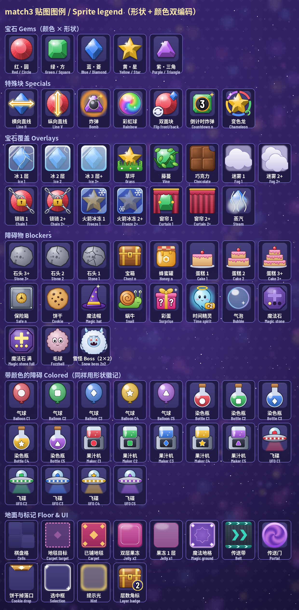
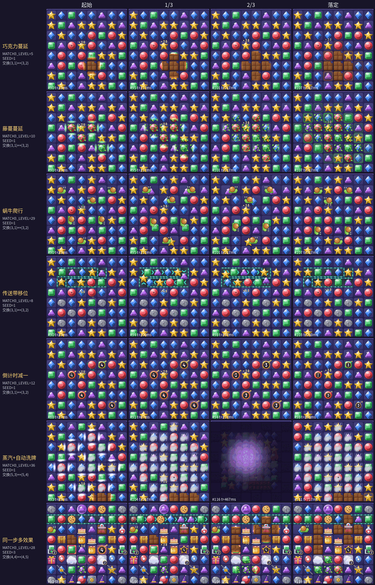

# UI 美术与贴图

本文说明游戏的美术风格、贴图清单与生成方式。规则层（`src/Match3/*`）完全不受影响。`tools/gen_assets.py` 生成 `assets/`，网页版再由 `web/tools/gen_web_atlas.py` 把它重新打包成 2x WebP 图集（只收棋盘 / HUD 贴图与关卡名，文字用浏览器字体画），见 [web.md §2.5 资源管线](web.md#25-资源管线)。

> **SDL2 桌面版已于 2026-10-05 移除**（`refactor/web-only`），网页是唯一前端。原桌面版的「加载与降级」「开发用环境变量」「复现 / 截图」「高分屏 / Retina」（含 SDF 字体设想）各节已删除，桌面专用的 `zh_*` / `g_*` 文字贴图与 `@` 尺寸变体也已从生成器与 `assets/` 删除（`refactor/web-only-2`；旧内容见 git 历史）。「连击表现」里提到的 `app/UI/*` 模块描述的是原桌面版实现，留作历史记录；时间线、帧数、颜色等数值仍是现行规格（来自 `app/pure` 的 `ComboFx` / `UI.Presentation`，网页经 `m3Meta` 读同一份）。本页三张截图（`screenshot-l16.png`、`combo-strip.png`、`end-of-step-strip.png`）是原桌面版拍的，棋盘画法与网页版相同。


## 风格

- **糖果宝石风**：深紫夜空背景，棋盘格是圆角深蓝半透明方砖（棋盘格交替两种深浅）。宝石有高光、渐变和柔和投影。
- **统一规格**：棋盘贴图按 **112×112**（格子 56 px 的 2 倍）绘制；HUD 面板、图标、星星、角标、背景和关卡名文字也都按**逻辑尺寸的 2 倍**烘焙。网页按 `devicePixelRatio` 放大画布后备缓冲，2x 屏上 1 个贴图像素 = 1 个物理像素（见 [web.md §2.4 自适应布局](web.md#24-自适应布局layoutjs)）。
- **颜色 + 形状双编码**：每种颜色同时对应一种轮廓，色弱玩家或灰度截图也能一眼区分（见下表）。
- **层数可读**：多层障碍的外观会随层数变化（裂纹、层数、厚度），层数 ≥ 2 时右下角还有**数字角标**。
- **HUD**：九宫格圆角面板（`panel_*`），金色描边表示强调/选中；网页的数字与中文标签用浏览器字体画，只有关卡名 `name_*` 是预渲染的文字贴图。

## 颜色 → 形状

| 颜色 | 内部 | 形状 | RGB |
|------|------|------|-----|
| 红 | `C1` | 圆形宝珠 | (236, 62, 78) |
| 绿 | `C2` | 切角方形翡翠 | (52, 196, 96) |
| 蓝 | `C3` | 菱形 | (56, 128, 246) |
| 黄 | `C4` | 五角星 | (255, 194, 36) |
| 紫 | `C5` | 三角形 | (172, 88, 236) |

带颜色的障碍（气球、果汁机、染色瓶、飞碟）也会在自身上印同样的**形状徽记**，所以不必只靠颜色判断。

## 图例

完整图例（中英文标签）：[`images/legend.png`](images/legend.png)，每次运行生成脚本都会重新生成。



### 特殊块

| 贴图 | 含义 | 外观 |
|------|------|------|
| `line_h` / `line_v` | 直线 LineH / LineV | 宝石上一条白金光带，两端带箭头，方向即消除方向（横 / 竖） |
| `bomb_glow` + `bomb_mark` | 炸弹 Bomb | 宝石后面有橙色呼吸光晕，宝石上有黑色小炸弹标记 |
| `rainbow` | 彩虹 Rainbow | 七彩旋涡球，游戏中缓慢旋转 |

### 覆盖物（宝石之上）

| 贴图 | 构造子 | 外观 / 层数表示 |
|------|--------|-----------------|
| `ice_1..3` | 冰层 `ice` | 青色透明冰壳，层数越多越厚、裂纹越少；≥2 显示角标 |
| `grass` | `Grass` | 格子底部一丛绿草 |
| `vine` | `Vine` | 绿藤缠绕宝石；将要蔓延的格子会闪绿色提示 |
| `choco` | `Choco` | 巧克力方块（盖住宝石）；将要蔓延的格子会闪棕色提示 |
| `fog_1..2` | `Fog n` | 白色云团，2 层更浓；≥2 显示角标 |
| `chain_1..2` | `Chain n` | 铁链 + 金锁：1 层是一条斜链，2 层是交叉双链 |
| `freeze_1..2` | `Freeze n` | 深蓝雪花釉壳，2 层颜色更深（和青色冰层 Ice 区分开） |
| `curtain_1..2` | `Curtain n` | 酒红幕布，2 层全闭，1 层半开 |
| `steam` | `Steam` | 灰白蒸汽团 |

### 障碍 / 特殊格

| 贴图 | 构造子 | 外观 / 层数表示 |
|------|--------|-----------------|
| `stone_1..3` | `Stone n` | 灰色岩块：3 层完整，2 层有裂纹，1 层碎裂；更多层时用 `stone_3` 加角标 |
| `chest` | `Chest n` | 金边木宝箱 + 层数角标 |
| `honey` | `Honey n` | 琥珀蜂蜜罐（带蜂巢六边形）+ 层数角标 |
| `balloon_c1..c5` | `Balloon c` | 对应颜色的气球，上面印有形状徽记，游戏中会上下浮动 |
| `cookie` | `Cookie` | 巧克力豆饼干（收集物） |
| `cake_1..3` | `Cake n` | 奶油蛋糕，层数就是蛋糕的层数（1/2/3 层），≥2 显示角标 |
| `magic_hat` | `MagicHat` | 紫色星星魔法帽 |
| `maker_c1..c5` | `Maker c n` | 对应颜色的果汁机；剩余次数 n **始终**用角标显示 |
| `snail` | `Snail dr dc` | 橙壳蜗牛，按爬行方向旋转 / 镜像 |
| `safe` | `Safe n` | 钢制保险箱 + 金色转盘 + 层数角标 |
| `flip_mark` | `Flip f b` | 正面宝石 + 右上角小宝石（翻面后的颜色）+ 左下角循环箭头 |
| `surprise` | `Surprise` | 粉色礼盒 + 问号 |
| `bottle_c1..c5` | `Bottle c` | 对应颜色的染色瓶 + 形状徽记 |
| `time_spirit` | `TimeSpirit` | 带光环的小精灵，标着「+2」，会上下浮动 |
| `countdown_1..9` | `Countdown c n` | 宝石上叠一个红色倒计时炸弹，中间写剩余步数 |
| `ufo_c1..c5` | 飞碟 `Ufo` | 对应颜色的飞碟，悬停在格子上方 |
| `bubble` | 气泡 `Custom "bubble" 1`（段 5） | 透明水泡：蓝青边缘 + 虹彩 + 高光，无颜色徽记，轻微上下浮动。网页 `cells.js` 按 Custom 名字画（不画层数角标；原桌面版经 `UI.CellTable.customTable` 分派，几何降级版 `primBubble` 已随桌面版移除） |
| `snow_boss_0..3` / `snow_boss_hurt_0..3` | 雪怪 Boss `Custom "snow_boss" v`（新玩法 5，2×2） | 冰蓝雪怪：一整只按 2 格（224 px）画好再切成四块，每格画自己的象限（0 左上 / 1 右上 / 2 左下 / 3 右下，读 `UI.CellFace.bossPart`，字段由元素自带），拼起来是一只：毛茸茸的雪白身体 + 冰蓝阴影、冰角、两只眼睛（怒眉）与獠牙；血量 ≤ 满血一半时换 `snow_boss_hurt_*`（皱眉 + 裂纹 + 创可贴 + 汗滴）；右下块底部三个小点显示召唤进度（每 3 步召唤一块雪块，雪块就是 1 层石头 `stone_1`）。网页 `cells.js` 的 `CUSTOM_ART` 按 Custom 名字分派（`drawSnowBoss`；原桌面版 `UI.CellTable.customTable`）；`snow_boss`（整只缩到一格）只给 HUD 血条当头像。（原桌面几何降级版 `primSnowBoss` 已随桌面版移除；网页缺图时逐格退回纯色块。） |
| `chameleon` / `chameleon_icon` | 变色龙 `Custom "chameleon" k`（新玩法 7，k = 当前颜色下标 0..4） | 底下照常画当前颜色的宝石 `gem_c{k+1}`（颜色读 `Match3.Element.Builtin.chameleonColor`），上面叠 `chameleon`：五色分段环 + 绿色卷尾 + 一点闪光，随 `pulse` 慢慢转动；换色是步末 `EvTick "chameleon"`，按事件类型复用倒计时段 `StTick`（前半段旧颜色、后半段新颜色）。`chameleon_icon` 是 HUD / 地图目标图标（`gem_c4` + 环合成一张）。网页 `cells.js` 的 `CUSTOM_ART` 按 Custom 名字分派（`drawChameleon`；原桌面版 `UI.CellTable.customTable`，几何降级版 `primChameleon` 已随桌面版移除）；消除粒子颜色 = 当前颜色（`UI.Palette.cellRGB`，网页 `cells.js` 的 `cellRGB` 同规则） |

### 地砖（宝石之下）

| 贴图 | 含义 |
|------|------|
| `tile_a` / `tile_b` | 普通棋盘格（交替两种深浅） |
| `carpet_open` / `carpet_covered` | 地毯目标格：虚线品红框表示未铺，编织纹品红地毯表示已铺 |
| `belt` | 传送带：青色边轨 + 箭头，箭头朝向就是移动方向 |
| `portal` | 紫色旋转传送门环 |
| `cookie_drop` | 饼干掉落口（新玩法 6）：金色漏斗（上宽下窄 + 深色口沿 + 两颗铆钉）+ 白色向下箭头，只占格子上部四分之一。和其它地砖不同，画在**棋子之上**、掉落口格上沿（上移 6 px 压在棋盘框上），不随下落动画偏移。网页 `web/www/cells.js` 的 `drawDrops` 读 `state.drops`（`Match3.View.bvDrops`）画；缺图时退回几何画法：三级金色台阶 + 白色箭头（位置、上移 6、几何画法都同原桌面版 `UI.BoardArt.drawDropsArt` / `drawDropMark`） |
| `jelly_2` / `jelly` | 双层果冻（地面层 `gsGround`，段 5）：双层为深粉果冻块 + 一道白色层线；单层为淡粉半透明。网页 `cells.js` 的 `GROUND` 表按名字分派（原桌面版 `UI.Ground.groundTable`），画在棋盘格之上、棋子之下；表里没有的名字或缺图时画淡灰框并计入 `fallbacks`（原桌面几何降级版已移除） |
| `magic` | 魔法地格（地面层 `gsGround` 里的 `("magic", 1)`，新玩法 8）：紫色符文地砖——径向紫光底、发光描边、中央淡八角星底纹、四角菱形符点；永久存在，不随消除变化（值恒为 1，不按层换图）。和果冻一样经网页 `cells.js` 的 `GROUND` 表按名字分派，画在棋盘格之上、棋子之下，所以棋子盖住中间，露出边框与四角（原桌面几何降级版 `primMagic` 已移除）。扩大的爆炸没有新贴图 / 新动画：Engine 的 `EvBlast` 覆盖格已含扩出来的一圈，直线 / 炸弹的高亮与清除动画按覆盖格原样画（直线从一行变成三行、炸弹 3×3 变 5×5） |

### 交互 / HUD

`sel_ring`（选中框，颜色随道具模式变化）、`hint_glow`（提示呼吸光）、`spark`（消除闪光）、`star_on/off`、`medal`、`node_cur/done/lock`（地图节点）、`icon_*`（锤子 / 交换 / 十字 / 步数 / 分数 / 多色）、`badge_1..9`、`name_*`（关卡名）。魔法石（新玩法 2）：`magic_stone_<充能>`，满 3 格的贴图外发光并轻微浮动。毛球（新玩法 3）：`fuzzball`（灰粉色毛团 + 大眼睛，轻微浮动；步末跳格借用皮带的平移动画）。魔力鸟组合增强（新玩法 4）：没有新棋子贴图，变身段借用蔓延的「长出新格」动画（第一轮之前，同色宝石从格子中心长成直线 / 炸弹；与彩虹格恰好差一行或一列的目标沿蔓延方向擦出，是 `drawEndSpread` 按来源方向分支的结果）。网页版（`web/www/cells.js` / `render.js`）画法相同：毛球用同一个浮动公式 `round(2·sin(pulse/9))`（网页逻辑帧 1/60 s、桌面 16 ms，周期约 0.94 s 对 0.90 s），跳格走皮带段，变身走蔓延段的同一组分支（匀速、白色前沿光、不迸碎屑）。规则开关角标：打开 `bomb_shapes` 的关卡，画 `bomb_glow` + `bomb_mark` 图标和文字「L/T 形出炸弹」；打开 `rainbow_combos` 的关卡画 `rainbow` 图标 +「彩虹组合变身」。角标表在 `Match3.View.ruleBadgeTable`（规则名 → 文字、叠放图标），网页版按它通用地画：关卡面板「第 N 关」右侧画图标 + 画布字体文字（小胶囊）。新增规则开关的角标：`ruleBadgeTable` 加一行即可（图标须是生成器里已有的贴图，`stack test` 核对）。

**Boss 血条**（新玩法 5）：目标是「击败 Boss」时（`Match3.View.gvBoss` 为 `Just`），HUD 目标条换成血条：左边 `snow_boss` 头像，红色进度条长度 = 剩余血量 / 满血，文字「HP 剩余/满血」；剩余 ≤ 一半后进度条变深红并随呼吸计数闪烁。网页 `web/www/cells.js` 按象限取 `snow_boss[_hurt]_<q>` + 召唤进度点，`hud.js` 读 `state.boss` 画血条，头像用 `snow_boss` 缩放（头像 / 着色 / 过半闪烁同原桌面版 `UI.HudArt`；原几何版 `UI.HudBlocks.hudBoss` 已移除）。

## 重新生成贴图

```bash
pip install pillow numpy        # 或 apt install python3-pil python3-numpy
python3 tools/gen_assets.py     # 约 40 秒；加 --preview 另存 /tmp/atlas_preview*.png
```

脚本会生成：

- `assets/atlas.bmp`：图集第 0 页（32 位 BGRA，带透明通道）。每页最大 1024×2048，放不下自动开新页（`atlas1.bmp`……）；目前 1 页（1024×1730），共 174 个贴图，与网页图集同一组（原桌面版的 `zh_*` / `g_*` 文字贴图与 `@` 尺寸变体共 318 张已于 `refactor/web-only-2` 删除，此前是 2 页 492 张）
- `assets/atlas.txt`：索引文件，每行 `name x y w h page`（第 6 列页号；旧的 5 列格式视为第 0 页）
- `assets/background.bmp`：页面背景（960×1176，即 480×588 的 2 倍，24 位不透明）
- `docs/images/legend.png`：图例

图形采用 4 倍超采样再缩小；关卡名文字不超采样，而是按目标像素字号直接用 FreeType 渲染（带 hinting，笔画对齐像素格）。随机种子固定，所以同一环境里多次运行结果一致；但换了 Pillow / numpy / 字体版本，少数贴图会有像素级差异（`refactor/web-only-2` 时在另一台机器上重跑未改动的生成器，保留的 174 张里有 21 张不同）。所以只删贴图、不改画法时，应从已提交的 `assets/` 里裁出原贴图重新打包（同一个 `pack`），保证网页图集逐像素不变。关卡名从 `src/Match3/Levels/Campaign.hs` 解析，新增关卡后重新跑一次即可。字体按顺序查找：拉丁字形用 Barlow Condensed / DejaVu / Arial，中文用 Noto Sans CJK / 文泉驿 / 苹方 / 华文黑体。

## 连击表现（逐轮回放）

实现：纯逻辑在 `app/pure/ComboFx.hs`（阶段机、时间线常量、下落映射）与 `app/pure/UI/Presentation.hs`（第 10 刀：效果事件 → 表现的**表现表**，帧数 / 颜色 / 碎屑 / 音效名、连击等级样式、蔓延生长曲线都在这一张表里，见下文「表现表」）；回放器是通用播放器 `Engine.Playback.Player Cascade`（帧号与加速在播放器里，阶段机是 `ComboFx.cascadeStages`），网页由 `web/hs/Match3Web/Anim.hs`（`m3AnimTick`）推进并把阶段、帧号与阶段事件编码给 JS；`web/www/main.js` 按阶段事件放弹字 / 粒子 / 震屏 / 音效，`render.js` 画各轮阶段与步末段，`hud.js` 画连击徽章与「N 连击！」总结；波次级的高亮 / 消失 / 粒子 / 得分浮字读 `WaveView` 里本轮的效果事件。（原桌面版的 `app/UI/Playback.hs` / `Cascade.hs` / `EndStage.hs` / `HudArt.hs` / `Types.hs` 已随 SDL2 前端移除，网页 JS 逐项迁自它们。）核心只新增了纯函数 `traceSwap` / `traceFreeSwap` / `traceHammer` / `traceCrossClear`（`Match3.Game.Move` / `Match3.Game.Boosters`，底层是 `Match3.Board.Cascade` 记录版连锁的 `crWaves`；前端经通用接口 `gameStep` 的整步报告一次拿到），返回 `MoveTrace { mtStart, mtWaves :: [CascadeWave], mtFinal, mtEnd :: [EndStep] }`。每个 `CascadeWave` 记录这一轮消除前的盘面、被消格、消除后留下的空洞、下落补子后的盘面和本轮得分。测试保证它的最终态、总分、清除格并集、轮数和 `trySwap` / 道具 API 的结果完全一致（`trace_*` 系列），所以前端只是把同一个结果**拆开播放**，规则没有任何改动。

### 时间线（60 fps，1 帧 ≈ 16.7 ms）

一次成功交换：交换动画 `swapFrames` = 10 帧，然后每一轮依次播放：

| 阶段 | 帧数 | 约 | 画面 |
|------|------|----|------|
| ① 高亮 `PhFlash` | `waveFlashFrames` = 12 | 200 ms | 棋盘其余部分压暗；被消格提到暗幕之上，带等级色光圈、`spark` 闪光、轻微弹跳。第 2 轮起在这一刻弹出「连击 xN」 |
| ② 消失 `PhPop` | `wavePopFrames` = 6 | 100 ms | 被消格缩小淡出，光环外扩，爆出粒子；从消除区域飘出本轮得分「+N」；第 2 轮起轻微震屏；新生成的特殊块放大出现 |
| ③ 下落 `PhFall` | `fallFramesFor d` = clamp 8..14 (6 + 最大落差 d) | 130–230 ms | 上方的宝石按列掉进空洞（t² 加速），新宝石从棋盘顶上方落入（裁剪在棋盘内） |
| ④ 落定 `PhRest` | `waveRestFrames` = 4 | 70 ms | 停顿一下再进入下一轮 |

每轮约 30～36 帧（0.5～0.6 s），实测 4 连锁全程约 2.2 s，5 连锁约 2.8 s（从松开鼠标到最后一轮落定，不含步末阶段）。


上图：第 5 关、种子 10、交换 (4,2)↔(5,2)（原桌面版截图），第 2～5 轮依次出现 x2 浅金、x3 橙、x4 红、x5 紫的「连击」弹字和「+N」得分浮字。

### 步末阶段（`PhEnd`）

一步里除了消除，还会发生一些「回合末」变化。规则层按 `trySwap` 的真实顺序把它们记在 `mtEnd` 里（`EndStep { esAfterWaves, esBefore, esAfter, esEffect }`，`esAfterWaves` 表示在第几轮之后发生），前端在对应的位置插入播放，播完才进入下一轮或结束：

| 顺序 | 效果（`EndEffect`） | 何时 | 表现段 | 基础帧数 | 画面 |
|------|--------------------|------|--------|----------|------|
| 1 | 倒计时减一 `EvTick` / countdown | 主连锁之后（归零爆炸是随后的普通轮） | `StTick` | 10（≈170 ms） | 前半段旧数字、后半段新数字；炸弹格红色光晕脉冲，数字放大回弹，冒红色火星 |
| 2 | 传送带移位 `EvBelt` / belt | 倒计时之后（移位后的连锁 / 收饼干是随后的普通轮） | `StBelt` | 14（≈230 ms） | 相邻格沿皮带方向平滑滑动；环首尾相接的那一格在终点缩放淡入 |
| 3 | 藤蔓 / 巧克力 / 蒸汽蔓延 `EvSpread` / vine · choco · steam | 皮带连锁之后 | `StSpread`（三种合成一段同时播） | 18（≈300 ms） | 新格的覆盖层从来源格那一侧「长」过来：藤蔓分 4 节一节一节伸长，巧克力先快后慢涂抹铺开，蒸汽匀速漫开；生长前沿带同色柔光，长好时迸几粒同色碎屑 |
| 4 | 蜗牛爬行 `EvMove` / snail | 蔓延之后（被推出匹配时，随后的普通轮再消） | `StSnail` | 18（≈300 ms） | 蜗牛沿朝向平滑挪一格并轻轻一拱，被推的宝石同时退到蜗牛原格（交错时侧让几像素）；碰壁的蜗牛原地横向压扁再展开，中点换朝向 |
| 5 | 自动洗牌（`ensurePlayable`，无可走步）——**不是** `EndEffect`，也不在 `mtEnd` 里：`ComboFx` 发现 `mtFinal` ≠ 结算后的 `gsBoard` 时自己追加 | 最后 | `StShuffle` | 22（≈370 ms） | 旧盘向中心收拢、暗幕和紫色光团盖住，换盘后新盘从中心散开 |

第 7 刀 7b 起 `EndEffect` 是通用形状（事件类型 `endEffectKind` + 元素名 `endEffectElement` + 逐项 `EndItem`）：表现段按事件类型选（`ComboFx.stageKindFor`，第 10 刀起即查表现表的 `stageKindOf`），蔓延取色 / 生长节奏按元素名查表（`UI.Presentation.elementRGBTable` / `spreadCurves`），蜗牛段从各项取起点 `eiFrom`、终点 `eiTo`、被推的格 `eiBack`、新朝向 `endItemDir`（写入的蜗牛）；画面与之前逐帧相同（22 个场景 + 3 个步末动画场景截图 AE=0）。

- **时长控制**：同一时刻连续的步末段（1～4）合计不超过 `endBudgetFrames` = 36 帧（≈0.6 s），超出时按比例压缩，每段至少 8 帧。常见情况：只有巧克力或藤蔓一段 0.3 s；蔓延 + 蜗牛 0.6 s；终章那种倒计时 + 皮带 + 蔓延 + 蜗牛全都有时压成 8 + 8 + 10 + 10 帧 = 0.6 s。自动洗牌很少出现、又需要让玩家看清，所以不计入预算，单独 0.37 s。
- 道具（锤子 / 十字 / 自由交换）按规则只有蔓延，没有倒计时 / 皮带 / 蜗牛；无效交换 / `NoMatch` / 被拒道具规则上什么都不发生，`mtEnd` 为空，不会播任何步末动画（`trace_rejected_move_is_empty` 锁定）。
- 回放期间（包括步末阶段）HUD 的步数已经是结算后的值；倒计时数字在 `StTick` 段的中点从旧值变成新值，和盘面一致。「下一步可能蔓延到的格子」的呼吸光预告只在静止时画，避免跟正在长出来的格子混在一起。


上图从上到下：巧克力蔓延、藤蔓蔓延、蜗牛爬行、传送带移位、倒计时减一、蒸汽 + 自动洗牌、同一步里四种效果齐全（终章），每行左侧标了复现用的关卡 / 种子 / 交换。两张拼图是原桌面版逐帧截取后拼接的，**不由** `gen_assets.py` 生成。

- 测试：`trace_end_steps_replay_to_trySwap_final` 对全部关卡 × 3 个种子的每个成功交换按时间线重放（轮 → 步末 → 轮……），要求每段首尾相接、`applyEndEffect esEffect esBefore == esAfter`，最后等于 `trySwap` 的终盘，并且抽样必须覆盖全部六种效果；`trace_end_steps_boosters_replay`、`trace_end_snail_push_and_turn`、`trace_end_spread_from_adjacent_source` 分别覆盖道具、蜗牛推 / 掉头、蔓延来源方向。

- **点击加速**：回放期间点击鼠标，或按空格 / 回车 / `N`，阶段机改为每帧推进 `fastStep` = 3 帧（整体约快 3 倍，包括步末各段和自动洗牌段），各轮和各步末段依旧逐个可见；标题栏提示 `Fast-forward combo`。开头 10 帧的交换动画照常播放（在交换中按下，加速从第 1 轮开始生效）。
- **播放锁定**：回放期间（含步末阶段）不接受新的交换、道具、撤销或洗牌输入，过关 / 失败叠层也等播完才画；提示、地图、重开、暂停仍可用。完整的键位表见 [`ui-controls.md` 播放锁定](ui-controls.md#播放锁定)。
- **不会重播**：回放只由本次调用返回的 `MoveTrace` / `MoveFx` 驱动。`NoMatch` / `InvalidSwap` / 被拒的道具返回空脚本，此时会清掉旧的弹字和 HUD 总结，不播任何东西（`failed_swap_resets_combo_feedback`、`trace_rejected_move_is_empty`、`undo_shuffle_reset_combo_feedback` 锁定）。撤销 / 洗牌也会清空弹字、总结、粒子和震屏，并且不会重播任何步末动画。

### 连击等级样式（`comboStyle`）

| 等级 | 颜色 | 弹字「连击」字高 | 震屏振幅 |
|------|------|------------------|----------|
| 第 1 轮 | 不弹连击字，只有得分浮字（暖白） | — | 0 |
| x2 | 浅金 (255, 238, 150) | 30 px | 2 px |
| x3 | 橙 (255, 164, 52) | 36 px | 3 px |
| x4 | 红 (255, 76, 64) | 42 px | 4 px |
| x5 及以上 | 紫 (214, 120, 255)，色相随时间彩虹流转 | 48 px | 5 px |

- **「连击 xN」弹字**：寿命 `comboPopLife` = 54 帧（0.9 s）。缩放 0.35 → 1.3（过冲）→ 1.0，最后 1/3 边上浮边淡出；背后有一层深色柔光加一层等级色辉光，压在任何颜色的宝石上都看得清。位置放在本轮消除区域上方（上方放不下就放到下方），并夹在棋盘左右边框内；下一轮弹字出现时，上一轮的弹字会加速淡出，避免叠字。
- **得分浮字「+N」**：寿命 `scorePopLife` = 48 帧（0.8 s），从本轮消除格的中心飘起，颜色跟本轮等级色，字号随等级略增。
- **震屏**：`shakeFrames` = 10 帧，振幅按上表线性衰减，只偏移棋盘、粒子和浮字（通过 `rendererViewport`），HUD 不动。
- **HUD 右下角**：回放期间显示当前轮「连击 xN」（等级色），第 1 轮显示滚动上涨的分数。连锁结束后，如果最高连击 ≥ 2，显示总结「N 连击！」`comboSummaryFrames` = 96 帧（1.6 s）：先弹入放大，带光晕，然后淡出。

### 表现表（第 10 刀）

上面各表里的帧数和颜色，第 10 刀起全部来自 `app/pure/UI/Presentation.hs` 的 `presentationTable`（每种效果事件一行；结构与完整的行见 [architecture.md「前端表现表」](architecture.md#前端表现表第-10-刀)）。读表的地方：

| 画面 | 读表 | 原来写在 |
|------|------|----------|
| 高亮 / 消失的光圈色（第 1 轮柔白，连击轮等级色） | `EvClear` 行的 `prColor`（连击轮用 `comboStyle`） | `UI.BoardArt.waveTint`、`UI.Cascade` 的字面量 |
| 高亮帧数、得分浮字 / 连击弹字寿命 | `prFrames`（`EvClear` / `EvScore` / `EvCombo` 行） | `ComboFx` 常量 |
| 得分浮字色 | `EvScore` 行的 `prColor`（连击轮用 `comboStyle`） | `UI.HudArt` / `UI.HudPrim` 的 `if k >= 2 …` |
| 步末段种类与基础帧数 | `stageKindOf` / `stageFrames` | `ComboFx.endStageTable` |
| 倒计时红光、洗牌紫光 | `stagePresentation 段` 的 `prColor` | `UI.EndStage` 的字面量 |
| 蔓延生长曲线、前沿柔光色 | `spreadCurveFor` / `spreadGlowFor`（按元素名，缺省匀速 / 白） | `UI.EndStage.spreadProgress` |
| 步末碎屑 | `prCrumbs`（倒计时来源格火星、蔓延按元素色） | `UI.Playback.endCrumbTable` |

表里的值与第 10 刀前逐一相同（测试 `presentation_*` 对照旧 case 的字面副本；22 个静态场景、6 个步末场景与连击 / 特殊块爆炸 / 组合 / 锤子 / 十字动画场景截图与 `ac211d8` 逐帧相同）。**给新元素加表现**：步末效果选一个已有事件种类即可按那一行播放；蔓延类在 `elementRGBTable` / `spreadCurves` 各加一行定颜色与生长节奏（不加就是白光、匀速、不迸碎屑）。**音效**：每行有 `prSound` 钩子（内置全部 `Nothing`，前端不引入音频依赖、不播放），（此句是第 10 刀时的状态；现在内置表有 `clear` / `special` 两个音效名，网页经 `m3Meta` 取音效名播放，原桌面钩子 `UI.Sound` 已随桌面版移除。） 原桌面版专用的贴图名列 `prSprite` 与取色函数 `clearTint` / `scorePopRGB`、贴图名 `clearSprite` / `comboPopSprite` 已于 `refactor/web-only-2` 删除。

### 贴图与降级

原桌面版为弹字烘焙的 `zh_combo` / `g_*` 大字形贴图与缺图时的像素字退回画法已随桌面版删除；网页的弹字、浮字和 HUD 徽章都用画布字体画（见 [web.md](web.md)）。
